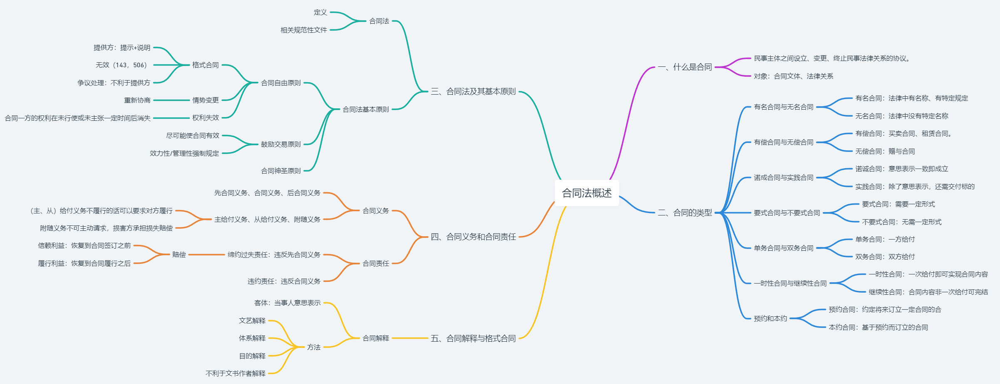
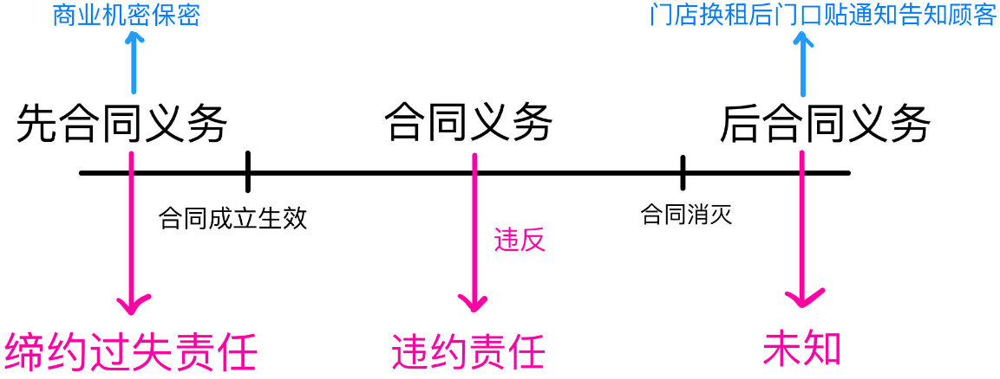
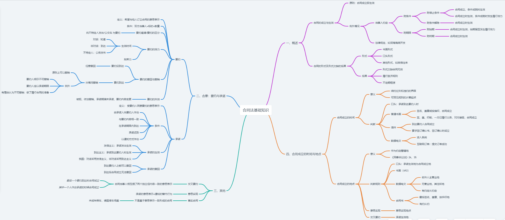
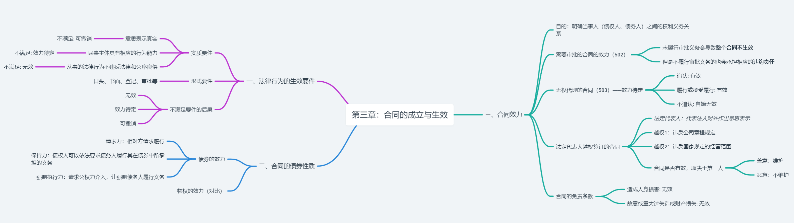
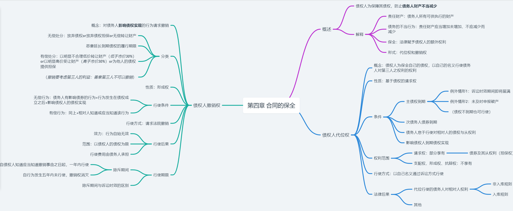
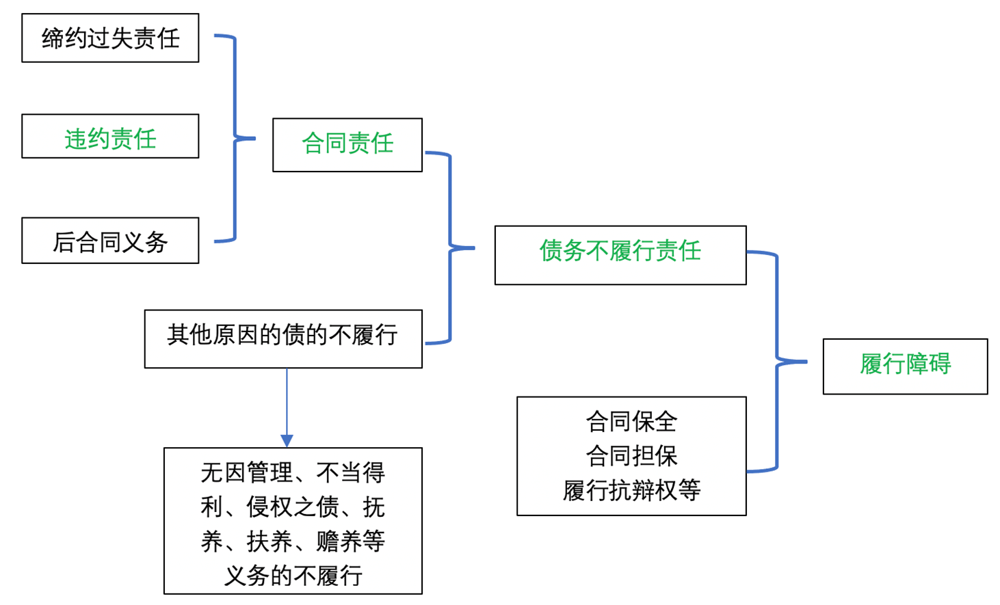
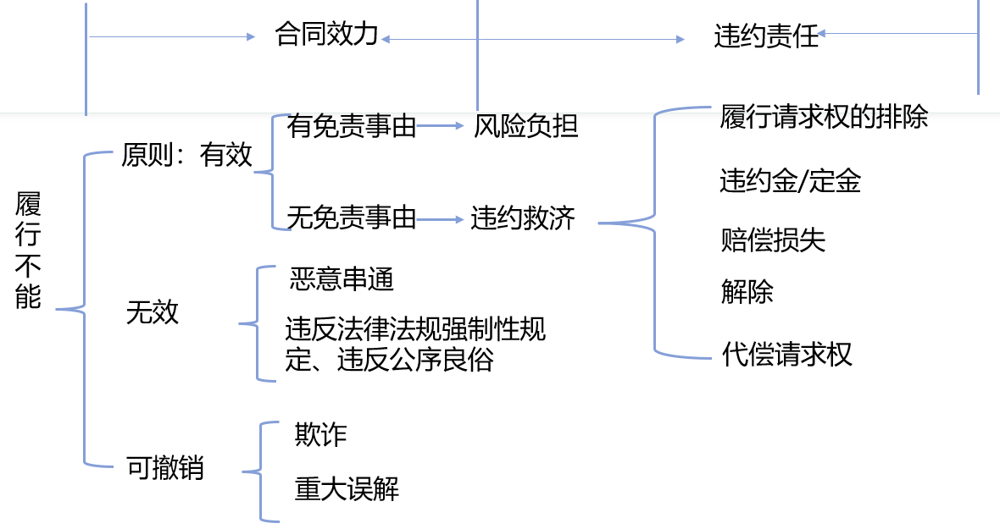
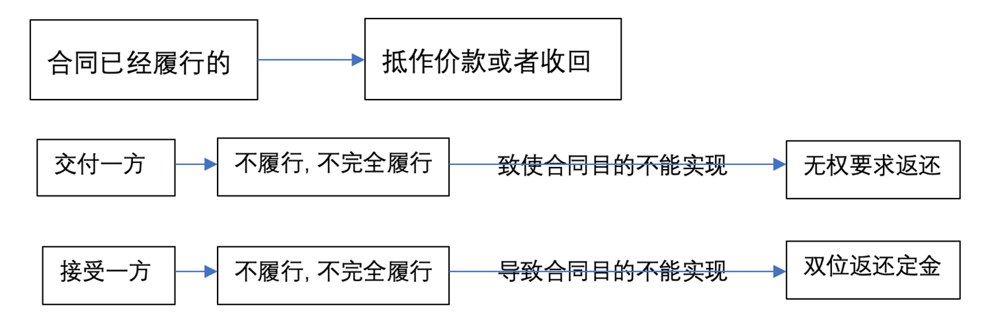
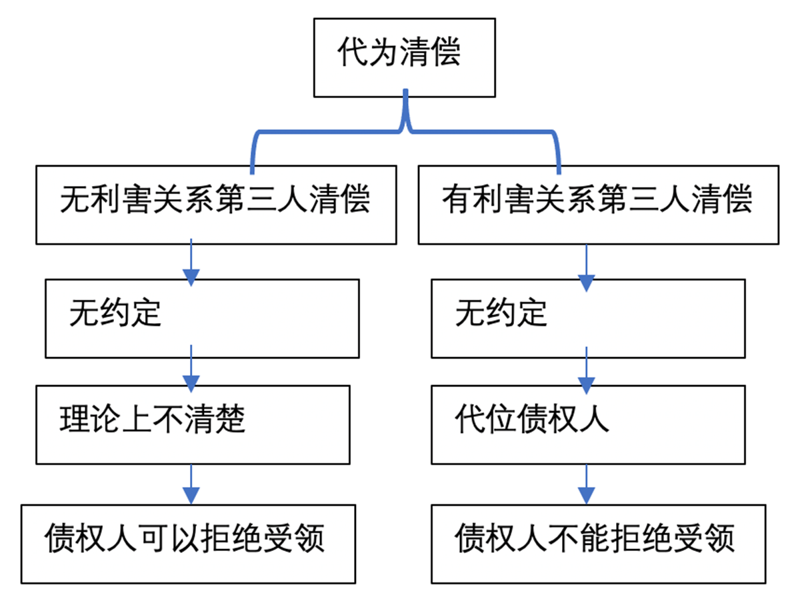

# 第一章 合同法概述


## 一、什么是合同

- 合同是民事主体之间设立、变更、终止民事法律关系的协议。(464)·
- 合同所指称的对象主要是两种：合同文体、法律关系

## 二、合同的类型
### (一)有名合同与无名合同——以法律是否设定规范并赋予名称为标准
#### 1.二者的定义
- 有名合同：法律中明确有名称、有特定规定的合同类型。例如：售合同、租赁合同、服务合同等
- 无名合同是指那些在法律中没有特定名称或详细规定的合同类型。例如：
#### 2. 区分有名合同和无名合同的意义——最重要的意义在于法律的适用
1. 纯粹的无名合同——适用一般规则
2. 结合合同(形式上是一个合同，包含两个以上合同，无相互依存关系)——适用各自规则
3. 联立合同(形式上是一个合同，包含两个以上合同，互为条件而相互依存)-是否有效就各个合同判断，如果不成立、无效、撤销或解除，另一个合同同其命运。
4. 混血 (1个行为，多个血统)最难，需要个别分析

### (二)有偿合同与无偿合同——以当事人是否因给付而取得对价为标准
#### 1. 定义
- 有偿合同，指双方当事人在从合同的缔结到债务的履行过程中均作出相互具有对价性质的付出 (并不限于财产的给付，也包含劳务、事务等)的合同。
- 无偿合同，指双方当事人中只有一方当事人作出给付。
- 注：对有偿性的理解应从整体把握

### (三)诺成合同与实践合同——以是否以物的交付或其他现实给付的完成为要件
#### 1.定义
- 诺成合同：也叫不要物合同，是指当事人各方的意思表示一致即成立的合同。
  - 自然人之间的借款，火车站行李寄存，赠与
  - 赠予原则上是可以撤销的，法律有特殊规定的除外赠予发生后原则上不能撤销
- 实践合同：也叫要务物合同，是指除意思表示一致以外，尚需交付标的物或完成其他现实给付，合同才成立。

### (四)要式合同与不要式合同——以是否需要具备一定形式才成立为标准
#### 1. 定义
- 要式合同：依法律规定、当事人约定或交易习恨的形式成立的合两。
- 不要式合同：不露要具备一定形式就成立的合同。
- 沉默：原则上在法律上没有任何效力，不作为意思表示。例外：当事人之间有约定，法律有特殊规定，交易习惯

### (五)单务合同与双务合同——以双方当事人是否互负对待给付义务
#### 1.定义
- 单务合同，也叫片务合同，指仅有一方当事人负给付义务的合同
  - 赠予(非附义务)
  - 自然人之间的借款：资金交付以后 合同才成立
  - 保让合同：一方(保证人)向另一方(债权人)承诺，如果主债务人不能履行其债务，保证人将承担责任。
    - 保证人 $\xrightarrow{\text{保让合同}}$ 债权人 $\xleftarrow{\text{借贷合同}}$ 债务人
    - 一般保证(默认)：债权人向债务人主张，提请诉讼强制执行无果后，才能向保证人主张，保证人有先诉抗辩权
    - 连带保证：属于连带责任(加重责任)，债权人可以向债务人主张，也可以向保证人主张
- 双务合同： 双方当事人互负对待给付义务的合同
- 对价意义：并非指双方给付在客观上具有相同的价值，而是应当作出的给付相互之间具有依存关系。

### (六)一时性合同与继续性合同——以义务是否持续为标准
#### 1.定义
- 一时性合同：因一次给付即可实现合同内容的合同
- 继续性合同：合同内容非一次给付可完结，而是可以继续实现的合同。

### (七)预约和本约——以合同目的为标准
- 预约：约定将来订立一定合同的合同
  - 预约违反：适用定金罚则——收受定金的一方违约需要双倍返还定金，交付定金一方违约无法收回定金，定金不能超过主合同标的额的20%
  - 法律承认定金，不承认订金
- 本约：基于预约而订立的合同
>- 2006年9月20日，被告蜀都实业公司(甲方)与原告讯捷公司 (乙方)签订《购房协议书》约定：“双方就蜀都大厦北一楼售房形成如下一致意见：
>1. 乙方购买建筑总价格6750万元。
>2. 协议签订之日起，甲方收到乙方预计购房定金1000万元。
>3. 双方应就购房合同及付款方式等问题在本协议原则下进行具体磋商。
>4. 双方就该宗房屋买卖合同签订时，本协议自动失效。
>- 合同签订后，讯捷公司分两次向蜀都实业公司支付1000万元，之后蜀都实业公司将讼争的房屋交付给迅捷公司使用至今。自2009年9月开始，双方就购房协议签订一事进行磋商，一直没有签订《房屋买卖合同》。蜀都实业公司要求： 
>1. 双方磋商达三年时间，仍在许多重大问题上存在着严重分歧，导致双方一直未签订《房屋买卖合同》，因此双方的房屋买卖关系未成立；
>2. 讯捷公司无偿占用蜀都实业公司房屋三年，应当支付场地占有使用费。
>- 而讯捷公司认为： 
>1. 讯捷公司认为双方的房屋买卖已经实际履行，合同成立。
>2. 讯捷公司占有并使用房屋系合法的，不应向蜀都实业公司支付场地占用费。由于双方在主要条款上分歧较大，未能达成供房协议。
>- 讯捷公司提起诉讼，要求；
>1. 确认讯捷公司与蜀都实业公司签订的《购房协议书》已成立并合法有效。
>2. 请求判令蜀都实业公司向讯捷公司履行办理房屋产权过户登记的义务，履行过户登记后5日内，讯捷公司支付剩余购房款5750万元；

**问题**
1. 购房协议书是预约合同还是本约合同？
   1. 《购房协议书》预约合同；
   2. 《房屋买卖合同》本约合同
   3. 判断标准：当事人的意思表示，当事人如果意思是预约就是预约
   4. 本案中法院的判断标准：是否交付房屋，因为房屋已经交付，所以法院认为本约已经签订
2. 该案房屋买卖合同关系是否成立，本案该如何处理？
   1. 认为《购房协议书》为预约合同，迅捷要返还
   2. 不认为预约合同，迅捷不要返还

>1. 《购房协议书》是预约还是本约？(预约合同的认定)
第495条 当事人约定在将来一定期限内订立合同的认购书、订购书、预订书等，构成预约合同。当事人一方不履行预约合同约定的订立合同义务的，对方可以请求其承担预约合同的违约责任。
>2. 《合同编通则司法解释》 (征求意见稿)
第七条【预约合同的认定】当事人以认购书、订购书、预订书等形式约定将来一定期限内订立合同，或者为担保将来一定期限内订立合同交付了定金，能够确定将来所要订立合同的主体、标的等内容，表明当事人受意思表示约束的，人民法院应当认定预约合同成立。
当事人主张双方之间订立的意向书、备忘录等构成预约合同的，人民法院不予支持，但是符合前款规定情形的除外。
当事人订立的认购书、订购书、预订书、意向书、备忘录等已就合同标的、数量、价款或者报酬等主要内容达成合意，符合本解释第三条第一款规定的合同成立条件，如当事人未明确约定将来一定期限内另行订立合同，或者虽有约定但当事人一方已实施履行行为且对方接受的，人民法院应当认定本约合同成立。

## 三、合同法及其基本原则
### (一) 合同法
- 定义： 规范合同的法律
- 需要关注的几个规范性与非规范性文件
  1. 联合国国际货物销售公约 (CISG)
  2. 美国统一商法典(UCC)
  3. 美国合同法重述 (第二次)
  4. 欧洲合同法

### (二) 合同法基本原则
#### 1. 合同自由原则
   - 当事人在法律允许的范围内就与合同有关的事项享有选择和决定的自由。
     - 尊重和保护当事人的**意思自治**
   - 古典合同自由——自由资本主义
     - 对个人意志自由的**绝对尊重**
   - 现代合同自由——垄断资本主义一一生产的社会化
     - **受限制**的合同自由
     - 格式合同、情势变更、权利失效、权利滥用禁止等等——对合同自由予以一定限制——形成了现代合同自由
     - 以及基于公平与诚实信用原则等的限制
    
##### (1) 格式合同 (格式条款)(496.1)
###### 1)格式合同 
- 格式条款是当事人为了重复使用而预先拟定，并在订立合同时未与对方协商的条款。
- 台湾地区民法称为“定型化契约”
###### 2)格式条款提供方的提示和说明义务 (496.2)
- 提示义务：提示注意免除或减轻其责任等与对方有重大利害关系的条款 (以合理方式提示)
- 说明义务： 按相对方要求，对上述条款予以说明
- 违反提示或说明义务，致使对方没有注意或理解与其有重大利害关系不的条款的，可主张该条款不成为合同的内容。
###### 3) 格式条款无效的情形 (497)
1. 具有民法典第143条和506条规定的无效情形；
2. 提供格式条款一方不合理地免除或者减轻其责任、加重对方责任限制对方主要权利(即使进行了提示和说明)；
3. 提供格式条款一方排除对方主要权利。

>第143条 (不得违反法律公序良俗)、144无民事行为能力人、146虚假意思表示的行为
>第506条 合同中的下列免责条款无效：
(一) 造成对方人身损害的；
(二) 因故意或者重大过失造成对方财产损失的。

###### 4)格式条款发生争议的处理
1. 按照通常理解予以理解；
2. 如有两种以上解释，应做出不利于格式条款提供方的解释；
3. 格式与非格式条款不一致的，应当采用非格式条款。

-*双方当事人特别约定要写在签字盖章之前，否则会被认定无效*

##### (2)情势变更(533)
> 合同成立后，合同的基础条件发生了当事人在订立合同时**无法预见的不属于商业风险的重大变化**，继续履行合同对当事人一方明显**不公平**的受不利影响的当事人可以与对方**重新协商**：在合理期限内协商不成的当事人可以请求人民法院或者仲裁机构变更或者解除合同。

##### (3)权利失效


#### 2. 鼓励交易原则
- 尽可能地使合同有效
- 对于违反法律、行政法规的合同无效的问题

>153条：违反法律、行政法规强制性规定的民事法律行为无效但是，该强制性规定**不导致民事法律行为无效的除外**。
>- 包养合同：夫妻共同财产 - 本人提起诉讼要求返还无效，但是夫妻的另一方起诉有效
>- 赌博合同

>王利明教授：
>- 违反效力性强制性规定一一无效
>- 违反管理性强制性规定一一不当然无效

>《民法典合同编通则司法解》 (征求意见稿) 第16条【违反强制性规定的合同效力】
合同违反法律、行政法规的效力性强制性规定的，人民法院应当依据民法典第一百五十三条第一款认定无效。在判断法律、行政法规的强制性规定是否为效力性强制性规定时，人民法院应当综合考量强制性规定的目的、当事人是否属于强制性规定保护的范国、强制性规定规制的是一方当事人还是双方当事人、违反强制性规定的社会后果等因素。
有下列情形之一的，一般应当认定合同因违反效力性强制性规定无效：
(一)合同主体违反法律、行政法规关于国家限制经营、特许经营以及禁止经营等强制性规定：(二)合同约定的标的物属于法律、行政法规禁止转让的财产；
(三)合同约定的内容本身违反禁止实施犯罪行为、不得限制或者剥夺个人权利、禁止实施垄断行为等强制性规定；
(四)当事人的交易方式违反法律、行政法规关于应当采用公开竞价方式缔约等强制性规定：
(五)当事人的交易场所违反法律、行政法规关于应当集中交易等强制性规定。
当事人在订立合同时不具备法律、行政法规所要求的交易资质或者未取得法律、行政法规所要求的批准证书，人民法院应当认定合同无效，但是交易资质、批准证书不涉及公序良俗或者合同订立后当事人已取得交易资质、批准证书的除外。当事人在合同订立后具备取得交易资质或者批准证书的条件，但却违反诚信原则不向有关部门提出中请，又以违反强制性规定为由主张合同无效的，人民法院对该主张不子支持。

- 效力性强制性规定：针对的就是合同效力
- 管理性强制性规定：针对一些行业进行特殊管理

#### 3. 合同神圣原则
- 行政部门监管的变化
>《经济合同法》时期(工商管理部门对合同的事先监管)第45条： 违法、违反序良俗可直接宣布合同无效。
对利用经济合同危害国家利益、社会公共利益的违法行为，由县级以上各级人民政府工商行政管理部门和其他有关主管部门依据法律、行政法规规定的职责负责处理，构成犯罪的，依法追究刑事责任

>《合同法》127条： **依据法律规定处理**
工商行政管理部门和其他有关行政主管部门在各自的职权范围内，依照法律、行政法规的规定，对利用合同危害国家利益、社会公共利益的违法行为，负责监督处理，构成犯罪的，依法追究刑事责任。

>《民法典》第534条：**对利用合同危害国家、公共利益的行为，依据法律规定处理**
对当事人利用合同实施危害国家利益、社会公共利益行为的，市场监督管理和其他有关行政主管部门依照法律、行政法规的规定负责监督处理


### 四、合同义务和合同责任
#### (一)合同义务
- 先合同义务、合同义务、后合同义务
<p align="center">
  
</p>

- 主给付义务、从给付义务、附随义务

  1. **主给付义务(Primary Obligations)**：
      - 这是合同当事人主要的、核心的义务，通常是合同的主要目的，这种义务的履行通常是合同存在的主要理由。
      - 例如，在买卖合同中，卖方的主给付义务是交付货物，买方的则是支付购买价格。

  2. **从给付义务(Secondary Obligations)**：
      - 这些义务是相对于主给付义务而言的，通常是为了支持或保证主给付义务的履行，能包括提供必要的信息、合作、或采取某些行动以确保主义务的顺利完成。
      - 例如，在房地产销售中，卖方提供房产的准确信息可以视为从给付义务。

  3. **附随义务(Ancillary Obligations)**：
      - 这些义务不直接与主给付义务相关，但对合同的顺利履行和当事人间的良好关系至关重要，它们包括诸如保密、尊重知识产权、遵守特定行业标准或法律规定等。
      - 例如，在技术转让合同中，保守商业秘密可能是一项重要的附随义务。

- (主、从)给付义务不履行的话可以要求对方履行
- 附随义务不可主动请求。但是造成损害对方要承担损失赔偿义务

#### (二)合同责任——违约责任与缔约过失责任(500，501)
##### 1. 在合同成立生效之前，合同订立过程中
##### 2. 违反先合同义务
  - 双方当事人基于诚信产生的义务，如：保密，协商，磋商的义务
##### 3. 承担过失责任
  - 有*故意*或者*过失*才承担责任——过错责任
  - 例外：无权代理、误传
    - 误传 - 传话人传错信息：意思表示不一致，合同不成立，违反先合同义务，误传的后果是由*表意人*承担的(即谁找的传达人谁承担责任)，但是表意人可能并没有过错。
    - 传话人是否承担责任 - 委托合同 - 有偿or无偿
      - 有偿：承担
      - 无偿：只有故意或者重大过失时承担
##### 4. 缔约过失的赔偿
  - 恢复到合同签订之前？——信赖利益——缔约过失赔偿
  - 恢复到合同完全履行之后？——履行利益——缔约过失不赔偿

>第五百条(列举了几种违反的行为) 当事人在订立合同过程中有下列情形之一，造成对方损失的，应当承担赔偿责任：
>- (一)假借订立合同，恶意进行磋商；
>- (二)故意隐瞒与订立合同有关的重要事实或者提供虚假情况；
>- (三)有其他违背诚信原则的行为。

> 第五百零一条  当事人在订立合同过程中知悉的商业秘密或者其他应当保密的信息，无论合同是否成立，不得泄露或者不正当地使用；泄露、不正当地使用该商业秘密或者信息，造成对方损失的，应当承担赔偿责任。

##### 5. 缔约过失责任类型
1. 法律行为效力瑕疵型无效
    - 效力待定未追认
    - 被撤销
2. 违反协助、通知、保密等义务
    - 问：刚进商场，滑倒，商场是否承担缔约过失责任？

##### 6. 缔约过失责任的后果
1. 赔偿的是信赖利益问：要不要以履行利益为最高限额？
2. 适用普通诉讼时效
    - 问：合同磋商阶段存在违反先合同义务的情形，这种情形持续至合同成立之后，如何承担责任？

>《合同编司法解释》《征求意见稿》 第五条【缔约过失的赔偿范】 
>- 当事人一方在订立合同的过程中有民法典第五百条规定的违背诚信原则的情形，对方请求赔偿其为订立合同以及为准备履行合同所支出的合理费用等损失的，人民法院应予支持。对方也有过错的，由双方当事人按照过错程度分担损失。
>- 当事人一方在订立合同过程中有民法典第五百条第一项、第二项规定的情形，或者实施其他严重违背诚信原则的行为，对方请求赔偿其因丧失其他缔约机会而造成的损失的，人民法院依法予以支持，但是应当扣除其为取得该机会所应支出的合理费用。
>- 当事人主张前款所称“因*丧失其他缔约机会*而造成的损失”的，应当对其他缔约机会的实现可能性以及损失的大小承担举证责任。

- *机会损失最大问题在于它的不确定性*
- *上述条文确定了哪些机会损失需要赔偿*

### 五、合同解释与格式合同
#### (一)合同解释——目标与方法
> 李四欠张三2W，还完款后，李四给张三写了个新的欠条：“还(huan/hai)”欠款1K
1. 合同解释的客体——合同当事人的意思表示
2. 合同解释的目标
   1. 表示行为的真实含义？
   2. 内心的真实意思？

> 第142条
>- 有相对人的意思表示的解释，应当按照**所使用的词句**，结合相关条款、行为的性质和目的、习惯以及诚信原则，确定意思表示的含义。(以表示意思为准)
>- 无相对人的意思表示的解释，不能完全拘泥于所使用的词句而应当结合相关条款、行为的性质和目的、习惯以及诚信原则，确定行为人的**真实意思**。(以表示真实为准)

4. 合同解释方法
   1. **文义解释**：探求当事人共同的真实意思，不得拘泥于所使用的词团
       - 有相对人：文义系一般通常之理解
       - 无相对人：文义系探求表意人内心真意之依据
       - 约定：预先支付定金若干，若双方未能履行契约，则应将定金返还
   2. **体系解释(整体解释)**： 结合各个条款作相互解释，确定各个条款在整个法律行为中的正确意思
      - 约定：张三自行车赠与李四使用，在李四使用亮毕后归还
   3. **目的解释**：舍文义而取目的 (双方共同目的) ，误载不害真意
      - 张三和李四意在买卖康师傅方便面，但因打印纸张问题康师傅显示为康帅傅30箱，李四借此交付给张三康帅傅30箱，遂成诉。
   4. **不利于文书制作者解释**
      - 谁控制风险谁承担损害后果
      - 谁获益谁承担损害后果
      > 李四欠张三2W，还完款后，李四给张三写了个新的欠条：“还(huan/hai)”欠款1K
      >- 做不利于李四的解释，即李四还要还张三9K
   5. **当合同文体用两种以上文字时的处理 (466)**
       - 约定各文本有相同效力的，推定具有相同含义；
       - 如无约定，应推定具有相同效力；
       - 词句不同的，应根据合同相关条款、合同性质、目的、诚信原则告示进行解释。


# 第二章 合同法基础知识
---
1. 概述
2. 合意：要约与承诺
3. 其他：交叉要约、意思实现、事实合同
4. 合同成立的时间与地点

---


## 一、概述
### (一) 合同的成立与生效 (502条)
- 原则上合同成立就生效
- 除非：
  - 当事人约定
    - 附条件
      1. 附停止条件——两种观点
        - 合同成立，条件成就时生效
        - 合同成立时生效，条件成就时发生履行效力
      2. 附条件解除
        - 合同成立时生效
    - 附期限
      1. 附始期——合同成立时生效，始期届至发生履行效力
      2. 附终期一一合同成立生效 
  - 法律规定
    - *例如：深海海底开发*
>**第四百七十条** 合同的内容由当事人约定，一般包括下列条款
(一)当事人的姓名或者名称和住所：
(二) 标的；
(三) 数量；
(四) 质量；
(五)价款或者报酬
(六) 履行期限、地点和方式
(七) 违约责任；
(八) 解决争议的方法。
当事人可以参照各类合同的示范文本订立合同。

>合同的必要条款：
《民法典合同编通则部分司法解释》(征求意见稿)
第三条【合同成立与合同内容】当事人对合同是否成立存在争议，人民法院能够确定合同主体、标的和数量的，一般应当认定合同成立。但是，有下列情形之一，当事人主张合同不成立的，人民法院应予支持：
(一)合同标的没有市场价格或者难以确定市场价格，也不属于依法应当执行政府定价或者政府指导价的，当事人未就价款或者报酬进行协商，依照民法典第五百一十条、第五百一十一条等有关规定亦无法确定；
(二)在订立合同的过程中，当事人一方就质量、价款或者报酬、履行期限、履行地点和方式、违约责任和解决争议方法等对当事人权利义务有实质性能响的内容作出了意思表示，但未与对方达成一致，或者双方明确约定须就某项内容协商一致合同才能成立，但事后无法达成合意；
(三)不符合法律规定或者当事人约定的其他成立条件。
据前款规定能够认定合同已经成立的，对于合同欠缺的内容，如当事人无法达成协议，人民法院应当依照民法典第五百一十条、第五百一十一条等有关规定予以确定。

- *非强制性规定，只要具备必备要件合同就有效*：***主体、标的、数量***

#### 2.合同的形式及形式欠缺的后果
- 第四百六十九条当事人订立合同，可以采用**书面形式、口头形式**或者其他形式
- 书面形式是合同书、信件、电报、电传、传真等可以有形地表现所载内容的形式。
- 以电子数据交换、电子邮件等方式能够有形地表现所载内容，并可以随时调取查用的数据电文，视为书面形式。
- *微信往来也就有法律效力*
- *书面形式是为了避免纷争和留证*

##### (2) 书面形式及书面形式缺的法律后果 (469)
- **书面**
  1. 合同书、信件、电报、电传、传真等
  2. 数据电文、电子数据交换、电子邮件等——有形表现所载内容，随时调取查用
  3. 签字、盖章、指纹 (按《民法典》，三个具有同等效力)

- **书面形式欠缺的法律后果**
  - 原则上，形式欠缺合同无效
  1. 履行了主要义务，对方接受，视为合同成立【履行救济规则】
  2. 租赁期限6个月以上的，法律规定要求书面合同，如果没有书面合同，视为不定期租赁
  3. 法律的其他规定

>民法典第490条第2款：法律、行政法规规定或者当事人约定合同应当采用书面形式订立，当事人未采用书面形式但是一方已经履行主要义务，对方接受时，该合同成立。


## 二、合意：要约与承诺
### (一) 要约
#### 1.要约的定义及条件
1. 定义： 希望与他人订立合同的意思表示
2. 条件 
    1. 内容具体确定；
    2. 表明经受要约人承诺，要约人即受该意思表示约束
    3. *要约之前的内容称作要约邀请*
3. 要约邀请 $ \rightarrow $ 要约 $ \rightarrow $ 承诺

>第472条 要约是希望与他人订立合同的意思表示，该意思表示应当符合下列条件：
(一) 内容具体确定(当事人一旦承诺，该合同生效)；
(二)表明经受要约人承诺，要约人即受该意思表示约束


```
进店买水  $ \rightarrow $  找老板买水  $ \rightarrow $  买百岁山(标的) $ \rightarrow $  买五瓶(数量)  老板说可以卖
+-------------------------------------------+----------+--------+
               要约邀请                    要约达成     承诺    合同成立
```


#### 2.要约邀请
- 希望他人向自己发出要约的表示
- 拍卖公告、招标公告、招股说明书、债券募集办法
- 商业广告和宣传 (内容符合要约条件的，构成要约)
- 寄送的价目表
- 商业广告和宣传的内容符合要约条件的，构成要约。
  - *例如：买楼的时候说送湖、本广告仅供宣传，一切以实物为准*
>第473条 要约邀请是希望他人向自己发出要约的表示。拍卖公告、招标公股说明书、债券募集办法、基金招募说明书、商业广告和宣传、寄送的价目要约邀请。

1. 没有约定价格的，是要约还是要约邀请？
2. 下列几种情形属于要约
    - 向不特定人发出的
      1. 商品标价陈列(*橱柜里面展出的并且有标价的*)
      2. 自动售货机
      3. 悬赏广告
      4. 公共交通工具——不能拒载(*不包括高铁和飞机，消费者(买票者)发出的是要约，铁路公司出票时是承诺*)
   - *供货商，大巴车，悬赏人的行为是要约*
   - *顾客同意支付时承诺*
   - *理科食堂二楼买饭，付款瞬间是承诺，选完菜以后是要约，挑菜时要约邀请*
#### 3.要约的效力
##### (1) 要约的生效时间 (474，137)
- 对话(面对面)——对方知道
- 非对话——到达
  - 书面一一到达
  - 数据电文
    1. 进入指定系统时
    2. 无指定，相对人知道、应当知道进入其系统时
    3. 有约定，按照约定
- 向不特定人做出——公告——发布时生效 (139)

>第137条 
>- 以对话方式作出的意思表示，相对人**知道**其内容时生效。
>- 以非对话方式作出的意思表示，**到达**相对人时生效。以非对话方式作出的采用数据电文形式的意思表示，相对人指定特定系统接收数据电文的，该数据电文进入该特定系统时生效；未指定特定系统的，相对人知道或者应当知道该数据电文进入其系统时生效。当事人对采用数据电文形式的意思表示的生效时间另有约定的，按照其约定
- *“知道”的判断标准：不同语言、方言 $ \rightarrow $ 当事人真正理解意思时才算是知道*
- *“到达”的判断标准*
>第474条 
>- 要约生效的时间适用本法第一百三十七条的规定

#####  (2)要约的拘束力
- 对要约人
  1. 形式拘束力
  2. 实质拘束力
- 对受要约人——取得了一个地位

#### 4.要约的撤回 (475) 与撤销 (476)
- *要约没到达——能不能撤回——到达之前撤回是任意的*
- *要约到达了——能不能撤销——具体情况具体分析*
##### (1) 撤回 (141、475)——是要约人在要约生效之前，使要约不发生法律效力的行为
- 撤回意思表示的通知先于或与要约同时到达，否则撤回无效
- 问： 撤回要约的通知因客观原因没有到达受要约人，发生什么后果？

##### (2) 撤销 (476)——要约人在要约生效后，受要约人发出承诺通知之前，将该项要约取消使要约的法律效力归于消灭的行为。
- 原则上可以撤销
- 例外不可以撤销
  1. 要约人明示不可撤销
  2. 要约人定以承诺期限
  3. 受要约人有理由认为要约不可撤销，并**为履行合同做了准备**
- 问： 不可撤销的要约，强行撤销，发生什么法律后果？
  - 看对方是否作出承诺
    - 承诺：违约责任
    - 未承诺：缔约过失责任
- 撤销的时间 (477)
  - 对话——在受要约人作出承诺之前为受要约人知道
  - 非对话——在受要约人作出承诺之前到达受要约人

>477条 撤销要约的意思表示以对话方式作出的，该意思表示的内容应当在受要约人作出承诺之前为受要约人知道；撤销要约的意思表示非以对话方式作出的，应当在受要约人作出承诺之前到达受要约人。

#### 5.要约的失效 (478)

- 问：要约人、受要约人死亡、丧失行为能力？ 法人终止？
- *自然人死亡，法人终止，要约是失效的*

>第478条 有下列情形之一的，要约失效：
(一)要约被拒绝；
(三)要约被依法撤销
(三)承诺期限届满，受要约人未作出承诺
(四)受要约人对要约的内容作出实质性变更

### (二) 承诺
#### 1.承诺的定义及条件 (479)
1. 承诺： 受要约人同意要约的意思表示
2. 承诺的条件：
    1. **承诺是由承诺人向要约人作出**
    2. 承诺的内容**与要约内容相一致**
        - 如果变更的话，看变更的性质
          - **实质变更 $ \rightarrow $ 是新要约**(488)
            1. 标的、数量、质量、价款、报酬
            2. 履行期限、履行地点、履行方式
            3. 违约责任、解决争义的方法等
          - **非实质变更**(489)
            1. 要约人明确表示不可变更的，是新要约
            2. 及时表示反对的，是新要约
            3. 未作表示的，视为同意接受承诺，合同成立
    3. **承诺须在承诺期限内到达**
        - **承诺期限的确定** (481)
          - 未定期限
            - 对话——即时承诺
            - 非对话——合理期限(*不确定法律概念——法官的自由裁量权*)
          - 定有期限——(确定承诺截止日、确定一个时间段、确定起止日)
            - 对话
            - 非对话
        - **承诺期限的起算** (482)
          - 快速通讯方式(电话、传真、电子邮件等) ——自到达受要约人之时起计算
          - 非快速方式(信件、电报)一承诺期限自 信件载明日期\电报交发日期 起算
    4. **承诺迟到**
        - *期满后作出的承诺原则是新要约*
        - *要约不认为是迟到，按照要约人的意思表示*
        - **必然迟到的承诺**(486) ——受要约人超过承诺期限发出承诺确定在通常情形不能及时到达
          - 迟到的承诺通常是新要约，要约人及时通知受要约人承诺有效除外
        - **非必然迟到的承诺** (487)——**原则上承诺有效**，除非要约人及时通知受要约人承诺无效
          - 例如：快递公司延误 
    5. **承诺需要以通知方式作出** (480)
        - 承诺应当以通知的方式作出；
        - 但是根据交易习惯或者要约表明可以通过行为作出承诺的除外。
        - 通知：
          1. 口头
          2. 书面
          3. 主动行为
        - 行为——主要是：**履行准备行为**
        - 交易习惯：
>《合同法解释 (二)》第7条： (1)在交易行为当地或者某一领域、某一行业通常采用并为交易对方订立合同时所知道或者应当知道的做法(2) 当事人双方经常使用的习惯做法对于交易习惯，应由提出主张的一方承担举证责任。  
    
3. 承诺的生效
    - 两种立法例
      1. **发信主义**———承诺发出生效——英美法系
      2. **到达主义**——承诺到达要约人时生效——大陆法系
      3. 我国：对话采用发信主义，非对话采用到达主义

4. 承诺的撤回
    1. 到达要约人之前
    2. 或撤回与承诺同时到达
    3. 承诺不可撤销，因合同已成立
>第485条 承诺可以撤回。承诺的撤回适用本法第一百四十一条的规定。
>第141条 行为人可以撤回意思表示。撤回意思表示的通知应当在意思表示到达相对人前或者与意思表示同时到达相对人。
>第479条 承诺是受要约人同意要约的意思表示
>第488条 承诺的内容应当与要约的内容一致。受要约人对要约的内容作出实质性变更的，为新要约。有关合同标的、数量、质量、价款或者报酬、履行期限、履行地点和方式、违约责任和解决争议方法等的变更是对要约内容的实质性变更
>第489条 承诺对要约的内容作出非实质性变更的，除要约人及时表示反对或者要约表明承诺不得对要约的内容作出任何变更外，该承诺有效合同的内容以承诺的内容为准。

## 三、其他：交叉要约、意思实现、事实合同
>***事实合同***
>- *不是基于意思表示一致形成的合同*
>- *未成年人坐车、德国停车场*
### (一)交叉要约
- 合同当事人相互提了两个独立但内容一致的意思表示
  - *最后一个要约到达时合同成立?*
  - *其中一个人作出承诺的时候合同成立？*
  - *张三要卖苹果，李四要买苹果，俩人同时发出要约*

- 效力——交叉要约是否成立合同？
- 交叉要约+任1个承诺=合同订立

### (二) 意思实现 (484第2款+480)
- 承诺不需要通知的，根据交易习惯或者要约的要求作出承诺的行为时生效
- **承诺**——承诺的意思表示+通知
- **意思实现**——承诺的意思表示+通知的替代行为

## 四、合同成立的时间与地点
### (一) 合同成立的时间
#### 1.合同成立时间的意义
1. 是缔约过失和违约的界限
2. 是可预见规则的计算起点
#### 2.合同成立时间的判断
1. 口头形式的合同成立时间的判断——承诺到达要约人时生效合同成立
2. 书面形式合同成立时间的判断 (491)
    1. **普通书面** (490，是483里“法律另有规定”的情形)
        - 签名、盖章或按指印，合同成立 (与483矛盾)
        - 签名、盖章、按指印之前，一方已履行主要义务，对方接受时，合同成立
    2. **信件**——原则上到达要约人合同成立，要求签订确认书的，签订确认书时合同成立
    3. **数据电文**
        - 数据电文——进入对方系统时成立/要求签订确认书的，签订确认书时合同成立
        - 互联网订单——提交订单成功时合同成立/但另有约定的除外——提交订单没货的，可追究违约责任
### (二)合同成立的地点
- 合同成立地点的意义——作为**约定管辖地**(国内、涉外)
- 合同签订地可决定管辖地点，可作为约定管辖地
1. **国内**： 
    1. 《民诉》24条，由被告住所地或者合同履行地人民法院管辖
    2. 可约定：《民诉》35，合同或其他财产权益纠纷当事人可以**书面**协议选择(原告住所地/合同履行地/合同签订地/被告住所地/标的物所在地 等与争议有实际联系的地点的人民法院管辖)

2. **合同成立地点的判断规则**
    - **口头形式** (492第1款)：承诺生效地为合同成立地
    - **书面** (492第3款)
    - **数据电文形式**(492)
        1. 有约定从约定
        2. 收件人主营业地为合同生成地
        3. 无营业地，其住所地为合同成立地
    - **合同书**(493)
      1. 有约定从约定
      2. 最后签名、盖章、按手印地

3. **意思实现**
    - 根据 交易习惯/要约要求  作出代替承诺通知行为的地点
    - 意思实现的地点为合同成立的地点
4. **交叉要约**
    - 承诺生效地点为合同成立地

>2012 年 9月10日，原告张三(以下简称原告)在被告亚马逊中国购物(以下简称被告)网站上看到自营商品中“名表新品折上最高立减 500 元”的促销活动，在取得网站提供的面额 500 元的现金优惠券 3 张后，购买了活动商品中的 3 款手表各 1 块，支付了现金优惠券，并选择了“货到支付余款”。9月11日，原告收到被告的订单确认邮件，载明其中两块手表缺货且在邮件下方以正常字体载明：“此订单确认信仅确认我们已收到了您的订单，只有我们向您发出送货确认的电子邮件通知您我们已将产品发出时我们和您之间的订购合同才成立。”9月13、14日，原告又收到被告发送的3份邮件，称原告购买的3份订单商品不能采购到货，被告遂将原告账户中上述 3 个订单全部删除，并退还了原告已付款项。为此，原告以交易合法有效但被告拒绝履约为由，诉请法院判令被告继续履行合同，被告负责人当面道歉并承担交通费用与材料复印费。被告辩称邮件中已附关于合同缔结的说明，买卖合同并未成立，原告主张合同成立并无事实和法律依据

# 第三章 合同的效力

---
- 实质要件
- 主体
- 意思表示真实
- 不违反
- 形式要件
---


## 一、合同的成立与生效
### (一)法律行为的生效要件
1. **实质要件**
    - 意思表示真实  $ \rightarrow^{不满足}\rightarrow $  可撤销
    - 民事主体具有相应的行为能力  $ \rightarrow^{不满足}\rightarrow $  效力待定
    - 从事的法律行为不违反法律和公序良俗  $ \rightarrow^{不满足}\rightarrow $  无效
2. **形式要件**
    - 口头、书面、登记、审批等
3. **不满足要件的后果**
    - 无效
    - 效力待定
    - 可撤销
### (二)合同的债券性质
1. **债券的效力**
    - **请求力**：相对方请求履行
    - **保持力**：债权人可以依法要求债务人履行其在债券中所承担的义务
    - **强制执行力**：请求公权力介入，让强制债务人履行义务
2. **物权的效力**(对比)
### (三)合同效力
- 明确当事人(债权人、债务人)之间的权利义务关系
#### 1.需要审批的合同的效力(502)
- 依法成立的合同，自成立时生效，但是法律另有规定或当事人另有约定的除外。
- 依照法律、行政法规的规定，合同的变更、转让、解除等情形应当办理批准等手续的，适用前款规定。
- 依照法律、行政法规的规定，**合同应当办理批准等手续的**，依照其规定。**未办理批准等手续影响合同生效的，不影响合同中履行报批等义务条款的效力以及相关条款的效力。应当办理申请批准等手续的当事人未履行义务的，对方可请求其承担违反该义务的责任。**
- ***未履行审批义务会导致整个合同不生效，但是不履行审批义务的也会承担相应的违约责任***

#### 2.无权代理的合同(503)
>503 无权代理人以被代理人的名义订立合同，被代理人已经开始履行合同义务或者接受相对人履行的，视为对合同的追认。
- 无权代理  $ \rightarrow $  合同效力待定
  1. 追认  $ \rightarrow $  有效
  2. 履行或接受履行(*即以行为的方式作出确认*)  $ \rightarrow $  有效
  3. 不追认  $ \rightarrow $ 自始无效

#### 3.法定代表人越权签订的合同
- *法人的法定代表人：代表法人对外作出意思表示(一般是单一的自然人，例如：董事长、总经理)*
- *公司章程中规定了法定代表人的权限(限制)*
- *如果法定代表人越权做出的行为，合同是否有效，取决于第三人是善意的还是恶意的*
    - *善意 $ \rightarrow $ 维护；恶意 $ \rightarrow $ 不维护*
- *注册时，国家规定了法人的经营范围，如果法人超过经营范围签订合同，也取决于第三人是善意的还是恶意的*
    - *善意 $ \rightarrow $ 维护；恶意 $ \rightarrow $ 不维护*

>504 法人的法定代表人或者非法人组织的负责人超越权限订立的合同除相对人知道或者应当知道其超越权限外，该代表行为有效，订立的合同对法人或者非法人组织发生效力。

>505当事人超越经营范围订立的合同的效力，应当依照本法第一编第六章第三节和本编的有关规定确定，不得仅以超越经营范围确认合同无效。

#### 4.合同的免责条款
>506 合同中下列免责条款无效
(一) 造成对方人身损害的
(二)因故意或者重大过失造成对方财产损失的

>507 合同不生效、无效被撤销或者终止的，不影响合同中有关解决争议方法的条款的效力。

>508本编对合同的效力没有规定的，适用本法第一编第六章的有关规定

# 第四章 合同的保全


## 概述
>合同的保全是债权人为保障其债权，防止债务人财产**不当减少(应当增加未增加、不应减少而减少)** 的法律手段。
- 解释：
1. **责任财产**：债务人所有可供执行的财产
2. **债务的不当行为** $ \rightarrow $ 债权人利益遭到损失
   - 责任财产本该增加不增加
   - 责任财产不当减少
3. **保全**：法律额外赋予债权人权利，用以债务人的不当行为以介入保护自己的债权
   - 介入的条件是严格的，因为原则上是不可以介入的
4. **保全的两种形式：**
   1. **代位权**——应当增加没有增加
      - 债权人向次债权人直接主张权利(代替债务人)
      - 例如：A欠B钱，C欠A钱，B可以直接向C要钱
   2. **撤销权**——不当减少
      - 责任财产无偿处分或以不合理的低价卖给第三人 $ \rightarrow $ 撤销该法律行为

## 一、债权人代位权
### (一) 概念
- 债权人代位权，是指债务人念于行使其债权或者与该债权有关的从权利，影响到期债权实现的，债权人为保全自己的债权，可以自己的名义行使债务人对第三人之权利的权利。

>第五百三十五条 因债务人怠于行使其债权或者与该债权有关的从权利，影响债权人的到期债权实现的，债权人可以向人民法院请求以自己的名义代位行使债务人对相对人的权利，但是该权利专属于债务人自身的除外。代位权的行使范围以债权人的到期债权为限。债权人行使代位权的必要费用由债务人负担。相对人对债务人的抗辩，可以向债权人主张

>第五百三十六条 债权人的债权到期前，债务人的债权或者与该债权有关的从权利存在诉讼时效期间即将届满或者未及时申报破产债权等情形，影响债权人的债权实现的，债权人可以代位向债务人的相对人请求其向债务人履行向破产管理人申报或者作出其他必要的行为。

>第五百三十七条 人民法院认定代位权成立的，由债务人的相对人向债权人履行义务，债权人接受履行后，债权人与债务人、债务人与相对人之间相应的权利义务终止。债务人对相对人的债权或者与该债权有关的从权利被采取保全、执行措施，或者债务人破产的，依照相关法律的规定处理。

### (二) 性质
1. 是基于**债权**产生的，是债权的一项权能
2. 是固有权利
3. 是一种**请求权**

### (三)条件
#### 1. 主债权到期
- 主债权到期，债务人陷于迟延，债务人不履行债务
- 例外： 紧急情况，**债权不到期也可行使** (536)
    - 紧急情况：不行使代位权，将损害债权，即主债权到期前，债权人可以代位向债务人的相对人请求其向债务人履行、向破产管理人申折或者作出其他必要行为。
    - 情形1：**诉讼时效期间即将届满**
    - 情形2：**未及时申报破产**
      
#### 2.次债务人债券到期
- 债务人和相对人(次债务人)之间的债权也到期

#### 3.债务人怠于行使对相对人的债权与从权利
1. 最窄解释：主观上松懈、懒惰
2. 扩及：客观上无法行使
3. 扩及：不以诉讼或仲裁方式向相对人主张债权的。

>合同法解释一，13条，第1款
债务人怠于行使其到期债权、对债权人造成损害的”，是指债务人不履行其对债权人的到期债务，又不以诉讼方式或者仲裁方式向其债务人主张其享有的具有金钱给付内容的到期债权情况的应当承担举证责任。

>民法典合同编司法解释，第34条【愈于行使权利形响到期债权实现的认定】
债务人不履行其对债权人的到期债务，又不以诉讼或者仲裁方式向相对人主张其享有的债权或者与该债权有关的从权利，致使债权人的到期债权未能实现的，人民法院可以认定为民法典第五百三十五条规定的“债务人怠于行使其债权或者与该债权有关的从权利，影响债权人的到期债权实现”问：没有怠于行使，但行使不完全，可以代位行使剩余债权吗?

#### 4.影响债权人到期债权实现
- 债务人**可供执行的财产不足以清偿**
- 如何计算不足以清偿?

### (四)债权人对债务人享有的权利
#### 1. 请求权——仅部分享有
- 债权或者与该债权有关的从权利
- 从权利——担保权
  1. 担保物权
      1. 抵押权
      2. 质权(成立之后)
      3. 留置权(成立之后)
  2. 保证 
- 问：哪些权利时可以代位行使的？

>民法典合同编司法解释 征求意见稿 第35条【专属于债务人自身的权利】
下列权利，人民法院可以认定为民法典第五百三十五条第一款规定的专属于债务人自身的权利：
(一)抚养费、赡养费或者扶养费请求权；
(二)请求支付基本养老保险金、失业保险金、最低生活保障金等保障当事人基本生活的权利；
(三)人身损害赔偿请求权；
(四)抚金请求权；
(五)其他专属于债务人自身的权利。

#### 2.支配权——不享有
- 例如，债务人房屋空着，但是不能强迫债务人出租其房屋
#### 3.形成权(解除、撤销)——不享有
- 例如，债权人不能主张撤销或解除债务人与次债务人之间的合同，以获取资金来清偿自己
#### 4.抗辩权——不享有

### (五)行使方式
1. 以自己名义
2. 通过**诉讼方式**行使

### (六)债权人代位权行使的法律后果
#### 1.可以代位行使的债务人对相对人权利的范围
- 例如：次债务人向债务人欠200W，债务人向债权人欠100W
  - 债务人只能主张100W
  - 100W直接给债权人而不给债务人(我国——解决“三角债”)
  - 100W直接给债务人而不给债权人(国外——“入库规则”)
#### 2.其他
1. 可以主张的债权的数额以债权人到期债权为限，行使的费用由债务人承担;
2. 原则上相对人直接向债权人履行 (例外536条，向债务人履行)
3. 相对人向债务人的抗辩可以对抗债权人
4. 具有中断两个债权诉讼时效的效力。
- 问：当主债权的数额并非次债务的全部债务时，诉讼时效全部中断吗?

## 二、债权人撤销权
### (一) 概念 (538，539)
- 债权人对债务人所为的 **影响债权实现的行为** 请求法院撤销的权利
#### (1)无偿处分
- 放弃债权
- 放弃债权担保
- 无偿转让财产
#### (2)恶意延长到期债权的履行期限
#### (3)有偿处分 
- 以明显不合理低价转让财产(*低于市价30%*)
- 以明显高价受让财产(*高于市价30%*)
- 为他人的债权提供担保
- *撤销要考虑第三人的利益：善意第三人不可以撤销*


>第五百三十八条债务人以放弃其债权、放弃债权担保、无偿转让财产等方式无偿处分财产权益，或者恶意延长其到期债权的履行期限，影响债权人的债权实现的，债权人可以请求人民法院撤销债务人的行为。

>第五百三十九条 债务人以明显不合理的低价转让财产、以明显不合理的高价受让他人财产或者为他人的债务提供担保，影响债权人的债权实现，债务人的相对人知道或者应当知道该情形的，债权人可以请求人民法院撤销债务人的行为。

>第五百四十条 撤销权的行使范围以债权人的债权为限。债权人行使撤销权的必要费用，由债务人负担。

>第五百四十一条撤销权自债权人知道或者应当知道撤销事由之日起一年内行使。自债务人的行为发生之日起五年内没有行使撤销权的，该撤销权消灭

>第五百四十二条 债务人影响债权人的债权实现的行为被撤销的，自始没有法律约束力。

### (二) 性质
- 形成权

### (三)行使条件
#### 1.无偿行为
1. 债务人需有影响债权实现的行为
2. 影响债权实现的行为发生在债权成立之后
3. 影响债权人的债权实现

#### 2.有偿行为
1. 需要有影响债权实现的行为
2. 相对人知道或应当知道上述行为
3. 侵害债权的行为发生在债权成立之后
4. 影响债权人债权的实现

### (四)行使
- 请求人民法院撤销

### (五)行使后果
- 范围：以债权人的债权为限
- 行使费用：债务人负担
- 效力：债务人的行为被撤销的，该行为**自始无效**

### (六) 债权人撤销权的行使期限
- ***债权人撤销权的行使期限是除斥期间而不是诉讼时效***
- ***诉讼时效可以终止或者中断，而除斥期间没有***
#### 1. 除斥期间
- 对应于形成权，而形成权仅有一方行使，法律效果就可以发生
- 而撤销权是形成权的一种，因此对应于除斥期间
- 期间限定：
    1. 自债权人知道、应当知道撤销事由之日起，一年内行使
    2. 自行为发生五年内未行使，撤销权消灭。
#### 2. 诉讼时效
- 对应于请求权，请求权的形式需要当事人双方都知道，适用诉讼时效
- 知道或者应当知道之日起——3年，最长不超过——发生之日起——20年
    

# 第五章 合同的变更与转让
- 合同变更——内容改变
    - 如何判断是新合同还是合同变更
        1. 影响合同性质 $ \rightarrow $ 新合同
        2. 不影响合同性质 $ \rightarrow $ 合同变更

- 合同转让
    1. **债权让与(重要)**
    2. **债务承担(重要)**
    3. 概括转让

## 一、合同转让
### (一) 债权转让
#### 1.含义、性质和类型
1. **含义**：指债权人将债权的一部分或全部转让给第三人。(545)
2. **性质**：准物的买卖 (也有人说是准物权变动)
    - 债权让与和物权变动的差别
      1. 标的不同——*没有有形的实体*
      2. 转移时间不同
      3. 债权转移没有公示方式——*债权让与要通知债务人*
3. **债权让与的类型**
    1. 普通债权让与
    2. 证券债权让与(不讲)

#### 2.不可转让的债权
- 原则上，具有**流通性**的债权，没有特别限制，就是可让与的债权
- 特别规定不可流通的债权：
    1. **根据债权性质不得让与的债权** (545)
        1. 有人身专属性的债权(*抚养、赡养、抚恤金等*)
        2. 劳务 (特定技能和劳动)
        3. 有信任关系的债权
        4. 交互计算的债权(*不能让与时因为此时债券不确定*)
        5. 非财产责任的债权(*赔礼道歉*)
    2. **当事人约定不得转让的债权**(545 第二款)
        1. 约定非金钱债权不得转让——不得对抗善意第三人
        2. 约定金钱债权不得转让——不得对抗善意第三人——可以转让
    问：当事人约定不得转让，对第三人发生什么效力?单方禁止转让的债权，可不可以让与?
    3. **依照法律规定不得让与的债权**
        - 如：死亡保险的债权，未经被保险人同意不得转让(*防止被保险人被杀*)
    4. **禁止扣押的债权不得转让**(我国目前没有，台湾地区民法294条，德国民法400条)
    5. **最高额抵押担保的债权确定前，部分债权转让的，最高额抵押权不得转让，但是当事人另有约定的除外**(不重要)

#### 3.债权转让的通知(546)
- 债权转让需要通知债务人，未经通知，对债务人不发生效力
##### (1)通知的方式(法律上没有规定)
1. 口头
2. 书面
3. 电文数据表示行为
4. 报刊公告 (特别情况下可以)

##### (2) 通知的性质——观念通知——准法律行为
##### (3) 通知的主体(重要)
1. 让与人
2. 让与人的辅助人
3. 让与人的代理人
- 受让人可不可以？*不可以，必须债权人自己通知，防止欺诈*
##### (4) 债权转让通知不得撤销 (经受让人同意的除外) (546条)

>第五百四十六条 
债权人转让债权，未通知债务人的，该转让对债务人不发生效力。
债权转让的通知不得撤销，但是经受让人同意的除外。

#### 4.债权让与的效力
##### (1) 从权利随同转移，从属于债权人自身从权利的除外 (547)
- 如：担保权、地役权、利息债权
##### (2) 债务人地位和权利不受到影响
- 债务人所得对抗让与人的事由，皆得以之对抗受让人 (抗辩，解除，撤销，抵销，情势变更)
>568 当事人互负债务，该债务的标的物种类、品质相同的，任何一方可以将自己的债务与对方的到期债务抵销，但是，根据债务性质、按照当事人约定或者依照法律规定不得抵销的除外。

>569 当事人互负债务，标的物种类、品质不相同的，经协商一致，也可以抵销549有下列情形之一的，债务人可以向受让人主张抵销：
(一)债务人接到债权转让通知时，债务人对让与人享有债权，且债务人的债权先于转让的债权到期或者同时到期;
(二) 债务人的债权与转让的债权是基于同一合同产生

##### (3)因债权转让增加的费用由让与人负担(550)

#### 5.其他(复杂)
##### (1) 债权的二重让与
- 若债权人将债权转让给两个人，谁取得债权?
- 债务人向谁履行?
##### (2)债权让与可否善意取得?
##### (3)债权的表见让与
- 指在债权人将债权让与通知了债务人，但实际上并未让与或让与无效，债务人基于对让与通知的信赖，向第三人所为的履行仍然有效这种情形，构成表见让与。
##### (4) 未结算债权、将来债权可否让与?


### (二) 债务承担
1，定义、债务承担协议类型、债务承担类型(1) 定义
债务承担，民法典上称为债务转移，即债务人将债务全部或部分转移给第三人。 (551)
(2) 债务承担协议的类型
D债务人与承担人签订的协议
@承担人与债权人签订的协议一是否需要征得债务人的同意?
@三方协议


(3)债务承担的类型
(债务转移)免责的债务承担一一债务人退出债权债务关系 (可以部分，可以全部) 551
(债务加入)并存的债务承担一承担人连带加入债权债务关系552(*一起还钱*)


2. 债务转移 (免责的债务承担 )--应征行债权人同意
债务人或承担人可以催告债权人在合理期限内予以同意，债权人未作表示的，视为不同意。
问: 债务转移之后，当承担人不履行债务或者违约时，可否向债务请求清偿或违约?

*原则上：沉默代表没有意思表示，后果视为拒绝*
*法律规定或者当事人明确约定，沉默可以作为意思表示*

3、 债务加入 (并存的债务承担)
552 第三人与债务人约定加入债务并通知债权人，或者第三人向债权人表示愿意加入债务，债权人未在合理期限内明确拒绝的，债权人可以请求第三人在其愿意承担的债务范围内和债务人承担连带债务
第三人与债务人约定加入债务，并通知债权人了债权人未在合理期限内第三人向债权人表示愿意加入债务，明确拒绝的，视为接受三方约定第三人愿意部分承得连责任

*此时，沉默视为接受，因为对债权人没有害处*

4.债务承担的效力 (553，554)
(1) 债务人转移债务的，新债务人可以主张原债务人的抗辩，但原债务人对债权人享有债权的，不得主张抵销。553(*防止债务人受到损害，即债务人把债务转让了，债券还保留*)
(2)新债务人应承担与主债务有关的从债务，但从债务属于原债务人自身的除外。554
(3) 债务转移和债务加入，发生诉讼时效中断的效力。(无规定)

- 抵消：互相各自欠对方100，可以以不用还钱

(三) 债权债务的一并转让(概括承受)当事人将自己在合同上的权利和义务一并转让给第三人，理论上称为债权债务概括转让。
约定
法定


约定:
555
当事人一方经对方同意，可以将自己在合同中的权利和义务一并转让给第三人。
须经相对人同意
适用债权转让、债务转移的有关规定

*买卖苹果：买苹果的、卖苹果的既是权利人(100W欠款)也是义务人(交付苹果)*

法定:
无需相对人同意，即可将债权债务一并转让。
法人分立
法人合并
继承 (台)

第六章 合同的履行
合同履行的含义与地位
二、合同履行的原则
合同履行的法定补充规则
四、履行主体与涉他合同
五、选择之债的履行
六、多数人之债的履行
七、合同履行的抗辩权

一、合同履行的含义与地位
(一)什么是履行
是指合同的当事人全面地、适当地完成算合同义务，债权人的合同债权得到完全实现，也叫清偿。

二、合同履行的原则
509
当事人应当按照约定全面履行自己的义务。当事人应当遵循诚信原则，根据合同的性质、目的和交易习惯行通知、协助、保密等义务。
当事人在履行合同过程中，应当避免浪费资源、污染环境和破生态。

(二) 诚实信用原则
起源于罗马法
法国 ( 1104，倡议性) : 合同应以善意履行之，此谓之兽意及城实信用。德国(157，台同履行的基本原则) : 契约应斟酌交易上之习惯，遵从城实信用以解释之瑞士 (2，上升到民法的基本原) : 行使权利、履行义务，应依城实及信用为之。《民法通则》第4条:民事活动应当遵循自愿、平等、等价有偿、诚实信用的原则。
1，发展了一些法律条款，如509，500，558
2，实践中出现纠纷时，法律没有规定时，需耍依照诚实信用原则发挥作用
(三) 绿色原则
能源的有效利用
生态和环境保护


三、合同履行的法定补充规则
补充顺序: 约定不明确一-补充协议一-按照合同相关条款一一交易习惯
第五百一十条 合同生效后，当事人就质量、价款或者报酬、履行地点等内容没有约定或者约定不明确的，可以协议补充:不能达成补充协议的，按照合同相关条款或者交易习惯确定。

(一) 履行质量
质量要求不明确的，按照强制性国家标准履行没有强制性国家标准的，按照推荐性国家标准履行没有推荐性国家标准的，按照行业标准履行没有国家标准、行业标准的，
按照通常标准或者符合合同目的的特定标准履行


*履行是事实行为*

*选择权是形成权*

*形成权还有解除权和撤销权*

*连带债务是加重债务，每个人都有义务偿还全部的债务*


5.不真正连带责任(学理存在争议，了解即可)
是指各债务人基于不同的发生原因而对于同一债权人负有以同一给付为标的的数个债务，因一个债务人的履行而使全体债务均归于消灭，此时数个债务人之间所负的责任即为不真正连带责任如产品责任
>第1203条 因产品存在缺陷造成他人损害的，被侵权人可以向产品的生产者请求略也可以回产品的销售者请求赔偿。
立品缺陷由生产者造成的，销售者赔偿后，有权向生产者追偿。因销售备的过错使产品存在缺陷的，生产者赔偿后，有权向销售者追偿。
>第1204条因运输者、仓储者等第三人的过错使产品存在缺陷，造成他人损害的，产昌的生产者、销售者赔偿后，有权向第三人追偿

## 七、双务合同的履行抗辩权
- 抗辩(对事实的否认) 与抗权 (具有对抗请求权正当性的权利)
### (一)同时履行抗辩权 (525)
1. 定义:当事人互负债务，没有先后履行顺序的，一方在对方未履行对待给付或者履行不符合约定时，有拒绝履行相应对待给付义务的权利
- *eg：买苹果，物权要求对方先履行*

### (二) 先履行抗辩权 (526)
1. 定义:当事人互负债务，有先后履行顺序，应当先履行债务一方未履行对待给付或履行不符合约定的，后履行一方有拒绝履行相应对待给付的权利。

### (三) 不安抗辩权(527)
- 指双务合同双方债务异时履行的，应先履行债务的当事人一方有确切证据证明在自己履行债务后将不能或不会得到对方履行的，有权中止履行自己债务的权利。
#### 1.条件
1. 基于同一双务合同
2. 当事人一方应先履行义务且债务已届清偿期
3. 后履行的一方有丧失或可能丧失债务履行能力的情形(以下四个比较重要)
    1. 经营状况严重恶化;
    2. 转移财产、抽逃资金，以逃避债务；
    3. 丧失商业信誉;
    4. 有丧失或可能丧失债务履行能力的其他情形

>抗辩权：
>1. 诉讼时效经过抗辩权
>2. 合同履行中的抗辩权(上面三种)
>3. 保证合同中——先诉抗辩权(一般保证)
>- 一般保证：债权人需要先通过诉讼的方式主张，强制执行力以后，保证人才承担债务
>- 连带保证：后果与连带债务类似，可以跳过债务人直接主张，保证人偿还全部债务

# 第七章 违约责任
## 一、违约责任
### (一)什么是违约责任
- 违约责任是指当事人一方不履行合同义务或者履行合同义务不符合约定而应当承担的民事责任。
### （二）违约责任、合同责任、债务不履行责任、履行障碍


### (三) 违约责任的性质
1. 违反合同义务产生的责任
2. 以**填补损害**为原则
- 例外:
    1. 法律例外规定一些情形适用**惩性赔偿**
    2. 约定的违约金可以超出实际损失(但不能超过**30%**)
    3. 在违约中是否允许精神损害赔偿，存在争议 (186，996)

- *侵权一般可以精神损害赔偿，违约一般不可以*

## 二、违约责任的归责原则
- 基于一定事由而确定违约责任是否成立的法律准则。
- 归责原则的作用
  1. 决定构成要件
  2. 决定举证责任的内容

### 1.我国违约责任归责原则的发展
- **过错责任原则**——《经济合同法》第29条规定:“由于当事人一方的过错，造成经济合南不能履行或者不能完全履行，由有过错的一方承担违约责任，如属双方的过错，根据实际情况，由双方分别承担各自应负的违约责任。
- **无过错责任原则** (严格责任)——《民法典》577 当事人一方不履行合同义务或者履行合同义务不符合约定的，应当承担继续履行、采取补救措施或者赔偿损失等违约责任。

- 按照我国的规则体系来理解：原则上采无过错责任+例外过错责任

## 三、违约行为形态
### (一) 履行不能
#### 1.履行不能的分类
##### （1）自始不能与嗣后不能
- 自始不能是指不能履行的情况**自合同成立之始**即存在；
- 嗣后不能指**合同成立后**发生履行不能的情况。

#### 2.自始不能与合同效力
- 履行不能的合同原则**有效**
- 效力瑕疵为例外
  - 一方不知：以欺诈规则处理
  - 双方都不知：以重大误解规则处理

#### 3.履行不能的合同效力及后果


### (二)拒绝履行
### 1.拒绝履行的行为
1. 履行期届满，明确表示或以自己行为表示不履行
2. 履行期尚未届满，明确表示或以自己行为表示不履行(578预期违约)
3. 不安抗辩权通知后，合理期限内未恢复、未担保

### 2.拒绝履行的后果
1. 继续履行
2. 损害赔偿
3. 违约金
4. 解除合同
5. （特殊）债务人拒绝履行之后，又同意履行的，
  - 原则上：对债权人没有损害的，有受领义务
    - 对债权人有损害的，可以拒绝——产生损害赔偿


#### 3.预期违约 (578)
- 履行期到来之前，明确表示或以自己行为表明不履行合同义务
- 后果:
  - 可等待到期主张违约
  - 也可选择不等待，直接主张违约

#### (三)不完全履行(582)
- 是指履行不符合约定，也称为瑕疵履行
- 一般后果: 继续履行、损害赔偿、违约金、不能实现目的的合同解除
- 特殊后果:
  1. 加害给付——违约责任与侵权责任竞合，择一行使。(给付不但没有完全完成，还对他人财产造成损害)
  2. 加工承揽等合同中，还有修理重做更换的规定等等


#### (四)迟延履行
##### 1.债务人迟延(履行迟延)
- 一般后果: 继续履行、损害赔偿、违约金 (特殊:可以与损害赔偿并存的违约金) 、合同解除
- 特殊后果 (加重责任)
  1. 迟延期间发生不可抗力不免责(*谁导致迟延谁承担责任*) (590)
  2. 执行政府指导价的，遇价格变动作不利于债务人的解释(*不利于迟延履行的一方*) (513)
  3. 经催告后合期限后仍未履行，可以解除合同 (563)

##### 2.债权人迟延(受领迟延)
- 因受领迟延导致的风险、费用、损失都由债权人负担。
- 具体包括
  1. 买卖合同风险转移，见法条 (605)
  2. 增加费用由债权人负担，债务人不再支付利息 (589)
  3. 遭受损害由债权人赔偿
  4. 债务人保管义务降低，除故意或重大过失外，不承担责任

## 四、违约责任形式
### (一)继续履行
#### 1.概述
- 指在违约方不履行合同或者合同履行不符合约定时，由法院强制违约方继续履行合同债务的违约责任方式
  1. 强制性
  2. 实际性
#### 2.继续履行的形态
1. 直接强制
2. 代替执行
  - 由债权人或第三人代替债务人履行债务，使债权内容获得实现相关费用由债务人负担
3. 间接强制
  - 若债务人于一定的期间未履行债务，则法院命令其支付一定的金钱或承担其他的不利益，以此对债务人的心理施加压力，间接使债权的内容获得实现。
4. 不适宜继续履行的情形
  - **金钱债务都适宜继续履行**
  - **非金钱**债务不适宜继续履行的情形
    1. 法律或事实上不能履行
    2. 债务的**标的**不适于**强制履行**或者**履行费用过高**
    3. 债权人在合理期限内未请求履行

### (二) 损害赔偿
#### 1.违约损害赔偿与侵权损害赔偿
1. 损害赔偿范围不一样
2. 归责原则不一样
3. 因果关系不同

#### 2.继续履行与损害赔偿——两种最主要的违约责任形式
- 当事人可以选择
- 如果选择继续履行是有条件的，法院不能依职权代为选择 
- 继续履行之后还有损失的，可以申请损害赔偿

#### 3.损害赔偿的最高额——违约造成的损失+履行后的利益
- 原则上赔到**合同履行之后**的利益
- 最高额的限制——不超过**违约一方**订立合同时**预见或应当预见**的因违约可能造成的损失
  - 具体限制
    1. **与有过失**：被违约方对损失的发生有过错的，可以减少相应的损失赔偿额
    2. **损益相抵**：被违约方因对方违约而获有利益，可以减少相应的损失赔偿额
    3. **减损规则**：被违约方对违约未采取适当措施，扩大部分不能请求损害赔偿

### (三) 违约金(定金)
- 当事人约定的在一方当事人违约时应向对方当事人支付的一定数额的款项。

#### 1.种类与性质
- 原则上，违约金是损害赔偿的预定，未约定或约定不明，推定为赔偿性违约金
- 当事人可能有三种约定
  - 到期不履行债务，**赔偿性违约金**——不能继续
  - 到期不履行债务，**惩性违约金**——继续履行
  - 迟延履行，**迟延行违约金**——继续履行

#### 2. 违约金的调整 
##### （1）违约金过低过高的限制
- 违约金超过造成的损失30％

##### （2）零损失的违约金——没有规定


#### 3.定金
>(不是违约责任，实际具有担保性质，原规定在担保法)
##### (1) 定金的成立与数额
- 成立：实践合同->以实际交付定金时成立
- 数额：不论约定多少，都以实际交付数额为定金数额->不得超过**主合同标的额**的20%，超过部分不产生定金效力

##### （2）定金的效力


##### (3) 违约金与定金
- 都约定时，择一适用
- 定金不足以弥补一方违约造成的损失的，对方可以就定金以外的损失要求赔偿

## 六、违约责任免责事由
### (一)约定具有效力的免责条款
- 原则上，当事人可以约定免责事由，按照免责条款承担违约责任
- 例外约定无效
  1. 造成人身损害的
  2. 因故意或重大过失造成财产损失的

### (二) 不可抗力
#### 1.定义
- 不可抗力是不能预见、不能避免且不可克服的客观情况
  1. 客观情况——非当事人行为所派生
  2. 不能预见——债务人在订立合同时不能够合理预见
  3. 不可避免——该客观情况发生具有必然性
  4. 不能克服——无法正常履行债务

#### 2.类型
1. 自然因素，典型如地震、冰雹、水灾
2. 人为因素:典型如战争、罢工、暴动
3. 政府行为: 典型如禁运、国家征收、货币管制
- 注:是否构成不可抗力，仍然要基于法政策考量，具体判断

#### 3.不可抗力的后果
1. 根据不可抗力的影响，部分或全部免除责任
2. 债务人的通知义务及证据提供
  - 通知+合理期限内提供证明
3. 迟延履行后发生不可抗力，不免除责任
4. 合同解除或者部分解除

# 第八章 合同的权利义务终止
## 一、清偿
### (一) 概念
- 是指债务人按照约定或者法律规定**向债权人履行债务、实现合同目的**的行为。 (郭明瑞)
### (二)清偿行为的性质——事实行为
### （三）一部清偿(部分履行)
### (四)第三人清偿(代位清偿)
- 在债权人和债务人没有约定的场合，**第三人向债权人代为履行债务**
1. 无利害关系第三人代为清偿
  - 债务亦得由无利害关系的第三人清偿之，但以该第三人以债务人的名义并以消灭债务为目的而为之者为限，或者，如该第三人以自己的名义为清偿时，以其非为代位行使债权人的权利者为限。

2. 有利害关系第三人代为清偿:
  - 债务人不履行债务，第三人对履行该债务具有合法利益的，第三人有权向债权人代为履行；但是，根据债务性质、按照当事人约定或者法律规定只能由债务人履行的除外。债权人接受履行后，其对债务人的债权转让给第三人，但是债务人和第三人另有约定的除外。
  - 第三人:如一般保证人、担保物权人

3. 法律后果
  - 债权人不能拒绝受领，拒绝受领的，承担拒绝受领的后果
  - 受领后，清偿第三人取得债权人地位
  - 清偿后，第三人与债务人之间的关系仍然可以依据基础法律关系处理



### (五)清偿抵充
- 债务人对同一债权人负担数宗同类债务，债务人的给付不足以清偿全部债务时，需要确定所提交的给付充抵哪些债务，这种情形被称为清偿抵充。

#### 1.抵充的确定
- 有约定从约定;
- 无约定由债务人指定;
- 债务人未指定，**优先履行先到期**的债务
- **均到期的**，优先履行对债权人**缺少担保**或**担保最少**的债务
- **均无担保或担保相等的**，优先履行债务人**负担较重的债务**
- 负担相同的，按债务到期**先后顺序**履行到期时间也相同的，按债务比例履行

#### 2.抵充债权的范围及顺序
- 债务人在履行主债务外还应当支付利息和实现债权的有关费用，其给付不足以清偿全部债务的，除当事人另有约定外，应当按照下列顺序:
  1. 实现债权的费用
  2. 利息;
  3. 主债务。


## 三、抵销
### (一) 概念及类型
#### 1.概念
- 当事人互负债务，依一方意思表示或双方合意，使彼此债务全部或部分地归于消灭。
  - 主张抵销一方的债权叫主动债权
  - 被抵销一方的债权叫被动债权 (禁止扣押债权如抚养费、赡养费等只能是主动债权)

### (三)法定抵销条件
- ***两个条件：双方互负同种类债务，双方都到清偿期***

1. 原则上均届清偿期，双方都可主张抵销。例外
  1. 不同时到期，一方可将自己的债务与对方到期债务抵销;
  2. 在破产中，一旦进入破产程序，所有债务视为已到期，债权人都可主张抵销。(*破产时所有债务都到期*)
2. 需债务或债权非属不可抵销的情形(*当事人约定除外*)
  1. 依债的性质不可抵销，如服务、不作为等(*服务很难是对等的*)
  2. 依特别约定不可抵销(*确保可以收回*)
  3. 禁止扣押的债权不得作为被动债权，但可作为主动债权(*抚养费、A欠B抚养费，B可以放弃抚养费，但是A不能主张抵消*)
  4. 因故意侵权行为负担的债务不可抵销(*A欠B钱，B说：把A腿打断把钱抵消了吧 -> 不可以*)
  5. **经过诉讼时效的债权不可作为被动债权主动抵销**(*过了诉讼时效A已经可以不还钱了，A放弃这种不还钱的权利，给B说咋俩能抵消 -> 可以抵消；但是B不能主张抵消*)

### (四)抵销权的行使
1. 以通知方式行使，不得附期限和条件

2. 行使抵销权的一方负担数项债务种类相同、但是享有的债权不足以抵销全部债务，当事人因抵销的顺序发生争议的，按照抵充规则。


## 四、提存
### (一) 概念与特征
#### 1.概念
- 提存是指债务人于债务已届清偿期时，依法将无法给付的标的物提交给提存部门，以消灭合同的权利义务的制度。提存人、提存受领人、提存物
- *公证处办理提存业务，提存机构收取保管费*
- *买房前卖房者没有交取暖费(欠2年)，买房人交，因为供暖合同不是物权而是债券，物权的对物的，债券是对人的，买房者交本年(1年)的供暖费，供暖公司不收，可以直接到公证处申请提存*

#### (二)提存机构与提存标的物 (《提存公证规则》第7条)
- 提存机构：公证处
- 提存标的物：货币、有价证券、票据、提单、利利证书、贵重物品、担保物或其替代物(主要是物上代位的三金)、适宜提存的其他财产

- 理论上:货币可以
  - 其他的物: 动产可以;不动产是否可以? (没有禁止)570.2 
- 不适合提存或提存费用过高，债务人可以拍卖、变卖标的物，提存价款

#### (三) 提存条件 570
1. 债权人无正当理由拒绝受领履行;
2. 不知受领人，难以给付:
  - 债权人下落不明;
  - 债权人死亡未确定继承人、遗产管理人，
  - 或丧失民事行为能力未确定监护人;
3. 法律规定的其他情形 (529)
  - 如:债权人分立、合并、住所变更，没有通知债务人，致使债务人履行发生困难，债务人可以中止履行，将标的物提存

#### (四)提存通知
- 提存后，需要及时通知有权受领人。
- 债权人、债权人继承人、遗产管理人、监护人、财产代管人等

#### (五) 提存的后果
1. 提存成立的，视为债努人在其提存范围内已经履行 (571.2)
2. 提存后
  - 毁损灭失风险由债权人承担
  - 标的物整息归债权人所有
  - 提存费用由债权人承担
3. 债权人可以随时领取提存物，领权提存物的权利自五年内不行使而消灭。提存物扣除提存费用后归国家所有。
4. 债权人对债务人负有债务的，在债权人未履行债务或者未提供但保之前，提存部门根据债努人的要求，应当拒绝领取提存物;债权人未履行对债努人的到期债务，或债权人书面表示放弃领取提存物的权利的，债务人负担提存费用后有权取回提存物。

## 五、免除
>第575条 债权人免除债务人部分或者全部债务的，债权债务部分或者全部终止，但是债务人在合理期限内拒绝的除外。

### (一)免除是单方法律行为还是双方法律行为?(没讲)

>《日本民法典》519:债权人对债务人表示免除债务的意思时，其债务消灭。
>《德国民法典》397:债权人以契约对债务人免除债务者，债之关系消灭。债权人与债务人以契约承认债努人之债之关累不存在者，亦同。

### (二)免除的效力
1. 自免除意思表示生效时起，债务全部免除的，合同全部权利义务消灭;部分免除的，合同部分权利义务消灭;
2. 免除部分连带债务的，在该连带债务人应当承担的份额范围内其他债务人对债权人的债务消灭。
3. 债务免除不能损害第三人利益。损害第三人利益的，可能发生撤销或无效的后果。

## 六、混同
>第576条 **债权和债务同归于一人的，债权债务终止**，但是损害第三人利益的除外(*担保*)。

- eg：大学合并，合并的商学院欠NKU钱，合并以后债务终止


- 混同的后果:
  1. 原则上合同权利消灭
    - 例外:因为混同影响第三人利益的，不消灭，如合同债权出质
  2. 连带债务人之一人与债权人发生混同，其他债务人就剩余债务承担连带责任

## 七、解除
### (一) 概述
#### 1.概念
- 是指在合同生效后尚未全部履行前，因当事人双方意思表示一致或者一方行使解除权而使合同权利义务终止的制度。 (郭明瑞)
#### 2.种类
- 协商解除 562.1 (*双方都不想履行了*)
- 约定解除权 562.2 (*在签订合同时约定，一方出现某种特殊情况合同解除*)
- 法定解除 563 (出现法律规定的情形)
  1. 不可抗力解除
  2. 继续性合同：没有约定期限，双方都可以随时解除合同
  3. 一时性合同解除

### (二)法定解除563
#### 法定解除事由(守约方解除权，黑体的双方都可以解除):
1. **不可抗力**+不能实现合同目的
2. 因违约导致的合同解除
  1. 预期请的
  2. 迟延履行
    - 迟延履行主要债务+催告+合理期限不履行
    - 迟延履行+不能实现合同目的
  3. 其他路约行为导政的合同解除(履行不能、拒绝履行、部分履行)
3. **持续履行的不定期合同**+随时可以解除——合理期限前通知对方
4. 法律规定的其他情形
>第580条 当事人一方不履行非金钱债务或者履行非金钱债务不符合约定的对方可以请求履行，但是有下列情形之一的除外:
(一) 法律上或者事实上不能履行(*继续履行转损害赔偿*);
(二) 债务的标的不适于强制履行或者履行费用过高;
(三) 债权人在合理期限内未请求履行。
有前款规定的除外情形之一，致使不能实现合同目的的，**人民法院或者仲裁机构**可以根据当事人的请求终止合同权利义务关系，但是不影响违约责任的承担。 - *违约方解除权：司法解除*

### (三)解除权的行使(565)
1. 应通知对方，合同自通知到达对方时解除(只寄这一条 )
2. 通知载明债务人在一定期限内不履行债务则合同自动解除，债务人在该期限内未履行债务的，合同通知载明期限届满时解除;
3. 不以诉讼为必要，任何一方有异议，可以请求法院确认解除行为的效力
4. 例外:直接起诉、申请仲裁
  - 合同自法院、仲裁机构将将起诉状副本或仲裁申请书副本送达对方时解除

### (四) 解除权的除斥期间(564)
1. 法律规定或有约定，期限届满不行使，解除权消灭;
2. 无规定，无约定，自解除权人知道或应当知道解除事由之日起一年内不行使的，解除权消灭;
3. 经对方催告后合理期限内不行使的，解除权消灭

>解除权时形成权 -> 除斥期间

### (五)解除权行使的后果(366)
1. 合同解除后，尚未履行的，终止履行;
2. 已经履行的，根据履行情况和合同性质，当事人可以请求**恢复原状(原则)**或者采取其他补救措施，并有权请求赔偿损失。
3. 合同因违约解除的，解除权人可以请求违约方承担**违约责任**，但是当事人另有约定的除外。
4. 主合同解除后，担保人对债务人应当承担的民事责任仍应当承担担保责任，但是担保合同另有约定的除外。(*买卖合同有担保，主合同解除，从合同(担保合同)依然成立*)

# 第九章
## 一、买卖合同概述
### (一)概念
- 买卖合同是出卖人转移标的物的所有权于买受人，买受支付价款的合同
### (二) 特征(双务+有偿+诺诚)
1. 买卖合同是出卖人转移所有权、买受人支付价款的合同，这也构成了双方当事人的主要义务，确定了合同性质。
2. **典型、双务、有偿、诺成**合同。是否为要式要看规定或约定
### (三)买卖合同的内容
- 买卖合同的内容一般包括标的物的名称、质量、价款、履行期限数量履行地点和方式、包装方式 检验标准和方法、结算方式、合同使用的文字及其效力等条款。

### (四)有偿合同对买卖合同的准用
- 法律对其他**有偿合同**有规定的，依照其规定;没有规定的，参照适用买卖合同的规定。

## 二、买卖的种类
### (一)民法典上的买卖与非民法典上的买卖
- 有关特别买卖的特别规则，如果特别法上有规定，就适用特别法上的规则民法典规定了引致条款 (如645、646引致条款);
- 其他在特别法上有规定，但民法典中没有引致条款的，也不影响适用特别法
- 出卖具有**知识产权**的标的物的，除法律另有规定或者当事人另有约定外，该标的物的知识产权不属于买受人

### (二)买卖与互易
- 互易参照适用买卖合同规定
- *互易：以货换货*

>附:禁止流通的标的物，原则上合同无效:


## 三、买卖合同的效力——当事人的权利义务
### (一)出卖人的义务
#### 1.交付义务
- 出卖人应当履行**向买受人交付标的物**或者**交付提取标的物的单证**以及以外的有关单证和资料，并转移标的物所有权的义务。
##### (1)交付的内容
1. 交付就是指由出卖人将**标的物**交给买受人占有，也就是**占有转移**
2. 交付的主要内容:交付标的物或提取标的物的单证及其他相关单证与资料
##### (2)交付的期限
- 从约定 -> 协议补充 -> 交易习惯 -> **随时**履行+准备时间

##### (3) 交付地点 (603)
- 从约定 -> 协议补充 -> 交易习惯

- **仍就不成的**
  - 交付不动产的，在**不动产所在地履行**;
  - 给付货币的，在**接受货币**一方履行;
  - 其他标的，在**履行义务一方所在地履行**。

- **仍不确定的**
  - 标的物需要运输的，出卖人和买受人应当将标的物交付给**第一承运人**
  - 标的物不需要运输，出卖人和买受人订立合同时知道标的物在某一地点的在该地点交付;不知道标的物在某一地点的，在出卖人订立合同时的**营业地**交付标的物。

##### (4)包装方式(619)
- 从约定 -> 协议补充 -> 交易习惯 -> 通用方式包装 ->**足以保护标的物**且**有利节约资源+保护生态**

#### 2.转所有权的义务(598)
- 动产——交付
- 不动产——登记

#### 3.瑕疵担保责任
- **标的物上不能有权力负担+标的物没有质量瑕疵**

##### (1)权利瑕疵担保责任
1. 定义：出卖人就交付的标的物，负有保证第三人对该标的物不享有任何权利的义务。
2. 构成要件
  - 善意取得
  - 权利瑕疵在订立合同时已经存在
3. 违反权利瑕疵担保义务的后果
  - 中止支付相应价款，但出卖人提供适当担保的除外
  - 当事人约定减轻或免除出卖人对标的物瑕疵承担的责任，因出卖人故意或重大过失不告知买受人标的物瑕疵的，出卖人无权主张减轻或免除责任

##### (2) 物的瑕疵担保
1. 定义:出卖人应当按照约定的质量要求交付标的物。出卖人提供有关标的物质量说明的，交付的标的物应当符合该说明的质量要求。
2. 内容:
- 需按约定质量交付标的物:
- 出卖人提供有关标的物质量说明的，交付标的物应当符合说明的质量要求;
- 没有约定或约定不明，依510、5111确定
  - 协议补充，补充不成，按合同相关条款及交易习惯
- 瑕疵在交付之前已经存在

3. 违反物的瑕疵担保义务的后果——承担违约责任(617，按582、584)
4. 当事人约定减轻或免除出卖人对标的物瑕疵承担的责任，因出卖人故意或重大过失不告知买受人标的物瑕疵的，出卖人无权主张减轻或免除责任(618)

#### 4. 特定情形下的回收义务(625)
- 依照法律、行政法规的规定或按照当事人的约定，标的物在有效使用年限届满后应予以回收的，出卖人负有自行或者委托第三人对标的物予以回收的义务。

### (二)买受人的义务
#### 1.价款支付义务(626)
- 从约定 -> 协议补充 -> 交易习惯 -> 订立合同时履行地的市场价格履行 ->有利于实现合同目的的方式

##### (1)支付地点
- 从约定 -> 协议补充 -> 出卖人的营业地支付
- 例外:约定支付价款以交付标的物或交付提取标的物单证为条件的，在交付标的物或交付提取标的物单证所在地支付。

##### (2)支付时间
- 从约定 -> 协议补充 -> 交易习惯 -> **随时**履行+准备时间 -> 收到标的物或提取标的物单证同时支付

##### (3)多交付的标的物的价款的支付
- 接收:约定价格支付价款
- 拒绝:应当及时通知出卖人

#### 2.检验义务(实际上是不真正义务)
##### (1)检验期
- 有约定，在约定期限内检验
- 无约定，及时检验;
- 如约定检验期过短，买受人难以完成，该期限仅视为买受人对标的物外现瑕疵提出异议的期限;
- 约定的期限或质保期不能短于法律、行政法规规定的期限，短于的，以法律行政法规规定的期限为准;
- 没约定检验期的，买受人签收的送货单、确认单等载明标的物数量、规格的，推定买受人已经对数量和外观瑕疵进行检验，但有证据足以推翻的除外。

##### (2) 检验中的通知义务 (621)
- 约定期限的，在期限内通知，怠于通知的，视为符合约定;
- 未约定期限的
  - 应在合理期限内通知：视为数量、质量符合约定;
  - 未在合理期限内通知的:如果有质保期的，适用质保期
  - 收到标的物两年内未能通知:受2年限制
- 例外：出卖人知道、应当知道标的物不符合约定的，买受人不受前面通知时间限制。

## 四、风脸负担与利益承受(重要)
- **所有权主义**——所有权人负担风险，承受利益
- **交付主义**——风险和利益交付之前归出卖人，交付之后由买受人承担

- eg：A买房子，房子交付以后还没有过户，地震导致房子塌了 -> 风险谁来负担
  - 谁所有谁承担——所有权主义
  - 谁占有谁承担——交付主义(我国)

### (一) 风险负担
#### 1.风险负担原则 (604)
- 交付前——由出卖人承担
- 交付后——由买受人承担
- 法律规定、当事人约定除外
#### 2.买受人导致的未按期交付的风险负担 (605)
- 买受人自违反约定时起，承担标的物毁损、灭失的风险
#### 3.买卖在途标的物的(606)
- 除约定外，自合同成立时起，风险由买受人承担。
#### 4.运输中的风险负担 (607)
- 出卖人按约定运送至买受人指定地点并**交付给承运人**后，风险由买受人负担无约定的，依603.2**交给第一承运人**后，风险由买受人承担。

>603.2 当事人没有约定的，适用510，仍不能确定的:
(一)标的物需要运输的，出卖人应当将标的物交付给第一承运人以运交给买受人
(二)标的物不需要运输，出卖人和买受人订立合同时知道标的物在某一地点的出卖人应当在该地点交付标的物，不知道标的物在某一地点的，应当在出卖人订立合同时的营业地交付标的物。

#### 5.出卖人将标的物置于交付地点，买受人违反约定未收取 (608)
- 自违反约定时起，风险由买受人负担。
#### 6.未交付单证、资料的，不影响标的物损毁、灭失风险的转移 (609)
#### 7.拒绝受领的风险负担 (610)
- 根本违约——拒绝受领或者解除合同——风险由出卖人负担(无正当理由->买受人承担/有正当理由->出买人承担)
#### 8.交付——风险由买受人负担——不影响出卖人承担违约责任 (611)

### (二)利益承受 630
- 利益随风险一起
- 交付前产生的擎息，归出卖人;
- 交付后产生的擎息，归买受人，有约定，按约定。

## 五、特种买卖
### (一)分批交付或分期付款买卖合同
#### 1.分批交付633
- 其中一批标的物不合格怎么办?
  1. 该批不能实现合同目的，**就该批解除合同**
  2. 该批致使之后的批次不能实现合同目的，**解除该批及以后**
  3. 该批与其他各批相互依存的，可以就已交付和未交付的各批解除

#### 2.分期付款买卖634
1. 分期付款的买受人未支付到期价款的数额**达到全部价款的1/5**经催告后在合理期限内仍未支付到期价款的，出卖人可以请求买受人支付全部价款或者解除合同
2. 出卖人解除合同的，可以向买受人请求支付该标的物的使用费

### (二) 凭样品买卖
1. 当事人应当**封存样品**，并可以对样品质量予以说明。出卖人交付的标的物应当与样品及其说明的质量相同。 (635)
2. 买受人不知道样品有**隐蔽瑕疵**的，即使交付的标的物与样品相同出卖人交付的标的物的质量仍然应当符合同种物的**通常标准**。 (636)

### (三)试用买卖合同
#### 1.试用期637
  - 可以约定
  - 无约定，适用510
  - 仍不能确定，由债权人确定
#### 2.推定合同成立638
- 试用期内可以购买，也可以不购买，依意思表示
  1. 试用期届满，买受人未作表示的，**视为购买**;(出卖、出租、设立担保物权)
  2. 意思实现的行为，视为同意购买。
  3. 试用期买卖的使用费629无约定一一推定免费
  4. 试用期买卖的风险负担640**由出卖人负担**

### (四)所有权保留买卖合同
#### 1.定义
- 当事人可以在买卖合同中约定买受人未履行支付价款或者其他义务的，标的物的所有权属于出卖人。 (641)
  - eg：*出租车*
  - *期待权与所有权保留息息相关*
- 出卖人对标的物保留的所有权，未经登记，不得对抗善意第三人
- 所有权保留买卖本质上债的担保，是以保留所有权的方保证债的履行

#### 2.标的物的取回
##### (1) 取回的条件 (法定) : 642
1. 未按约定支付价款，催告后合理期限仍未支付的;
2. 未按约定完成特定条件;
3. 将标的物出质或作出其他不当处分
##### (2) 如何取回
1. 法定取回
2. 协商取回
3. 协商不成的，参照适用担保物权实现程序


# 案例
>2006年9月20日，被告都实业公司(甲方)与原告讯捷公司 (乙方)签订《购房协议书》约定双方就蜀都大厦北一楼售房形成如下一致意见:
1.乙方购买建筑总价格6750万元。
2.协议订之日起，甲方收到乙方预计购房定金1000万元。
3.双方应就购房合同及付款方式等问题在本协议原则下进行具体磋商。
4.双方就该宗房屋买卖合同签订时，本协议自动失效。
合同签订后，讯捷公司分两次向蜀都实业公司支付1000万元，之后蜀都实业公司将讼争的房屋交付给迅捷公司使用至今。自2009年9月开始，双方就购房协议签订一事进行砖商，新有签订《房屋买实合同》。蜀都实业公司要求:
 (1) 双方磋商达三年时间，仍在许多重大问圈上存在着严重分歧，导致双方一直未签订《房屋买卖合同》，因此双方的房屋买卖关系未成立;
 (2)讯捷公司无偿占用圈都实业公司房屋三年，应当支付场地占有使用费。
 而讯捷公司认为:
 (1)讯排公司认为双方的房局买卖已经实际展行，合同成立。 
 (2) 讯捷公司占有并使用房屋系合法的，不应向都实业公司支付场地占用费。由于双方在主要条款上分歧较大，来能达成供房协议。
讯捷公司提起诉讼，要求:
第一，确认讯捷公司与蜀都实业公司签订的《购房协议书》已成立并合法有效。
第二，请求判令圈都实业公司向讯捷公司履行办理房屋产权过户登记的义务，履行过户卷记后5日内，讯排公司支付剩余购房款5750万元。


>一审：
合同有预约与本约之分，预约的目的在于有事实或法律上的障碍，暂无法订立主合同时约定将来订立一定合同，预约合同的权利人仅得请求对方履行订立本约合同的义务，而不得径行依照预约合同的内容请求履行。《购房协议书》第三条约定讯捷公司与蜀都实业公司应就购房合同及付款方式等问题在本协议的原则下进行具体磋商，第五条约定双方就该宗房屋买卖合同签订时，本协议自动失效。该内容的约定表明双方在签订《购房协议书》后还应当 就房屋买卖的事宜进行进一步协商并签订《房屋买卖合同》，但并不能据此认定《购房协议书》一定属于预约合同或定金合同，理由如下:1.《购房协议书》中的当事人名称、标的、价款、违约责任等主要条款明确具体，根据《合同法解释(二)》第一条第一款关于“当事人对合同是否成立存在争议，人民法院能够确定当事人名称或者姓名、标的和数量的，一般应当认定 合同成立。但法律另有规定或者当事人另有约定的除外”之规定，《购房协议书》因具备合同的必备条款而应当认定合同成立

>再审
首先，仅就案涉《购房协议书》而言，其性质应为预约、预约是指将来订立一定契约的契约。预约的形态多种多样，有的预约条款非常简略，仅表达了当事人之间有将来订立本的的意思，至于本约规定什么内容留待以后磋商决定;有的预约条款则非常详尽，将未来本约应该规定的内客几乎都在预约中作了明确约定。而若仅从内容上看，后者在合同内容的确定性上几乎气本约无异，即使欠缺某些条款，往往也可以通过合同解释的方式加以补金。因此，仅根据当事人合意内容上是否金面，并不足以界分预的和本的，判断当事人之问订立的合同系本约还是预约的报本标准应当是当事人的意思表示，也就是说，当事人是否有意在将来订立一个新的合同，以最终明确在双方之间形成某种法律关系的具体内容。如果当事人存在明确的将来订立本约的意思，那么，即使预的的内容与本的已经十分接近，即便通过合同解释，从预的中可以推导出本约的金部内容，也应当尊重当下人的意思表示，排除这种客观解释的可能性。本案中，都实业公司与讯排公司在 2006年9月20日签订的《购房协议4书》中明确约定了双方拟进行买类的房屋的位置、面积和价款，应当说具备了一份正式的房屋买卖合同的主要内容，可直接据此照行而无须另订本约。但是，双方当事人同时在该协议中约定:“....3.甲双方应就购房合同及付款方式等问题在本协议原则下进行具体磋商。5.甲之双方就该宗房屋买合同签订时，本协议自动失效。”可见，双方当事人虽然约定了房屋的位置、面现及总价款，但仍一致认为在付款方式等问题上需要日后进一步磋商，双方的这一意思表示是明确的，而且，当事人在该协议第5条进一步明确要在将来订立一个新的合同，以最终明确双方之间的房屋买卖法律关系的具体内容。因此，本院认为，案涉《购房协议书》的性质为预的合同，一审、二审判决认定该《购房协议书》的性质为本约是错误的，应予纠正
其次，结合双方当事人在订立《购房协议书》之后的履行事实，蜀都实业公司与讯捷公司之间已经成立了房屋买卖法律关系。本院认为，对于当事人之间存在预约还是本约关系，不能仅凭一份孤立的协议就简单地加以认定，而是应当综合审查相关协议的内容以及当事人嗣后为达成交易进行的磋商甚至具体的履行行为等事实，从中探寻当事人的真实意思，并据此对当事人 之间法律关系的性质作出准确的界定。本案中，双方当事人在签订《购房协议书》时作为买受人的迅捷公司已经实际交付了 定金并约定在一定条件下自动转为购房款，作为出卖人的蜀都实业公司也接受了讯捷公司的交付。在签订《购房协议书》的三 个多月后，蜀都实业公司将合同项下的房屋交付给了讯捷公司，讯捷公司接受了该交付。而根据《购房协议书》的预约性质，蜀都实业公司交付房屋的行为不应视为对该合同的履行，在当事人之间不存在租赁等其他有偿使用房屋的法律关系的情形下，蜀都实业公司的该行为应认定为系基于与讯捷公司之间的房屋买卖关系而为的交付。据此，由于蜀都实业公司在该房屋买卖法律关系中的主要义务就是交付案涉房屋，根据《合同法》第三十六条、第三十七条的规定，可以认定当事人之间达成了买卖房 屋的合意，成立了房屋买卖法律关系。 综上所述，蜀都实业公司与讯捷公司之间的房屋买卖法律关系成立，且系当事人真实意思表示，内容不违反法律、行政法 规的强制性规定，合法有效。**一审、二审判决认定《购房协议书》即构成本约的理由不当，但其关于蜀都实业公司和讯捷公司之间成立房屋买卖法律关系的结论是正确的**


## 问题1：购房协议书是预约合同还是本约合同?
- 本约->交付房屋->履行
- 预约->交付房屋->效力如何？
能构成预约合同的合同，内容基本上具备本约合同的条款，所以内容是否完备不是判断标准
判断标准：当事人意思表示，预约是为了将来签订合同做准备就是预约合同，由于本案明确表达将来要制定本约，所以是预约合同

## 问题2：该案房屋买实合同关系是否成立，本案该如何处理?
卖方交付房屋的行为，视为有履行合同的意思表示，此时的履行行为已经使得本约有效

当事人的履行行为能否推定房屋买卖成立？
### 履行行为使合同成立的情况
1. **以行为做成意思表示(承诺**)
  - eg：商店买烟，我：老板买烟；老板没说话把烟给我了，我付钱 -> 以行为作出承诺的意思表示
2. **原则上承诺是需要通知的，承诺在通知时生效，以行为代替通知 -> 意思实现**
  - eg：以信函订酒店：您要是决定合理给我留个房间即可，不需要回复。但是酒店的承诺来不及通知，直接给我预定了房间，这就是意思实现，即以行为代替通知
3. **履行补救规则**：补救了书面形式的欠缺，双方当事人约定合同必须以书面形式，但是双方当事人事实履行了，欠缺书面形式不影响效力，即补救了合同欠缺的形式要件
4. **事实合同**：双方当事人没有意思表示
  - eg：德国停车场案、无民事行为能力人坐公交车

### 1.买卖合同成立与否 -> 不成立
- 蜀都实业公司**交付房屋的行为**是否使**本约合同成立**
  - 没有发出要约，正在要约邀请阶段 -> (1)不符合
  - 双方当事人没有约定和交易习惯 -> (2)不符合
  - 意思表示不一致 -> (3)不符合
  - 事实行为出现了，双方当事人的所有行为都已经完成才是事实合同 -> (4)不符合

- 法院的判决旨在鼓励交易，双方交易的争议在于额外金额，但是**错误**的
  - 无法推定本约成立，双方只有交付行为，但是哪一种都不属于，因为无法推定本约成立
  - 房屋买卖合同没有成立

### 2.没有成立的后果(法院认为合同成立)
- 双方各自承担什么责任——违反预约合同的法律后果？
  - 迅捷公司不能强制要求法院促成买卖合同 -> 法律不能强迫当事人的意志和意思
  - 只能通过赔偿损失来补救

- 赔偿损失赔到什么程度？
  1. 信赖利益：各自返还财产 -> 恢复到没有签订合同之前的状态
  2. 履行利益：本约的履行利益，视为合同履行，承担合同履行后产生的利益(我国)，房屋涨价的利益应当赔偿迅捷公司
