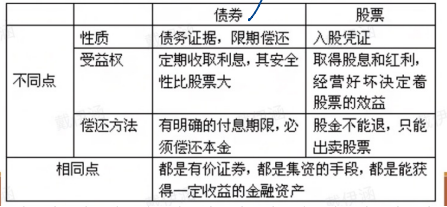
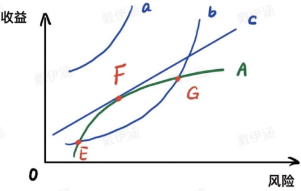
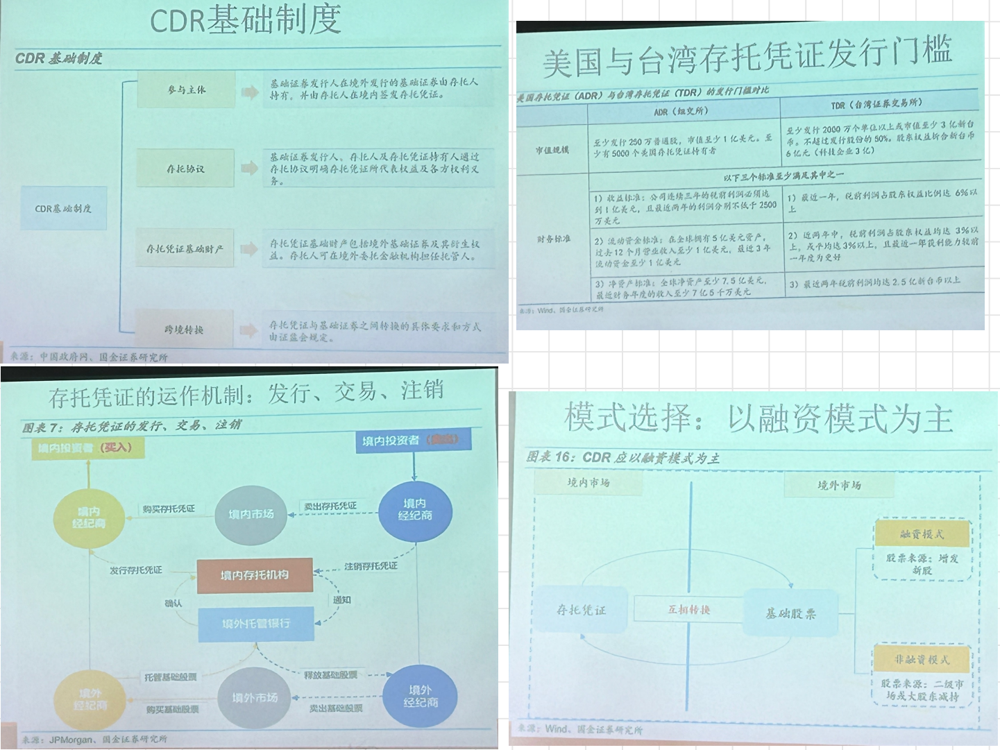

# 第一讲 证券
## 一、证书与证券
### 1. 证书
- 证书是记载一定法律事实或者法律行为的文件，其作用仅仅是证明这种法律事实或法律行为曾经发生
### 2. 证券
#### （1）概念
- 以书面形式或者其他形式加以记载，并**证明或者设定权利为目的而做成的凭证**
#### （2）本质
- 具有**财产属性**的民事权利。证券本身并无价值，其价值在于其代表的民事权利
- **特征**：**证券上不仅记载一定的权利，而且证券本身就代表一定的权利**通常权利与证券相结合，权利存在于证券之上，权利不能离开证券而存在。例如：火车票，电影票

- 证券的存在与权利的存在有密切的关系。依其密切程度可以分为：
1. **金券**：标明一定金额，只能为一定目的而使用，**证券与权利密切结合不可分**，失去金券，无任何补救办法。例如：邮票
2. **资格证券（免责证券）**：表明持有人具有行使一定权利的资格的证券。**义务人向持有证券的人履行义务后即可免责**。例如：车船票、存车牌、银行存折。**特点：一般情况下不可分；特殊情况下，只要权利人能够证明自己的权利，即可分离**。
3. **有价证券**：表示一定的权利，**权利人行使权利必须持有证券，原则上不得离开证券而行使权利**。例如：票据、债券。不持有证券的人按照通常方法证明其权利同样不能行使权利；只有依照法律规定的特殊方法才能行使权利。
    - 完全有价证券（权利的发生、移转、行使均以证券存在为必要）：票据
    - 不完全的有价证券（权利的发生不以持有证券为必要）：股票、债券、仓单
### （3）民商法趋势
- 为了便于流通和交易便捷：权利证券化，证券无纸化（电子化）。
### （4）证券的分类：
1. 是否具有财产价值：无价证券v有价证券
    - 有价证券（代表权利的不同）：金券、货物证券（提单、仓单）
    - 货币证券（代表对一定量货币的请求权的书面凭证，是货币的替代物）
    - 资本证券（代表资本所有权或收益请求权）
2. 设权证券（货币证券）v证权证券（资本证券）
3. 实物式v簿记式
4. 记名与否
5. 挂牌与否（上市与否）
### （5）证券上的权利
- 证券所有权（物质）+ 证券权利（内容）

## 二、证券法上的证券
### 1.  证券与融资
- 投入资金扩大生产 + 借入资金以应急需 $\rightarrow$ 融资
- 融资方式 $\rightarrow$ 内部融资（利润积累） or 外部融资（企业之外）
#### 商品与证券的区别
- 商品：生产的——利用、消费——价值可以客观判断——重在规制格式条款、虚假广告
- 证券：创造的——**本身无价值**，市场有价格——**价值有几何，重在投资者对其盈利性和前景的预期、其他投资者的出价**——**价值判断需要信息**——**重在规制信息披露、防止内部人利用信息优势、信息欺诈**

### 2. 法定定义
>证券并非“一定表现为某种纸质的、符合一定形式要求的证券格式”。证券是因投资于一项共同的风险事业而取得的主要通过他人的努力而赢利的权益（凭证）。

- **特征**：投资凭证+权益凭证+可转让+要式

### 3. 我国证券市场上的证券
#### （1） 股票

- 股票是公司**所有权份额**的凭证。其特点在于公司将自身分成**大小相等**的股份，以股份计算投资者对公司的所有权份额。

- 股份的价值取决于：
  1. **公司本身的价值以及由此决定的市场价格**。eg.市价1亿，发行1000万股，股票价格10元；if市价1.5亿，then股价15元。
  2. **公司已发行股份数**。公司市价给定，那么股价与已发行股份数成反比。

- 股东的权利：收益权+表决权     
  - 收益权：股利+剩余财产分配+股价升值（理论上看，**分红越多，升值越少**，。分红与否，不影响股东总权益。Eg.1.5亿市价，共1000万股，市价15元；拿出1000万分红，股利1元；股价变为14元）

- 股票的种类：普通股&特别股
  - 人民币特种股票
    1. B股（境内发行、外币购买）
    2. H股（香港发行、港币购买）
    3. N股（纽约发行、美元购买）
  - 特别股：优先股、劣后股、混合股。
    - 优先股：累积、转换、可赎回（理由）、固定股利否

- 表现形式：（中国）公开发行采**无纸化**方式，表现为记载的数字。

#### （2）债券
- 债权代表对公司的债权，实质上是一种**债务关系**。
1. 与普通债权的比较：范围、数量、缔约成本
2. 与股票的比较：
  - 资金供给方承担的**风险**不同；
  - 债权投资：资金供给方获得的是资金需求方**到期还本付息**的承诺；
  - 股权投资：资金供给方则可以**按照股权比例分享资金需求方未来的经营利润**，并且可能**按股权比例参与对资金需求方的管理**。

  

3. 债券的价格影响因素：市场利率、公司的资信、市场利率下降债券价格上升
4. 分类：主体分、利率分、抵押担保条件分、偿还期限分
- 特别需要指出的是，“**公司债券尚未现实发行**”，市场上现有的均是依《企业债券管理条例》发行的。

#### （3）基金——证券组合。
- 特点：
  1. 集合理财，专业管理
  2. 组合投资，分散风险
  3. 独立托管，资产安全

  

**效率前沿线**：给定的风险水平下能够获得的最大预期收益率的投资组合的集合。
- 左端点：在该端点处的投资组合具有最低的风险，也即是风险最小化组合，通常由完全无风险的资产或低风险资产组成。
- 右端点：在该端点处的投资组合则具有最高的预期收益，但也伴随着最高的风险。
- 在效率前沿之下的投资组合被认为是次优的，因为它们在相同的风险水平下提供了较低的预期回报，或者在相同的预期回报下承担了更高的风险

**投资随意线**：投资者的投资取向，画出的曲线。表示一个具体的投资者在给定的风险下所要求的基本收益；或在给定的收益下所愿承担的最大风险。
- CML的起点是无风险利率，这表示投资者可以不承担任何风险而获得的回报。从这一点出发，CML向上倾斜，表示随着承担更多风险（通过在投资组合中加入市场投资组合），投资者可以期望获得更高的回报。

**分类**：
1. 开放型v封闭型（基金份额能否赎回）；
2. 契约型v公司型（组织形式）；
3. 成长型、收入型、平衡型（风险收益）；
4. 股票基金、债券基金等（投资对象）

#### （4）权证
- **期权**：期权是一种**买卖选择权**，即在约定的期限内以约定的价格买入或者卖出某种证券的权利。
  1. **看涨期权（Call Option）**：给予买方在未来某个时间以特定价格购买基础资产的权利。如果在到期时，**基础资产的市场价格高于行权价格**，买方可以行使期权以低于市场价格购买资产，从而获得利润。

  2. **看跌期权（Put Option）**：给予买方在未来某个时间以特定价格出售基础资产的权利。如果在到期时，**基础资产的市场价格低于行权价格**，买方可以行使期权以高于市场价格出售资产，从而获得利润。
  
  3. 举例：
  > **看涨期权（点叫权）**：假设你对一个特定的房子很感兴趣，这个房子**目前市场价值是100万美元**。**你认为**由于即将到来的地区发展，这个房子的价值在未来一年内会**显著上升**。但是，你目前没有足够的资金来购买这个房子，或者你不确定房价是否真的会上升。因此，你和房东签订一个协议（相当于买一个看涨期权），**支付给房东1万美元，以获得在未来一年内以100万美元的价格购买这个房子的权利**。
  >- 在这个例子中，1万美元就是**期权费**，100万美元是**行权价格**。
  >- **如果一年后房子的市场价值上升到了120万美元，你可以行使期权以100万美元的价格购买房子，然后立即以市场价值卖出，赚取20万美元（减去期权费）的利润。如果房价下跌，你可以选择不行使期权，你的损失仅限于已支付的1万美元期权费。**

  >**看跌期权（投放权）**：假设你已经拥有一个价值100万美元的房子，但你担心由于某些不利的政策变动，这个地区的房价可能会在未来一年内下跌。为了对冲这个风险，你与一个买家签订了一个协议（相当于卖出一个看跌期权），买家支付给你1万美元，以换取在未来一年内以100万美元从你这里购买房子的权利。在这个例子中，1万美元是你收到的期权费，100万美元是行权价格。如果一年后房价下跌到80万美元，买家可能会行使期权，强制你以100万美元的价格卖出房子，这样买家就能以低于市场价的价格买到房子。即使房价下跌，你也通过卖出看跌期权获得了一些补偿（期权费）。如果房价上升或保持不变，买家将不会行使期权，你则保留房子并且还赚取了1万美元的期权费。

- **行权价与市场价差距越大，期权价值越大**。此外，期权具有**期限性**。

- 分类：欧式权证（仅得在到期日行权）v美式权证（到期前随时可以行权）

- 期权是一种单项权，期货是一种双向权，其实质是一种未履行的购物合同。

#### （5）存托凭证
>存托凭证代表了投资者**持有一家外国公司的股份**。这些凭证在投资者的**本国证券市场**上交易，而不是在股份实际上市的公司所在国的市场上交易。

- 定义：是指由存托人签发、以境外证券为基础在**中国境内发行**、代表**境外基础证券权益**的证券。

- 存托凭证持有人享有境外股票的权益，但存托凭证的报价、交易、结算与当地市场一致，这就避免了跨境交易的诸多不便（如时差，货币结算等）

  

### 4. 其他类证券
#### （1）类似股票的投资份额或权益分享
#### （2）证券衍生产品
>本身不直接代表任何实体资产的所有权，而是其价值和性能依赖于所参考的基础资产。
1. 通常是指从证券等原生资产派生出来的金融产品。

2. 主要类型
- 期货：交易双方在**期货交易所**通过买卖期货合约并根据合约规定的条款约定**在未来某一特定时间和地点，以某一特定价格买卖某一特定数量和质量的商品**的交易行为。

  1. **商品期货 - 石油**：石油公司可能会使用石油期货来锁定未来销售石油的价格。例如，如果该公司预计在六个月后生产出一定数量的石油，它可以通过售卖相应期限的石油期货合同来提前确定销售价格。这样，无论市场价格如何波动，公司都能以合同规定的价格销售其石油。

  2. **农产品期货 - 小麦**：农民可能利用小麦期货来对冲风险。如果农民担心小麦收成时的市场价格可能低于其生产成本，他们可以通过出售小麦期货合同来提前锁定一个更高的销售价格。这样可以降低价格下跌的风险。

- 期权
  - 期权和期货的区别

| **特征**       | **期权**                                                           | **期货**                               |
|----------------|--------------------------------------------------------------------|----------------------------------------|
| **性质**       | 权利合同                                                           | 义务合同                               |
| **权利和义务** | 买方有权利但无义务行使；卖方有义务履行（如果买方选择行使期权）。   | 买卖双方均有履行合同的义务。           |
| **风险暴露**   | 买方风险限于支付的期权费；卖方风险可能较大。                      | 买卖双方均面临较大风险。               |
| **执行时间**   | 美式期权可随时行使，欧式期权只能在到期日行使。                    | 到期自动结算或需要实物交割。           |
| **市场用途**   | 对冲风险和投机。                                                    | 套期保值和投机。                       |
| **资本要求**   | 买方支付期权费；无需保证金。                                       | 需要初始保证金，可能需随市场价值调整。 |
| **合同类型**   | 可以是标准化的也可以定制（场外交易）。                             | 标准化合同，在交易所交易。             |

# 第二讲：证券市场
## 一、概念
- 证券发行和交易活动的场所。
1. 发行市场、流通市场
2. **场内市场、场外市场**  
   - **场内市场**：指在正式的交易所进行的交易，如股票交易所和期货交易所。
   - **场外市场**：指不在正式交易所进行的交易，而是在参与者之间直接进行。这些交易通常涉及股票、债券、衍生品等金融工具。
3. 股票市场、债券市场、基金市场等。
4. **主板市场、创业板市场**
   - **主板市场**：指上市标准最高、信息披露最好、透明度最强、监管体制最完善的证券交易全国性大市场。
   - **创业板市场**：也称二板，是为了适应新经济的要求和高新技术产业发展的需要而设立的市场。

## 二、功能
- 投资、融资、桥梁、资源配置、发现价格、杠杆

## 三、参与者
- 发行主体、投资主体、中介机构、自律组织、监管机构

## 四、运行机制
### （1）股票的价值（风险与投资）
- 风险决定收益，一般来看，**风险越大，收益越高**。股票的风险被区分为**系统性风险**和**非系统性风险**。
  - **系统性风险**和该类股票市场整体相关
  - **非系统性风险**和发行股票公司的具体风险相关。
- **投资者通过投资不同的股票，可以分散投资风险，规避非系统性风险**。简而言之，如果投资者的投资组合中包含了整个股票市场的所有股票，那么影响投资者投资价值的将仅仅是股票市场的整体风险，而非某个具体股票的特殊风险。因此，决定某种股票价格的，也并非该股票的特殊风险，而是其可以产生的未来现金流。但是，具体某只股票未来产生现金流的大小，目前是未知的，只能来自于投资者的预期。因此，**股票的价值依赖于所有投资者的预期总和。而投资者的预期。则依赖于人们对该股票有关信息的判断**。

### （*）未来现金流与信息披露

>- 决定某种股票价格的，也并非该股票的特殊风险，而是其可以产生的未来现金流，**某只股票的现金流（与持有或投资于股票相关的现金流入和流出）取决于投资者的预期**
>- 股票的价值依赖于所有投资者的预期总和——依赖于公司的各种重要信息做判断

### （2）有效市场假设（股票市场的有效性）
- **股票市场的有效性**：股票价格能否**反映所有相关信息**。
- 假定在一个完善的市场、交易成本为零的情况下，**股票市场的价格一定会反映所有的相关信息。这就是一个有效市场**。为了检验股票市场的有效性，砝码（Fama）在1970年提出了有效市场假定理论。
- 砝码（Fama）将**股票市场的有效性按照股票价格对信息的反映程度**，区分为**弱势有效，准强式有效和强式有效**三类。
  - **弱势有效**：股票价格反映了所有股票的历史价格信息
  - **准强式有效**：股票价格反映了所有公开信息
  - **强式有效**：股票价格反映了所有信息，无论是否公开。

### （3）证券市场有效的运行机制
>有效市场假定确定了检验股票市场是否有效的基本条件，就是看不同信息在股票价格中的反映速度。在砝码的假定中，股票市场是不存在交易成本的，信息的处理和获得也是不需要交易成本的。实际的市场当然并非如此。但是。人们认为，**即使在交易成本存在的情况下，股票市场也会趋向于有效**。

#### 1）交易机制
>**信息是通过不同投资者的交易反映到股票价格上来的，股票市场的价格机制将迫使市场趋向于有效**。这种有效的机制包括：
1. **完全知情下的交易**：在信息为所有投资者都知道和了解的情况下，这些投资者的交易会使得该信息立刻反映到股票价格中去。
2. **职业投资者知情的交易**：
在很多情况下，尽管信息是公开的，但是**一般投资者并不能了解该信息**，例如，上市公司披露的年报是公开信息，但是一般投资者也许并不能读懂其中的财务信息，这些信息也许只有专业的股票分析人员才能理解和消化，不过在这种交易机制下，**懂得这些信息的职业投资者的交易很快会将信息反映到股票价格中去**，即使该信息没有为所有投资者理解。
3. **信息派生交易**
在很多情况下，一些信息也许是保密的和非公开的，只有少数内部人士才能获得。但是，这些**内部人士的交易行为可能使得该信息为市场解密，而反映为股票价格**，这种解密可以区分为**交易解密**和**价格解密**：
   - **当投资者可以通过观察内部人士的交易行为推测有关信息存在时，可以称为交易解密**。例如，观察公司总裁的股票交易行为，可以推测该人是否掌握内部信息，当内部人士的交易规模足够大，可以引起股票价格变动时。
   - **投资者也可以从该股票的价格波动中推测有关信息的存在，这被称为价格解密**。例如，实践中，很多上市公司收购的信息发布之前，被收购公司的股票价格已经持续攀升，不过，完全有效的价格解密还只是在理论上存在。
4. **无知交易**
一些信息，市场上没有任何个人能够获知，例如投资者对某股票的不同预期会相互抵消。因此，没有人事先知道市场整体对某只股票的预期，尽管这样的信息非常重要。这样的信息只有在**所有投资者都交易之后才能汇总反映到股票价格中去**。

#### 2）信息的交易成本
> 信息成本包括**信息获得成本、信息处理成本和信息证实成本**。信息的分布是否广泛，和信息成本的大小成反比。通过交易机制，信息分布的广泛性和股票市场的有效性密切相关，信息分布越广泛，股票价格反映该信息就越迅速。因此，**提高股票市场有效性的关键在于减少信息成本**。

- 资本市场发展出许多技术以减少信息成本，从而促进资本市场的有效性：
  1. 强制性信息披露制度强制要求发行人必须披露相关信息，减少了整个市场的信息获得成本；
  2. 证券分析师的存在，使得对信息的处理专业化，减少了信息处理成本；
  3. 市场也发展出一些减少信息证实成本的机制，例如由信誉中介机构出面担保信息的真实性；或者由国家宣布对提供虚假信息者加以刑事或者行政的处罚，等等。

#### 3）信誉中介机构——减少信息成本的有效机制
- 发行人提供的信息无法在事先全部证实，而且存在发行人在出售股票后改变自己承诺的动机，投资者的**信息证实成本过高**。
- 减少信息证实成本的方法：
  1. 发行人通过**对信誉的投资**减少投资者的疑虑，向投资者表明，发行人更注重信誉而非股票出售价格。不过，由于发行人并非资本市场的常客，这种信誉投资往往不太可行。
  2. **信誉中介机构**因此应运而生，他们通过**向发行人出借自己的信誉而减少信息证实成本**。例如，由投资银行作为承销商，向投资者表明他们已经调查和评估了该股票，并参与了发行人的信息披露活动，他们愿意用自己的信誉担保发行人提供的信息真实性。由于投资银行是资本市场的“重复博弈者”，他们的信誉担保显然比发行人更为可信。
  3. **会计师、律师等社会中介机构**在其中起的作用和投资银行类似，也都是信誉中介机构。

## 五、中国证券市场的特点
- 股权集中、国有股等是大股东

## 六、证券交易市场——流通市场
### 1. 证券市场的结构
- 证券交易市场的目的就是为股东提供**流动性**——退出机制（股权换钱）
- 对交易市场的**监管**主要表现为两个基本方向：
  1. **控制交易行为**。即对经纪人、交易商、投资者和交易所的行为进行控制，防止市场的操纵和过度投机；
  2. **控制上市公司的某些行为，使交易者获得真实信息，在公平基础上交易**。例如：规定会计准则、信息披露规则，以及通过代理权征集、收购兼并获得公司控制权和内幕交易等。

### 2. 证券交易市场的基本分类：场内市场&场外市场
#### （1）场内市场（交易所市场），
>在正式的证券交易所内进行的交易活动。这些市场通常受到严格的监管，交易过程标准化、透明度高，且交易信息公开。
- 主板、中小板、创业板
- 对应的企业为上市公司
#### （2）场外市场
>在正式交易所之外进行的证券交易，场外市场为投资者提供了更为灵活的交易方式和金融产品，但同时也需要投资者对交易对手的信用状况有更高的警觉。
- 新三板
- 对应的企业均为非上市公司
#### （3）取缔场外非法市场
>目前在中国现实中，存在于交易所之外的合法证券交易，主要包括两类的	**通过产权交易所的非上市公司股份的转让**；另一类是**证券商的代办股份让业务**。
##### 非公开发行公司的股权转让——产权交易所
>产权交易所作为产权交易的中介服务机构，它本身并不参与产权交易，只是为产权交易双方提供必要的场所与设施及交易规则，保证产权交易过程顺利进行。
1. 产权：非公司制企业的产权或部分产权、股权、知识产权、其他。
2. 程序：登记、披露信息、受让方征集、签约、结算、变更登记（过户）
3. 管辖：地方政府
##### 证券公司代办业务股份转让市场（三板市场）
>新三板指全国性中小企业股份转让市场，为那些还未上市的中小微企业提供股权交易的场所，准入门槛低，企业质量层次不齐。

# 第三讲  证券法
## 一、证券市场和证券法的关系
>股票没有固定还本付息的承诺，**股票的回报取决于公司管理层的努力经营和诚信。**这种依赖于他人努力的投资方式面临严重的**信息不对称**难题。处于中小地位的中小股东投资者，面对经理或者控股股东滥用控制权，以牺牲小股东利益谋取私利的风险。因此，理性的投资者就会要求融资者必须支付更大的折价，以补偿他们在股票投资中承担的额外风险。

### 1. 两种市场
在这种信息不对称下，一个自然演变的股票市场可能达到两个完全不同的均衡：

- **柠檬均衡**——由于没有足够能力辨识公司的诚实与否，投资者只有假设所有发行股票的公司都是**不诚实**的，其愿意支付的价格必须在股票的真实价值上再打一个折扣。这种低价使得诚实公司拒绝在这个市场上发行股票，因为市场无法给予他们的股票应有的价值，而诚实公司的离去会进一步加剧股票市场的恶化，渐渐使得次优的公司也离开，最终形成**劣币驱逐良币**的现象

- **第二种均衡**：投资者因为可以区分诚实与不诚实的公司，从而可以对不同的公司股票予以不同价格，鼓励了诚实公司的股票发行提升了市场上股票的平均质量，也提升了股票的价格，从而鼓励更多诚实者发行股票，最终发展处一个强大的股票市场

### 2. 两类投资者
大股东——无需保护
中小投资者——信息不对称——风险更大（经理人与控股股东的道德风险）——需保护

### 3. 资本市场需要证券法保驾护航
>为了防止股票落入第一种均衡而发展出强大的股票市场，法律应当为投资者提供足够的保护。同时，较高的投资者保护水平和较高的股票市场市值高度相关，所以法律对**中小投资者**的保护强弱对该国公司的外部融资和股票市场规模影响巨大，这要求法律和相关制度必须使得少数股东能够：
  1. 获得判断公司商业价值的充分信息
  2. 确信公司内部人员不会通过“自我交易”诈取他们投资的大部分，或者全部价值

## 二、中国《证券法》的立法历程
>2019年《证券法》主要变化
>- 市场化：**全面废除核准制，改采注册制**
>- 法治化：欺诈责令回购制度（24）、投资者适当性管理（88）、责任精确到人（85）、集团诉讼（95）、行政执法和解（171）、奖励举报（176）、上市公司不得滥用停牌权（110）、废止暂停上市、加大证监会执法权限（218）
>- 现代化：存托凭证等证券扩张、证券交易场所
>- 数字化：投资者个人信息保护（41）、程序化交易（45）、中登信息化服务（147）

## 三、《证券法》和《公司法》的关系
- 在股票发行和交易方面，《证券法》为《公司法》的特别法，在两个法中均有规定的，应当优先适用《证券法》，只有在《证券法》没有规定时，才能以《公司法》作为补充
- 我国司法实践中，法院一般承认在涉及上市公司活动的领域，中国证监会的规章和规范性文件有效，应当得到优先适用

## 四、证券法的基本原则
### 1. 公开、公平和公正原则
> 《证券法》第三条：证券的发行交易活动，必须实行公开、公平、公正的原则
- 公开：证券监管的核心理念，即**强制信息披露**的要求：
  1. 证券公开发行时，必须公开披露相关信息
  2. 发行之后上市公司还需要履行持续信息披露义务
- 公平：给予合法投资者平等进入市场交易的机会，适用同样的交易规则，拥有同等的权利获得信息
- 公正：每个市场主体都应均等适用相同的法律，平等对待交易各方（针对立法者、司法机构、证券主管机构）
### 2. 诚实信用原则
> 《证券法》第四条：证券发行、交易活动的当事人具有平等的法律地位，应当遵守自愿、有偿、诚实信用的原则
- 诚实信用原则被认为是民法中的帝王条款，可以用于填补法律漏洞

## 五、《证券法》的地位
- 《证券法》是《商法》的特别法、《公司法》的特别法。优先适用证券法，补充适用公司法。

# 第四讲  证券发行

- 是指证券发行人依照法定程序将自己的证券出售或交付给投资者的行为。
- 股票公开发行，**实质发行人**通过**证券经营机构**向发行人以外的社会公众就发行人的股票作出的**要约邀请、要约或者销售行为**。（彭冰）

- 发行关系的性质
>彭冰：发行法律关系其实是发行人和投资者之间的**股票买卖**关系。\
陈甦：证券法律法规中对有关证券发行活动使用“销售”、“发售”等词语，只是借用交易活动中的常用术语以形象地描述发行过程中的某些活动，并**不意味着证券发行是一种交易活动**，**也不意味着证券发行人与投资者之间是一种买卖关系**。证券发行是一种**筹资活动**而不是交易活动，发行人是以提供投资机会为条件，向投资者募集资金，证券不过是投资者在出资之后其投资权益的证明和代表。

- 发行人：股份有限公司、**在一定期间内再次销售者**（承销商）、发起人。
- 张三将够得的股票快速转出，相当于承销商，看似是买卖行为，实际上是公开发行。

## 一、股票公开发行的界定
> 股票发行市场的目的在于有效的汇集社会储蓄资金。 为达到这一目标，股票发行市场必须保护投资者的合法利益
>- 筛选出最有效益的企业作为投资目标，使投资者有利可图
>- 坚定投资者的信心，使其相信企业不会浪费或者剥夺他们的资金
>- 非公开发行的证券不应该受到审批、核准或者注册制的要求

- 公开发行的界定
  - 向**不特定对象**发行证券
  - 向**特定对象**发行证券累计**超过200人**
  - 公开发行证券，不得采用广告、公开劝诱和变相公开方式。

## 二、界定股票公开发行的原则——保护之必要
> **界定股票公开发行的原则**
  >- 公开发行——需要核准
  >- 非公开发行——无需核准 
  >- 诉求核准（注册）的立法目的——只有在需要证监会核准程序保护的情况下，采应当将该行为划入公开发行的范围。
  >- 相比收益而言，核准的成本过高——“小额发行豁免”

- 根本目的在于**保护投资者**，但是这并不是绝对的，保护不能过分阻碍企业融资的便利（两者需要利益衡量）
- 发行准核程序使得证券发行人必须向投资者披露相关的信息，但是这无疑增加了企业融资的成本
  - 信息披露以及材料准备
  - 支付承销商或中介机构的费用
  - 时间成本
  - 维护政府机构核准制的成本
- 所以，不要求所有的证券发行都要经过核准程序

## 三、界定股票发行的相关因素
### 1.发行
#### （1）发行的内涵
- 包括要约（要约邀请）+ 交付
#### （2）发行与交易
- 简单划分：
  - 一级市场是**发行市场**：涉及的是发行人**创设**证券，并**交付**给投资者
  - 二级市场是**交易市场**：将已经发行完毕的证券在投资者之间**相互买卖**和交易
- 复杂情况下，简单划分的问题：
  - 公司回购股份并奖励给职工——是否构成发行？
  - 简单划分的问题在于，发行人可以利用中介转售来规避对公开发行的监管
  - 举例：P45-46
  - 美国：界定“承销商”的概念——任何在购买时即意图此后销售证券的人，都构成承销商，其销售证券的行为被界定为发行
#### （3）发行主体
- 一般：独立法人
- 问题：将一次大的融资计划分割为不同发行主体分别进行，迷惑投资者
- 以**实际控股人**作为实际发行主体进行认定
### 2.特定对象
- 某一发行群体是否特定，在于**划定该范围的方法**与**界定公开发行**之间的目的是否相关。简单说，就是**将发行对象范围特定化的方法是否符合发行核准的立法目的**。换言之，**是否需要证券法的保护是根本**。具体而言，**该投资者是否能够获取所需信息，是否有能力对此信息进行分析、决策**
- 界定发行对象是否特定，应当看该发行对象是否需要发行核准程序保护
  - 投资者是否能获取所需要的相关信息
  - 是否有能力依照信息进行分析
  - **成熟投资者**
    - **客观标准**：投资经验+与发行人的关系+财富标准 
    - **主观标准**：发行人**合理的相信**，投资者具备应有的商务知识经验，可以评估投资价值与风险。但人数受到限制
### 3.人数
- 超过两百人（不包括200人）
### 4.累计
- 防止“拆分”发行
- 采用无限制累计
### 5.发行方式
> “非公开发行证券，不得采用广告、公开劝诱和变相公开的方式”
#### （1）广告、公开劝诱的主体
- 发行人自己
- 发行人的代理人——**承销商**
- 注意：发行人符合非公开发行要求，但是符合成熟投资者的某个公司搜集了非公开发行的信息，分类汇编后向社会公众提供，此时，广告、公开劝诱不能认定为是发行人或者其代理人做出的
#### （2）广告、公开劝诱的范围
- 在限制广告和公开劝诱的发布范围时，需要考虑受众是否符合**成熟投资者**的标准
#### （3）广告、公开劝诱的内容
- 吸引潜在投资者对非公开发行证券的兴趣
- 产品宣传不应该在禁止范围之内
- 由于对非公开发行证券投资者的成熟要求，应当可以将非成熟投资者排除在购买者之外，从而证券法豁免对非公开发行证券的保护不会损害这些非成熟投资者
### 6.其他豁免可能
- **小额发行豁免**：在金额不大的情况下，公开发行的成本可能超过收益，因此，应当免于发型准和程序

### 7.分类
#### （1）股票发行v债券发行  
#### （2）公募发行v私募发行（不公开、定向、内部、私下发行）
- 私募发行：是指企业不通过公开市场，而是向**特定的投资者群体**（如机构投资者或合格的个人投资者）发行证券的过程。这种发行方式与公开发行相对，**不需要向公众广泛募集资金，也不需要遵循严格的公开发行规则，如注册和披露要求**。
#### （3）招标v非招标  
#### （4）直接v间接  
- **直接发行**：是指企业直接向公众或特定投资者发行证券的过程。
- **间接发行**：涉及到金融中介，如银行或投资银行，它们在企业和投资者之间发挥桥梁作用。在间接发行中，企业不是直接向投资者筹集资金，而是通过金融中介来完成。

#### （5）初次v增资  
- 初次：第一次融资
- 增资：第一次以后的发行
#### （6）平价、溢价、折价
- 面值100就卖100 $\rightarrow$ 平价
- 面值100卖150  $\rightarrow$ 溢价
- 面值100就卖80  $\rightarrow$ 折价\
注意：中国不允许折价发行

## *无限制累计
- **无限制累计**计算的是从第一次发行开始，一直到本次发行的人数
- 累计计算的是公司**所有股东人数**，而非某次发行中的投资者人数
- 无限制累计计算，超过200人就纳入公开发行的范畴，固然有利于加强对投资者的保护，但是监管范围的扩大面临两个难题：
  - 现存股东人数超过200人的公司数量庞大
  - 由于股东向多人转让股份，可能导致股东人数超过200人，在公司的控制能力之外

## 四、发行审核
>核心问题——促进融资v投资者保护
### 1. 两种体制
#### （1）注册制  
- 形式审查，**只要求披露，不实质审查**，主体自主、效率较高，采取**事后责任**追究的机制

#### （2）核准制  
- **实质审查**，确保一定价值，投资者易生信赖。但是**周期长、政府干预较多**。
- 在核准制下，股票发行不以真相公开为已足，尚须符合一定的实质条件，法律或排除某种证券，或规定公司成立过程使其符合股东公平出资原则，或考虑上述以及其他经济因素而授予主管机关广泛的裁量权。
- 在大多数情况下，核准制中行政机关的实质判断一般**仅仅及于投资价值的判断，而不会涉及披露信息的真假**。

### 2. 我国的审核体制
- 1993《公司法》审批制——强干预（审核机构说谁就是谁）
- 1998年《证券法》股票核准、债券审批
- 2005核准制
- 2019注册制

趋势：市场主体选择的注册制——注册后审查——加强自律，提高效率

## 五、发行条件
### 1. 证监会对国企改制首次公开发行并上市的实质条件
- 持续经营时间三年、注册资本足够缴纳、符合国家产业政策、主营业务和董事、高级管理人员没有发生变化，实际控制人没有实质性的变更
- 业绩明确+风险显露 $\rightarrow$ 可公开发行

### 2. 股票发行的一般要求
#### （1）同股同权，同股同价
- 同种类的每一股份应当享有同等权利，同次发行的同种类股票，每股的发行条件和价格应当相同。
#### （2）禁止折价发行

#### （3）股票的形式
- 股票公开发行和交易的无纸化
- 股票全部采用记名方式

### 3. 设立发行股票
- 符合《中华人民共和国公司法》
### 4.公司首次公开发行新股的条件
1. 组织机构健全且运行良好
2. 具有持续盈利能力 $\rightarrow$ 经营能力
3. 财务状况良好 $\rightarrow$ 删除，亏损公司也能
4. 最近三年财务会计文件无虚假记载 $\rightarrow$ 会计报告被出具无保留意见审计报告，无其他重大违法行为（删除）5. 募集资金使用符合规定

- 公司对公开发行股票所募集资金，必须按照招股说明书或者其他公开发行募集文件（新增）所列资金用途使用
- **改变资金用途**，必须经股东大会作出决议
- 擅自改变用途，未作纠正的，或者未经股东大会认可的，不得公开发行新股

### 5. 上市公司公开发行证券的条件
#### （1）一般条件
- 见“公司首次公开发行新股的条件”
#### （2）特别条件
- 配股、增发新股
  - 配股，又称为权利发行。是公司向现有股东**按其持股比例发行新股票的方式**。股东会获得认购新股票的优先权。配股通常以**低于**市场价格的价格提供，作为对现有股东的一种**激励**
  - 增发新股，或称为配售，是公司在公开市场上向新老股东增发新股的一种方式。与配股不同，增发新股不一定提供给现有股东，**也可能针对新的投资者**。

## 六、股票发行程序

### 1. 首次发行并上市
股东大会决议 $\rightarrow$保荐、申报（20万受理费） $\rightarrow$监事会受理申请（5日内决定）、初审（发行监管部、合规性）和预披露 $\rightarrow$发行委审核（投票表决，又称“上会”） 【注册制后发审委已废止】 $\rightarrow$会后事项和核准（披露的实效性，受理后3个月内答复；披露事项无变更，办理封卷手续；申请人需要提交无重大事项发生的承诺函） $\rightarrow$期限（超过3个月，退回重新申请）和复议（60日内申请复议，60日内作出决定） $\rightarrow$发行（核准后的6个月内）（公告 $\rightarrow$承销（≤90天）  $\rightarrow$ 认购与配售 $\rightarrow$超额配售选择权  $\rightarrow$ 发行方式） $\rightarrow$ 上市（2006年之前，联动，只要是公开发行的股票，一定会上市交易，只有通海高科一例失败；2006年之后，上市与否则看是否满足证券交易所的上市条件，不再由证监会负责）。

### 2. 上市后发行
股东大会决议 $\rightarrow$ 核准 $\rightarrow$ 发行

## 七、私募
### 1.定义
- 对特定人为招募有价证券之行为。
### 2. 一般程序
- 决议、提供信息、备案
### 3. 私募对象的资格与人数
1. 金融机构：银行、证券、保险、信托、票券等业 $\rightarrow$ 无人数限制
2. 具备专业知识且资力丰厚的自然人、法人或基金
3. 公司或关系企业的董事、监事和经理 $\rightarrow$ 我国小于200人  我国台湾地区35人
4. 转售的限制
   - 不限制持有期间（**随时可以转售**），但应符合特定条件。
     - 金融机构之间的限制
     - 依法所生移转（如继承、强制执行）：这些情况通常指的是因法律行为而非市场交易导致证券所有权变更的情形。
     - 数量（少于1000股）
     - 时间（前后两次之间不少于3个月）\
     （防止以私募之名，行公开发行之实  $\rightarrow$  过大规模的转售）
   - 根据持有期间长短进行限制或放开

## 八、公司债的发行条件
>公司债是由私营企业发行的用以筹集资金的**债券**。企业可能会发行公司债以融资进行扩张、投资、并购、研发或者用于企业的日常运营。公司债通常是有**固定期限**的，到期后债券持有人可以得到本金的返还。在债券的有效期间内，债券持有人通常会收到定期的利息支付，

### 1. 积极条件
>**第十五条**\
公开发行公司债券，应当符合下列条件：\
（一）具备健全且运行良好的组织机构；\
（二）最近三年平均可分配利润足以支付公司债券一年的利息；\
（三）国务院规定的其他条件。\
公开发行公司债券筹集的资金，必须按照公司债券募集办法所列资金用途使用；改变资金用途，必须经债券持有人会议作出决议。公开发行公司债券筹集的资金，不得用于弥补亏损和非生
产性支出。上市公司发行可转换为股票的公司债券，除应当符合第一款规定的条件外，还应当遵守本法第十二条第二款的规定。但是，按照公司债券募集办法，上市公司通过收购本公司股份的方式进行公司债券转换的除外。
### 2. 消极条件
>**第十七条** \
有下列情形之一的，不得再次公开发行公司债券：\
（一）对已公开发行的公司债券或者其他债务有违约或者延迟支付本息的事实，仍处于继续状态；\
（二）违反本法规定，改变公开发行公司债券所募资金的用途。

## 九、公司债发行报送的文件
>**第十六条**\
申请公开发行公司债券，应当向国务院授权的部门或者国务院证券监督管理机构报送下列文件：\
（一）公司营业执照；\
（二）公司章程；\
（三）公司债券募集办法；\
（四）国务院授权的部门或者国务院证券监督管理机构规定的其他文件。\
依照本法规定聘请保荐人的，还应当报送保荐人出具的发行保荐书。

## 十、发行失败
>国务院证券监督管理机构或者国务院授权的部门对已作出的证券发行注册的决定，发现不符合法定条件或者法定程序，**尚未发行证券的，应当予以撤销，停止发行**。**已经发行尚未上市的，撤销发行注册决定，发行人应当按照发行价并加算银行同期存款利息返还证券持有人**；**发行人的控股股东、实际控制人以及保荐人，应当与发行人承担连带责任，但是能够证明自己没有过错的除外**。股票的发行人在招股说明书等证券发行文件中隐瞒重要事实或者编造重大虚假内容，已经发行并上市的，国务院证券监督管理机构可以责令发行人回购证券，或者***责令负有责任的控股股东、实际控制人（幕后大佬）***买回证券。

**说明**：
- 公司债已经发行尚未上市，这通常是指公司债券已经通过私募或公开发行的方式销售给了投资者，但是还没有在公开的证券交易所进行交易。
- 发行指的是公司首次向投资者销售其证券（股票或债券）的行为，无论是通过私募还是公开募股（IPO）。
- 上市是指一家公司的股票或债券被批准在证券交易所进行交易的过程。
- 关系：一般而言，公司发行证券后，可能会选择将其证券上市，但这并不是必须的。

# 第五讲 证券承销
## 一、概述
### 1. 概念
>证券承销是指承销团队（通常由一家或多家投资银行组成）在证券发行过程中的一系列活动，旨在帮助发行人（如公司或政府）将新发行的证券成功销售给公众或机构投资者。
### 2. 方式  
#### （1）包销
>证券代销是指证券公司代发行人发售证券，在承销期结束时，将未售出的证券全部退还给发行人的承销方式。

#### （2）代销
>证券包销是指证券公司将发行人的证券按照协议全部购入或者在承销期结束时将售后剩余证券全部自行购入的承销方式。
#### （3）区别的意义
- 风险不同，所以佣金多少也不同。

### 3、承销商资格
- 证券公司、资金管理公司等

## 二、承销协议 
>证券公司承销证券，应当同发行人签订代销或者包销协议，载明下列事项：
（一）当事人的名称、住所及法定代表人姓名；
（二）代销、包销证券的种类、数量、金额及发行价格；
（三）代销、包销的期限及起止日期；
（四）代销、包销的付款方式及日期；
（五）代销、包销的费用和结算办法；
（六）违约责任；
（七）国务院证券监督管理机构规定的其他事项。

## 三、承销中需遵守的义务
1. 保证募集文件的真实、准确、完整的义务
2. 禁止非法承销的义务
3. 不得预先自留股票的义务

## 四、承销团
>第三十条 
向不特定对象发行证券聘请承销团承销的，承销团应当由主承销和参与承销的证券公司组成。

- 强制to自主

  - 实践中，超过人民币五千万元的非常常见，但在股票发行供不应求的情况下，一家承销商即可完成承销任务。此时，为了合规，不得不在形式上拉一个、盖个章，所谓“造假合规”，原因是规定不合理。

## 五、承销期及其届满
1. 承销期的法定：不得超过九日
2. 期满发行失败的后果
>第三十三条 
股票发行采用**代销**方式，代销期限届满，向投资者出售的股票数量未达到拟公开发行股票数量**百分之七十**的，为发行失败。发行人应当按照发行价并加算银行同期存款利息返还股票认购人。
3. 期满的报告备案
>第三十四条 
公开发行股票，代销、包销期限届满，发行人应当在规定的期限内将股票发行情况报国务院证
券监督管理机构备案。

# 第六讲 证券上市
## 一、概念
- 证券上市是指公开发行的有价证券，依照法定条件和程序，在**证券交易所**或其他依法设立的交易市场**公开挂牌交易**的行为。
## 二、上市条件
>**证券交易所上市规则规定的上市条件**，应当对发行人的经营年限、财务状况、最低公开发行比例和公司治理、诚信记录等提出要求。
- 原先是具体规定
## 三、删除暂停上市制度
## 四、终止上市（退市）
>退市（Delisting）是指一家公司的股票**从证券交易所的正式名单中移除，不再在该交易所上市交易的过程**。退市可以是自愿的，也可以是强制性的

>第四十八条 
上市交易的证券，有证券交易所规定的终止上市情形的，由证券交易所按照业务规则终止其上市交易。证券交易所决定终止证券上市交易的，应当及时公告，并报国务院证券监督管理机构备案。

>第四十九条 
对证券交易所作出的不予上市交易、终止上市交易决定不服的，可以向证券交易所设立的复核
机构申请复核。

>特别处理制度：特别处理（ST）和退市风险警示（*ST）是针对那些面临一定财务困境或者不符合上市规则的公司而设立的特殊制度。

# 第七讲 证券交易
## 一、交易程序
- 开户  $\rightarrow$ 委托 $\rightarrow$ 成交 $\rightarrow$ 清算与交割 $\rightarrow$ 过户
>- 委托是指投资者向证券公司发出的买入或卖出证券的指令
>- 成交后，交易双方需要完成清算与交割过程。清算是指确定交易双方的应收应付关系，确保资金和证券的准确无误地交换。交割是指实际转移证券和资金的过程。
>- 过户是指将卖方名下的证券登记为买方名下的正式过程。

## 二、交易规则变化
### 1. 交易场所
- 证券交易所
- 国务院批准的其他证券交易场所
### 2. 交易方式
>第三十八条 证券在证券交易所上市交易，应当采用**公开的集中交易方式**或者国务院证券监督管理机构批准的其他方式。

>公司法第一百三十九条 **记名股票**，由股东以**背书方式**或者法律、行政法规规定的其他方式转让： 转让后由公司将受让人的姓名或者名称及住所记载于股东名册。

>第一百四十条 **无记名股票**的转让，由股东将该股票**交付**给受让人后即发生转让的效力。

- 背书是指在票据（如支票、汇票、本票等）背面签字或盖章，以证明其所有权转让的行为。

### 3. 交易种类
- 已允许**融券交易**，区分现货与融券交易已经没有必要

>- **现货交易**是指以即时价格买卖金融工具的交易方式，交易一旦成交，交易双方需即刻交割资产和现金。
>- **融券交易**是指投资者从券商**借入股票**（或其他资产），并立即卖出，**预期在未来以较低价格买回同等数量的股票还给券商**，从而获利的交易方式。融券交易常用于做空，以期待股价下跌。

## 三、交易限制
### 1. 公司法的卖出限制
>公司法第一百四十一条 
>1. **发起人股份锁定期**：公司发起人在公司成立后的一年内，不得转让其持有的公司股份。
>2. **股份上市前股份锁定期**：公司在证券交易所上市交易前已发行的股份，自股票上市之日起一年内不得转让。
>3. **董监高股份转让申报**：公司的董事、监事、高级管理人员必须申报他们持有的公司股份及其变动情况。
>4. **董监高股份转让限制**：在任职期间，董事、监事、高级管理人员每年转让的股份不得超过其所持有公司股份总数的25%。
>5. **董监高上市后股份锁定期**：董事、监事、高级管理人员所持公司股份自公司股票上市交易之日起一年内不得转让。
>6. **董监高离职后股份锁定期**：上述人员离职后半年内，不得转让其所持有的本公司股份。
>7. **章程可设进一步限制**：公司章程可以对董事、监事、高级管理人员转让其持有的公司股份设定其他限制性规定。

### 2. 证券法的卖出限制
>第三十五条 证券交易当事人依法买卖的证券，必须是依法发行并交付的证券。**非依法发行的证券，不得买卖。**

>第三十六条 依法发行的证券，《中华人民共和国公司法》和其他法律对其转让期限有限制性规定的，在限定的期限内不得转让。 （指引性规定）**上市公司持有百分之五以上股份的股东、实际控制人董事、监事、高级管理人员，以及其他持有发行人首次公开发行前发行的股份或者上市公司向特定对象发行的股份的股东**，转让其持有的本公司股份的，不得违反法律行政法规和国务院证券监督管理机构关于持有期限、卖出时间、卖出数量、卖出方式、信息披露等规定，并应当遵守证券交易所的业务规则。

#### 总结与比对

下面是根据上述内容总结的公司法和证券法在卖出限制方面的异同，表格形式如下：

|       | 公司法                                                        | 证券法                                                                                    |
|---------|---------------------------------------------------------------|-------------------------------------------------------------------------------------------|
| **发起人股份锁定期** | 发起人在公司成立后一年内不得转让其持有的公司股份。                  |                                              |
| **上市前股份锁定期** | 公司股票上市前已发行的股份，在上市之日起一年内不得转让。             | 同公司法。                                                                               |
| **董监高股份锁定期** | 董监高在任职期间每年转让股份限制为所持股份总数的25%，上市后一年内不得转让，离职后半年内不得转让。 | 上市公司的大股东、实际控制人、董事、监事、高级管理人员等在特定条件下的转让限制。 |
| **法律适用范围**    | 公司法主要适用于公司内部人士的股份转让。                            | 证券法适用于所有证券交易当事人，并对大股东、实际控制人等有特定规定。                         |
| **股份转让申报**    | 董监高需申报其持股及变动情况。                                       | 对于大股东、实际控制人等信息披露有相应规定。                   |

### 3. 证券法的持有、卖出限制
>第四十条 
上述法条的要点总结如下：
>1. **交易限制**：证券交易场所、证券公司、证券登记结算机构的从业人员，证券监督管理机构的工作人员，以及法律、行政法规规定禁止参与股票交易的其他人员在任期内或法定限期内，不得直接或间接持有股票或其他具有股权性质的证券。
>2. **禁止化名或借名交易**：上述人员不得使用化名或借用他人名义持有或交易股票或其他具有股权性质的证券，也不得接受他人赠送的这类证券。
>3. **原有股票处理**：如果上述人员在任职前已持有股票或其他具有股权性质的证券，必须依法进行转让，即不能在任职期间持有。
>4. **特例**：对于实施股权激励计划或员工持股计划的证券公司从业人员，允许他们按照国务院证券监督管理机构的规定持有和卖出本公司的股票或其他具有股权性质的证券。 

## 四、短线交易
>短线交易，也称为日内交易或短期交易，是一种**在很短的时间内买卖股票或其他金融工具的策略，目的是从市场的小幅波动中获利**。与长期投资战略相比，短线交易更加关注市场即时动态和技术分析。

>**第四十四条**
>1. **关联人短线交易的定义**：上市公司内部人（包括持股5%以上的股东、董事、监事、高级管理人员）以及他们的直系亲属或利用他人账户持有的股票，如果在买入后六个月内卖出，或者在卖出后六个月内买入，构成短线交易。
>2. **短线交易的后果**：这些关联人通过短线交易所得的收益应当归还给公司。
>3. **执行责任**：公司董事会有责任收回这些收益。
>4. **股东的权利**：如果董事会不执行收回利润的规定，股东可以要求董事会在30日内执行。
>5. **法律诉讼**：董事会如果在规定期限内仍未执行，则股东有权代表公司利益向人民法院提起诉讼。
>6. **董事的法律责任**：不执行规定的董事将依法承担连带责任。
>7. **例外情况**：某些情况下，如证券公司因包销剩余股票而持有5%以上股份，或国务院证券监督管理机构规定的其他情况，不适用于上述短线交易规定。

- **豁免新增**：做市商如果持股5%以上，不断买入卖出，属于其义务所在，其收益不应收归公司，应予以豁免。

- **做市商**（Market Maker）是金融市场上的一类参与者，他们通过持续提供买入价（Bid）和卖出价（Ask），即双边报价，来为特定证券提供流动性和交易便利。

## 五、归入权

### 1. 含义
>归入权是指公司依照公司法或证券法的规定所享有的**将公司负责人违反其对公司所负法定义务而获得的利益收归公司所有的权利**。
### 2. 归入权和内部交易的关系
- 不得以获得内幕消息为要件
### 3. 赞成理由/反对意见/立法者的理由
### 4. 归入权行使的对象
>**短线交易通常指的是股东或内部人在特定的短时间内（如六个月内）买入然后卖出，或卖出然后买入公司的股票**。上市公司的董事、高级管理人员和大股东（通常是持有5%以上股份的股东）在买入公司股票后的六个月内卖出，或者在卖出后六个月内买入的，需要将通过这种短线交易获得的利润归还给公司。**归入权**则是公司或其他权利持有者对违反短线交易规则的个人进行追索的法律手段。
#### （1）物的范围
>可被追索的资产或利益，它们是违规行为（例如短线交易）产生的**非法所得**

1. 上市股票
2. 其他具有股权性质的证券（股票在国务院批准的其他全国性证券交易场所交易的-）
#### （2）人的范围
1. 董事、监事的名与实；
>- **名**：在公司治理结构中，监事或监事会被赋予一系列职责和权力，主要是监督公司的财务活动，保障股东和公司其他利益相关者的利益，以及监督公司高层管理人员的行为
>- **实**：监事的作用可能受到各种因素的限制，监事可能与公司管理层有太过紧密的关联，导致利益冲突，难以客观执行监督职责
2. 身份的变迁（两端说、一端说、中间说）
>- **两端说**：如果交易的任一方利用了内幕信息或者进行了违法的证券交易，另一方可以行使归入权要求赔偿损失。既可以针对卖方，也可以针对买方。
>- **一端说**：则只有买方可以行使归入权。这种观点的理由是卖方通常拥有更多的信息，而买方在交易中处于信息不对称的劣势位置。
>- **中间说**：折中观点，它认为归入权的行使应当基于特定的条件或情况。
#### （3）高级管理人员 
- 应从经理人与发行公司之间的关系，及其实际执行的职务观**是否有获知内部信息的机会**，而不拘泥于使用的头衔
#### （4）持股超过5%的大股东
1. 是否办理过户
2. 未申报者
3. 协议取得、行使处分
4. 基金能否例外
5. 包括其配偶、父母、子女持有的及利用他人账户持有的股票或者其他具有股权性质的证券一一得到明确（实质管理受益权、风险） 。
6. 例外：夫妻分居，实际亦无往来的情，是否过苛？

### 7.时间：六个月内
- 在买入公司股票后的六个月内卖出，或者在卖出后六个月内买入的，需要将通过这种短线交易获得的利润归还给公司

### 8.买入、卖出——二分法（美国）
#### （1） 传统型现金买卖
- 客观认定：**只须有买卖事实**，不问是否在集中交易市场买卖，不问是否利益内幕信息的可能性。
#### （2） 非传统型的买卖
>非传统型的买卖可能不直接涉及常规的股票买入和卖出，但可能涉及内幕交易，在评估这些非传统型交易是否构成内幕交易时，可能会考虑以下因素：
- 考虑利用内幕信息可能性；
- 交易是否是交易者自愿进行的；
- 对交易时点是否具有控制力
  - case：如果交易者在知道内幕信息后选择行使期权**转换为普通股**，并在信息公开前卖出股票，这可能会被看作是利用内幕信息。

### 9. 收益计算
>在股票交易和会计处理中，有几种不同的方法可以用来确定股票的成本，并据此计算出卖出股票时的利润或损失。

>假设董事甲***2月1日***买入股票300万股，每股10元； ***9月1日*** 卖出股票100万股，每股15元；***10月1日***买入股票200万股，每股12元；***11月1日***卖出股票100万股，每股20元。

#### （1）股票编号法

**卖出股票的批次**：

- 2月1日买入股票300万股，每股10元。
- 9月1日卖出股票100万股，每股15元（假设这是2月1日买入的股票）。
- 10月1日买入股票200万股，每股12元。
- 11月1日卖出股票100万股，每股20元（假设这是10月1日买入的股票）。

**计算收益**：

- 第一次卖出的利润 = `（15 - 10） x 100万股 = 5 x 100万股`。

- 第二次卖出的利润 = `（20 - 12） x 100万股 = 8 x 100万股`。

- 总利润 = `5 x 100万股 + 8 x 100万股 = 500万 + 800万 = 1300万元`。

#### （2）先进先出法（FIFO）

**按照先进先出法，董事甲卖出的股票被认为是最先买入的股票**：

- 9月1日卖出100万股，这被认为是2月1日买入的股票。
- 11月1日再卖出100万股，按FIFO，这也被认为是2月1日买入的股票。

**计算收益**：

- 第一次卖出的利润 = `（15 - 10） x 100万股 = 5 x 100万股`。

- 第二次卖出的利润 = `（20 - 10） x 100万股 = 10 x 100万股`。

- 总利润 = `5 x 100万股 + 10 x 100万股 = 500万 + 1000万 = 1500万元`。

#### （3）平均成本法
>适用结果与一般观念的收益较为相符，但该方法允许内部人在6个月内所为的买卖盈亏互相抵消，如前3个月亏损，利用后三个月弥补。

根据平均成本法，董事甲的**买入成本**是：

- 总成本 = `300万股 x 10元/股 + 200万股 x 12元/股`。
- 总股数 = `300万股 + 200万股`。

**计算平均成本**：

- 平均成本 = `（300万股 x 10元 + 200万股 x 12元） / （300万股 + 200万股）`。

然后**使用平均成本来计算卖出股票的利润**：

- 第一次卖出的利润 = `（15 - 平均成本） x 100万股`。
- 第二次卖出的利润 = `（20 - 平均成本） x 100万股`。

- 总利润 = 第一次卖出的利润 + 第二次卖出的利润 = `1340万元`（根据之前的计算）。

#### （4）最高卖价减最低买价

### 10.普通股与优先股
>*赖英照： 从归入权的立法目的考量，两者股票是否具有同质性，固然相关，但关键的因素在于内部人是否有利用内幕消息的可能性，及两者证券的价格是否具有互动关联性。*

| 特征       | 普通股 | 优先股  |
|------------|----------------------|------------------------|
| 投票权     | 有                   | 通常没有 |
| 股利       | 不固定，视公司盈利状况而定 | 固定或基于公式，优先于普通股 |
| 风险       | 较高                 | 较低 |
| 收益潜力   | 较高                 | 通常较低，但更稳定 |
| 清算顺序   | 在债权人和优先股股东之后 | 在普通股股东之前 |
| 股利累积   | 无                   | 有（未支付的股利会累积到后续年份支付） |
| 价格波动   | 较大                 | 较小，因为收益较为稳定 |

### 11.请求权人
1. 公司
2. 股东代位诉讼

## 六、程序化交易
>四十五条 
通过计算机程序自动生成或者下达交易指令进行程序化交易的，应当符合国务院证券监督管理机构的规定，并向证券交易所报告，不得影响证券交易所系统安全或者正常交易秩序。

- 程序化交易： 区别于人工作出交易决策和下单的交易。程序化交易比人工交易**更迅捷**，所蕴含的**风险也越大**。

## 七、证券交易中的保密义务
>第四十一条 
证券交易场所、证券公司、证券登记结算机构、证券服务机构及其工作人员应当依法为投资者的信息保密，不得非法买卖、提供或者公开投资者的信息。\
证券交易场所、证券公司、证券登记结算机构、证券服务机构及其工作人员不得泄露所知悉的商业秘密。

# 第八讲 信息披露

>强制信息披露制度的目的在于**减少信息获得成本**，相应的法律责任制度和中介机构的参与，是为了**减少信息证实的成本**

## 一、信息披露的含义
- 指证券发行人或其他相关负有信息披露义务的人在证券发行、上市、交易的过程中，按照法定或者约定的要求将应该向社会公开的财务、经营及其他方面影响证券投资者投资判断的信息向证券监督管理机构和证券交易所报告，并向社会公众公告的活动。

## 二、公开的意义

>购买股票与购买普通商品，在证券法的角度来看，具有以下几个异同点：
>### **相同点**
>1. **交易基础**：无论是购买股票还是普通商品，都需要遵循基本的交易原则。
>2. **合同关系**：交易双方通过买卖行为建立**合同关系**，买方需要支付价款，卖方需要转移所有权。
>3. **市场规则**：两者的交易都受到**市场供求关系**的影响，价格通常由市场竞争决定。
>### 不同点
>1. **法律性质**：
 >  - 购买股票是**投资行为**，股票代表的是公司的一部分所有权，投资者通过购买股票成为公司的股东之一，享有股东权利。
 > - 购买普通商品是**消费行为**，商品购买后用于消费或使用，并不涉及对生产要素的所有权。
>2. **监管环境**：
 > - 股票交易通常**受到严格的证券法规和监管机构的监督**。
 > - 普通商品交易则主要受到民法、商法等法律的规范，监管相对宽松。
>3. **交易平台**：
  > - 股票通常在**证券交易所**内进行交易。
  > - 普通商品可以在各种平台交易。
>4. **信息披露要求**：
   >- 购买股票的公司需要定期**披露财务报表和重大信息**，以保证市场的透明度。
   >- 普通商品的生产者或者卖方通常仅需提供商品信息。
>5. **风险性**：
   >- 股票投资具有**较高的市场风险**，股价受公司经营状况、市场环境、宏观政策等多种因素影响。
   >- 普通商品购买的风险相对较小，主要关注商品的质量和用途。
>6. **盈利方式**：
   >- 股票的盈利来自**股价升值和公司分红**。
   >- 普通商品购买后的“盈利”通常是商品使用带来的满足或便利，**不涉及资本增值**。

1. 购买股票与购买普通商品的异同

2. 公开的实质是公开**证券的质量**，以便投资者在知情的情况下买卖证券。
   - 注意：保护知情权，并不确保知情。
     - 投资者的主观懈怠疏忽 
     - 证券专业知识

3. 推论：
- **质量得到确保、基本没有风险的证券不需要公开**
- 投资者**依靠自己的力量可以取得质量信息**的证券也不必要求公开。
- 例如：政府债券、私募

4. 意义
    - 约束证券业者。
    - 投资者借此做出判断。 
    - 有助于监管。

## 三、信息披露的基本要求
### 1. 原则（8*）
#### （1）真实

#### （2）准确
- 注意语义的多义性
- 重点在于主体理解的一致

#### （3）完整
>所谓完整，不能只说对自己有利的事实，隐瞒不利的事实
- 只需达到所有信息的效果，**并非所有的信息**
- 重大信息：能够影响或者可能影响证券市场价格的信息，影响投资者的决策
- 信息的三分法：客观信息、评价性信息、预则性信息
  1. **客观信息**：客观信息是指能够反映事实真相的信息，它是基于事实和数据的描述，不包含个人的感情色彩或主观判断。
  2. **评价性信息**：评价性信息包含个人或集体的看法、评价或判断。这种信息是主观的，通常基于客观信息，但加入了个人的情感、态度和价值观。
  3. **预则性信息**：预则性信息是关于将来行动的指导性信息，通常基于对客观信息的分析和对评价性信息的考虑。

#### （4）易解
- 专业术语通俗表达
- 招股说明书与摘要

#### （5）易得
>第八十六条   依法披露的信息，应当在证券交易场所的网站和符合国务院证券监督管理机构规定条件的媒体发布，同时将其置备于公司住所、证券交易场所，供社会公众查阅。

#### （6）及时
- **定期公开**：法定披露义务，披露内容和流程是固定的
- **临期公开**：重大事项发生时间不固定，没有固定流程要求

#### （7）正当
- 符合规定的方式

#### （8）公平
>第七十八条第三款 证券同时在境内境外公开发行、交易的其信息披露义务人在境外披露的信息，应当在境内同时披露。

>第八十二条第三款 发行人的董事、监事和高级管理人员应公平地披露信息，所披露的信息真实、当保证发行人及时、准确、完整。 

>第八十三条 信息披露义务人披露的信息应当同时向所有投者披露，不得提前向任何单位和个人泄露。但是，法律、于政法规另有规定的除外。\
任何单位和个人不得非法要求信息披露义务人提供依法要披露但尚未披露的信息。任何单位和个人提前获知的前信息，在依法披露前应当保密。

- 公开披露的信息不得有选择性的对**少数投资者**进行披露
- 公司**内部人员**在信息披露前，应当将信息的知情者控制在最小范围内，不得泄露公司内幕消息，不得进行内幕交易

#### （*）诚信原则
- 公司应诚信履行信息披露义务，包括**积极履行义务**和**善意履行义务**
  - **积极履行义务**：给予投资者足够的信息做出投资判断
  - **善意履行义务**：负责公司信息披露事务的直接责任人和相关主管人员，都应当保证信息披露的真实、准确完整，承担**过错推定责任**——只要他们能够证明自己在信息披露过程中没有过错的，就可以不承担责任

## 四、初次信息披露

- 初次信息披露首次公开发行信息披露：首次进入市场，披露内容较多。主要为招股说明书、上市公告书招股说明书的性质：广告的性质。时面应载明：“发行人保证招股说明书的内容真实、准确、完整。政府及国家证券管理部分寸本次发行所作出的任何决定，均不表明其对行人所发行的股票的价格或者投资人的收益出实质性判断或者保证。

#### （1）**招股说明书**
> **预先披露**：预先披露的招股说明书不是发行人发行股票的正式文件，不能含有价格信息，发行人不得据此发行股票。
> 有效期：6个月 
  
#### （2）**上市公告书**
- 由于上市公告书的披露时间接近招股说明书，因此对于相关信息，只需要简要披露甚至不披露，但是在上市公告书中应当说明情况

#### （3）豁免
- 披露信息存在不确定性，及时披露可能损害公司利益或者误导投资者
- 披露信息属于国家机密或商业机密

#### （4）真实性的保证
1. 追究相关个人的法律责任
2. 通过要求各类中介机构介入信息披露活动，以自己的信誉对信息披露内容的真实性作出保证。

>发行人可能是证券市场上的外来者，他们也许只融资一次或者融资次数相对较少，因而他们造假的成本比较低，对自己在资本市场上的信誉关注不够；但是，与发行人不同的是，**保荐机构、承销商和证券服务机构**是证券市场的重复参与者——他们以此为生，因此，对于自己在证券市场上的信誉有更多关注。“**如果他们让一个公司弄虚作假或过度夸大其前景……他们就会蒙受信誉损失**。如果他们纵容错误披露，就要对投资者承担责任。”保荐机构、承销商或者证券服务机构的收入主要来自为证券市场提供的服务，相对于其总体收入来说，每一	个发行人支付的费用仅仅是其收入的一部分，信誉损失会给他们带来总体收入的丧失，因此，对他们来说，信誉损失的成本比较高。大多数国家的证券信息披露制度中都引入了承销商、证券服务机构参与，构成了信誉中介。

## 五、发行时的信息披露制度
>- 首次公开发行：发行人是首次进入证券市场，投资者对其并不了解，因此，发行人应当披露更多信息
>- 上市公司的新股发行：因为上市公司已经负有持续信息披露义务，因此，在信息披露的要求上会有所降低。

#### （1）信息披露要求（P123）
1. **招股说明书**
  - **预先披露**：预先披露的招股说明书不是发行人发行股票的正式文件，不能含有价格信息，发行人不得据此发行股票。
  - 有效期：6个月 
2. **上市公告书**
  - 由于上市公告书的披露时间接近招股说明书，因此对于相关信息，只需要简要披露甚至不披露，但是在上市公告书中应当说明情况

#### （2）监管
1. 事先检查
  - 招股说明书应当包括在向中国证监会提交的公开发行股票申请材料中 
2. 及时更新
  - 保证审核期间信息披露内容的及时有效
  - 招股说明书中引用的最近一期财务会计资料只有6个月的有效期，超过该有效期需要更新

## 六、持续信息披露制度
>股票发行结束、上市交易之后，上市公司仍然负有持续的信息披露义务。这是因为股票的价值依赖于发行人的生产经营情况，而如果发行人不提供这些信息，投资者就无法对股票投资决策作出判断。

#### （1）定期报告
1. 年度报告：每个会计年度结束之日起4个月内
2. 中期报告：每个会计年度的上半年结束之日起2个月内
3. 季度报告：应该在会计年度前3个月、9个月结束后的1个月内

#### （2）临时报告（P130）
- 发生可能对上市公司股票交易价格产生较大影响的事件，投资者尚未得知时，上市公司应当立即将有关该重大事件的情况向国务院证券监督管理机构和证券交易所报送临时报告，并予公告，说明事件的起因、目前的状况和可能产生的法律后果。

#### （3）监管
1. 证券交易所对持续性信息披露的监管
2. 中国证监会的监管

### 5. 消极信息披露义务
- 法律并没有规定这些主体负有信息披露的义务，但是这些主体不能在证券市场主动作出虚假陈述或者信息误导。
（《证券法》第78条）
### 6 律师在证券发行中的角色（P133）

# 第九讲 上市公司收购
## 一、上市公司收购基础理论
>第七十七条国务院证券监督管理机构依照本法制定上市公司收购的具体办法。《上市公司收购管理办法》（2020年3月20日修订）

### 1.概念
1. 公司控制权是指对一个公司的经营管理或者方针政策具有决定性的影响力，对公司的经营计划、方针、财务、人事等事务的决定权。

>《上市公司收购管理办法》 （2020） 第八十四条 有下列情形之一的，为拥有上市公司控制权： （一）投资者为上市公司**持股50%以上**的控股股东；（二） 投资者可以实际支配上市公司股份**表决权超过30%**；（三） 投资者通过实际支配上市公司股份表决权能够**决定公司董事会半数以上成员选任**：（四） 投资者依其可实际支配的上市公司股份表决权足以**对公司股东大会的决议产生重大影响**；（五） 中国证监会认定的其他情形。

2. 上市公司收购概念
   - 上市公司收购是收购人通过法定方式，取得上市公司一定比例的发行在外的股份，以实现对该上市公司控股或者合并的行为。
   - 通过购买上市公司股票而获得控制权的方式，被称为上市公司收购。
   - 这里所说的“上市公司收购”，其实际意义是“收购上市公司”
3. 特征：主体、客体、目的

### 2.分类

1. 收购方式
- 要约收购
- 协议收购
- 间接收购
- 集中竞价收购：谁出价高谁就能把股票都买走
>第六十二条 投资者可以采取要约收购、协议收购及其他合法方式收购上市公司。

2. 合作与否
- 敌意收购：把高层都换掉
- 友好收购：对公司高层没有影响

3. 法律义务
- 自愿收购
- 强制收购
  - 收购达到一定规模，会使得这家公司不再符合公司上市的条件，进而导致公司退市
  - 公司退市会导致其他中小投资者手中的股票卖不出去，为了保护中小投资者，要求收购者强制收购中小投资者手中的股票

### 3.理论争议和立法取向
- 公司收购是否创造价值，是立法采取限制还是鼓励公司收购活动正常的关键。
- 从立法思路来看，美国对于上市公司收购的立法采取了中立的态度，既不鼓励也不限制收购活动的发生，只是要求充分的信息披露。
- 证监会态度：积极鼓励。这是因为，规章的起草者认为，中国目前的证券市场处于一个转轨时期，需要并购重组以解决大量历史遗留问题，“至少在一定程度上，并购重组可以稳定社会，活跃市场，提高上市公司的质量”

### 4.中国上市公司收购的特殊环境
- 股权结构集中，大多有控股股东  $ \rightarrow $  收购必须和控股股东合作，才能取得控制权  $ \rightarrow $ 只能是善意收购，恶意收购很少发发生

## 二、上市公司收购人
>《上市公司收购管理办法》（2020）第五条 
收购人**可以通过取得股份的方式**成为一个上市公司的控股股东**，可以通过投资关系、协议、其他安排的途径**成为一个上市公司的实际控制人，也可以同时采取上述方式和途径取得上市公司控制权。收购人包括投资者及与其一致行动的他人

### 1.几个概念控股股东、实际控制人、一致行动人、一致行动
- 一致行动：
  - 一伙人，有共同的目标——取得公司控制权
>《上市公司收购管理办法》 （2020） 第八十三条第一款 本办法所称一致行动，是指**投资者通过协议、其他安排，与其他投资者共同扩大其所能够支配的一个上市公司股份表决权数量的行为或者事实**。

- 共同取得人：信托、委托书、协议、意思联络、本人及其配偶、未成年子女及二亲等以内亲属持有表决权股份合计超过1/3的公司，或担任过半数董事、监事或董事长、总经理的公司。

>（中国台湾地区《<证券交易法>第43条之1第1项取得股份申报事项要点》第3点）

- 美国法院判决：单纯的亲属、朋友或商务关系，不能据以认定有共同取得的事实，必须有某种共同行动的合意才能

####  *一致行动人的推定与反证*
>《上市公司收购管理办法》 （2020） 第八十三条第二款-第四款
在上市公司的收购及相关股份权益变动活动中有一致行动情形的投资者，互为一致行动人。**如无相反证据，投资者有下列情形之一的，为一致行动人**：
（一）投资者之间有股权控制关系；
（二）投资者受同一主体控制；
（三）投资者的董事、监事或者高级管理人员中的主要成员，同时在另一个投资者担任董事、监事或者高级管理人员；
（四）投资者参股另一投资者，可以对参股公司的重大决策产生重大影响；
（五）银行以外的其他法人、其他组织和自然人为投资者取得相关股份提供融资安排；
（六）投资者之间存在合伙、合作、联营等其他经济利益关学
（七）持有投资者30%以上股份的自然人，与投资者持有同一上市公司股份；
（八）在投资者任职的董事、监事及高级管理人员，与投资者持有同一上市公司股份；
（九）持有投资者30%以上股份的自然人和在投资者任职的董事、监事及高级管理人员，其父母、配偶、子女及其配偶、配偶的父母、兄弟姐妹及其配偶、配偶的兄弟姐妹及其配偶等亲属，与投资者持有同一上市公司股份；
（十）在上市公司任职的董事、监事、高级管理人员及其前项所述亲属同时持有本公司股份的，或者与其自己或者其前项所述亲属直接或者间接控制的企业同时持有本公司股份；
（十一）上市公司董事、监事、高级管理人员和员工与其所控制或者委托的法人或者其他组织持有本公司股份；
（十二）投资者之间具有其他关联关系。
一致行动人应当**合并计算**其所持有的股份。投资者计算其所持有的股份，应当包括登记在其名下的股份，也包括登记在其一致行动人名下的股份。
投资者认为其与他人不应被视为一致行动人的可以向中国证监会**提供相反证据**。

- 收购：只能出高价收购，这是中小投资者抛售股票的机会
- 计算股票的时候要把同一伙人的都算进去

### 2.上市公司收购人的义务
1. 书面报告 *第六十三条第一款本文* 向国务院证券监督管理机构、证券交易所作出书面报告。
2. 要约收购期限内的禁售义务要求：30日 ≤ 要约有效期 ≤ 60日，但出现竞争要约的除外
   - *短期收购给投资者很大压力，因为不做决定机会就没了，所以收购期限要有下界*

>第六十七条 收购要约约定的收购期限不得少于三十日并不得超过六十日。

>第七十条 采取要约收购方式的，**（禁售）收购人在收购期限内不得卖出被收购公司的股票**，也不得采取要约规定以外的形式和超出要约的条件买入被收购公司的股票。
（没有收购诚意，防止操纵市场）

### 3.要约的维持义务：价格、数量、期限
>第六十八条 在收购要约确定的承诺期限内，收购人不得撤销其收购要约。收购人需要变更收购要约的，应当及时公告，载明具体变更事项，**且不得存在下列情形： （一）降低收购价格：（二） 减少预定收购股份数额； （三） 缩短收购期限； （四） 国务院证券监督管理机构规定的其他情形**。 【新增】
- *保证收购人不能做对投资者不利的事情，出发点必须要对投资者有利*

>《上市公司收购管理办法》 （2020） 第四十条 收购要约期限届满**前15日内**，收购人**不得变更收购要约**；但是出现竞争要约的除外。
出现竞争要约时，发出初始要约的收购人变更收购要约距初始要约收购期限届满不足15日的，应当延长收购期限，延长后的要约期应当不少于15日，不得超过最后一个竞争要约的期满日并按规定追加履约保证。
发出竞争要约的收购人最迟不得晚于初始要约收购期限届满前15日发出要约收购的提示性公告，并应当根据本办法第二十八久和笑一十九久的规定局行公生务

### 4.平等对待义务
- 公司控制权会给控股股东带来的巨大利益因此，在公司股权的买卖上，购买可能形成对公司控制权的股份就需要比购买其他一般股份支付更多的价格，这种超过一般股份的价格被称为“控制权溢价”

  - *不同人手中的股票作用不同——大股东持有的股票拥有控制权*
  - *收购人倾向于给大股东更高的收价，这对中小投资者不公平*

>第六十九条 收购要约提出的各项收购条件，适用于被收购公司的所有股东。
**上市公司发行不同种类股份的。收购人可以针对不同种类股份提出不同的收购条件**（第二款新增）

### 5.锁定义务——18个月
>第七十五条 在上市公司收购中，收购人持有的被收购的上市公司的股票，在收购行为完成后的十八个月内不得转让。 （原来是12个月，延长）
- *不能今天买完明天就买，否则公司没办法平稳的发展*
>《上市公司收购管理办法》 （2020） 第七十四条第二款 收购人在被收购公司中拥有权益的股份在同一实际控制人控制的不同主体之间进行转让**不受前述18个月的限制**，但应当遵守本办法第六章的规定。

### 6.公告义务
>通知该上市公司，并第六十三条第一款本文予公告。

## 三、上市公司收购基本原则与规则
### 1.平等原则
1. 平等收购条件
>第六十九条 收购要约提出的各项收购条件，适用于被收购公司的所有股东。**上市公司发行不同种类股份的，收购人可以针对不同种类股份提出不同的收购条件**。（新增）

2. 平等参与收购——比例接纳
>第六十五条第二款 收购上市公司部分股份的要约应当约定，被收购公司股东承诺出售的股份数额**超过预定收购的股份数额的，收购人按比例进行收购**。

### 2.披露原则
1. 大额持股：5%
2. 收购人的收购信息披露
   - *每到5%的整数点时都要披露，不管是上升还是下降*
>第六十四条 依照前条规定所作的公告，应当包括下列内容： （一） 持股人的名称、住所； （二） 持有的股票的名称、数额；（三） 持股达到法定比例或者持股增减变化达到法定比例的日期、**增持股份的资金来源；（新增） （四） 在上市公司中拥有有表决权的股份变动的时间及方式。（新增）**

- 5%≤-<20%，不是第一大股东 **简式**权益变动报告书
>《上市公司收购管理办法》 （2020） 第十六条 （一）投资者及其一致行动人的姓名、住所；投资者及其一致行动人为法人的，其名称、注册地及法定代表人；（二）持股目的，是否有意在未来12个月内继续增加其在上市公司中拥有的权益：

- 5%≤-<20%，是第一大股东；20%≤-≤30% **详式**权益变动报告书
>《上市公司收购管理办法》 （2020） 第十六条第二款、第十七条 （一）投资者及其一致行动人的控股股东实际控制人及其股权控制关系结构图；（二）取得相关股份的价格、所需资金额，或者其他支付安排；（三）投资者、一致行动人及其控股股东、实际控制人所从事的业务与上市公司的业务是否存在同业竞争或者洲在的同业竞争，是否存在持续关联交易；存在同业竞争或者持续关联交易的，是否已做出相应的安排，确保投资者、一致行动人及其关联方与上市公司之间避免同业竞争以及保持上市公司的独立性；（四）未来12个月内对上市公司资产、业务、人员、组织结构、公司章程等进行调整的后续计划；（五）前24个月内投资者及其一致行动人与上市公司之间的重大交易；（六）不存在本办法第六条规定的情形；（七）能够按照本办法第五十条的规定提供相关文件。

3. 目标公司管理层意见、利害冲突——*给中小投资者提示*
>美国法：目标公司应自公开收购开始之日起10日内，向股东表明赞成、反对、中立或无法表示任何意见&采此立场的理由；如事后变更立场，应尽速通知股东。

4. 慢走规则：5% 该条规定的主要目的是预警，有大股东出现，这些人可能成为潜在的收购人
   - *目的：给广大投资者一些思考的时间*
   - *3日的期限：缺少及时性，有一定问题*
>第六十三条 通过证券交易所的证券交易，投资者持有或者通过协议、其他安排与他人共同持有一个上市公司已发行的**有表决权股份**达到**百分之五**时，应当在该事实发生之日起三日内，向国务院证券监督管理机构、证券交易所作出书面报告，通知该上市公司，并予公告，在上述期限内不得再行买卖该上市公司的股票，**但国务院证券监督管理机构规定的情形除外。（增加但书，预留豁免空间）**
投资者持有或者通过协议、其他安排与他人共同持有一个上市公司已发行的有表决权股份达到百分之五后，其所持该上市公司已发行的有表决权股份比例每增加或者减少百分之五，应当依照前款规定进行报告和公告，在该事实发生之日起至公告后**三日**（原为“二日”）内，不得再行买卖该上市公司的股票，但国务院证券监督管理机构规定的情形除外。（修订为“有表决权股”司苑李谍中的“举牌”行为，主要针对有是表决权股份）
第六十三条第三款、第四款
投资者持有或者通过协议、其他安排与他人共同持有一个上市公司已发行的有表决权股份达到百分之五后，其所持该上市公司已发行的有表决权股份比例每增加或者减少百分之一，应当在该事实发生的次日通知该上市公司，并予公告。**（新增，1%的增减·公告，不限制买卖）**
违反第一款、第二款规定买入上市公司有表决权的股份的，在买入后的三十六个月内，对该超过规定比例部分的股份不得行使表决权。**（新增，违规增持股份部分的表决权限制规则，三年内无表决权）**

### 5.强制规则
1. 强制要约收购**达到30%**，继续收购
   - *如果还想继续收购，必须向所有股民要约收购，旨在让所有中小投资者获得利润*
>第六十五条第一款 通过证券交易所的证券交易，投资者持有或者通过协议、其他安排与他人共同持有一个上市公司已发行的有表决权股份达到百分之三十时，继续进行收购的，应当依法向该上市公司所有股东发出收购上市公司全部或者部分股份的要约。
>第七十三条第一款 采取协议收购方式的，收购人收购或者通过协议、其他安排与他人共同收购一个上市公司已发行的有表决权股份达到百分之三十时，继续进行收购的，应当依法向该上市公司所有股东发出收购上市公司全部或者部分股份的要约。但是，按照国务院证券监督管理机构的规定免除发出要约的除外。
该条延续2014年《证券法》第八十八条，修改了原《证券法》规定的强制全面要约收购制度，改为较为缓和的强制要约制度，表明我国上市公司收购制度正在从原来的英国模式向美国模式转化。英国：认为中小股东应分享控制权溢价，控制权移转时有退出的机会。
达到30%以后，增持比例应>5%。
《上市公司收购管理办法》 （2020） 第二十五条收购人依照本办法第二十三条、第二十四条、第四十七条、第五十六条的规定，以要约方式收购一个上市公司股份的，其预定收购的股份比例均不得低于该上市公司已 发行股份的5%。

### 6.强制收购剩余股票
- *如果不强制卖，以后中小投资者可能没办法继续买了，所以需要强制收购*
>第七十四条，收购期限届满，被收购公司股权分布不符合证券交易所规定的上市交易要求的，该上市公司的股票应当由证券交易所依法终止上市交易： **其余仍持有被收购公司股票的股东，有权向收购人以收购要约的同等条件出售其股票，收购人应当收购**。

## 四、要约收购（简单介绍）
### 1.概念与特征
- 从理论上讲，要约收购是收购人在证券交易所的集中竞价系统之外，直接向股东发出要约买其手中持有股票的一种收购方式。
- 场内交易、公开收购。A86 cf台湾：简易公开收购 <5%或者>50%

### 2.适用要件
1. 达到30% 
2. 继续收购 同前--强制要约收购

>第六十五条第一款 通过证券交易所的证券交易，投资者持有或者通过协议、其他安排与他人共同持有一个上市公司已发行的有表决权股份达到百分之三十时。继续进行收购的，应当依法向该上市公司所有股东发出收购上市公司全部或者部分股份的要约。第七十三条第一款 采取协议收购方式的，收购人收购或者通过协议、其他安排与他人共同收购一个上市公司已发行的有表决权股份达副百分之三十时。继续进行收购的，应当依法向该上市公司所有股东发出收购上市公司全部或者部分股份的要约。但是，按照国务院证券监督管理机构的规定免除发出要约的除外。

### 3.收购程序 
- 报送上市公司收购报告书、公告要约、预受与收购、报告与公告
>第六十六条 依照前条规定发出收购要约，收购人必须公告上市公司收购报告书，并载明下列事项：
（一）收购人的名称、住所：
（二） 收购人关于收购的决定：
（三） 被收购的上市公司名称：
（四）收购目的：
（五） 收购股份的详细名称和预定收购的股份数额：
（六） 收购期限、收购价格；
（七） 收购所需资金额及资金保证；
（八） 公告上市公司收购报告书时持有被收购公司股份数占该公司已发行的股份总数的比例。

### 4.要约效力（略·对比合同要约·参考前文诸段）
1. 承诺期内不得撤销 
>第六十八条第一款第一句 在收购要约确定的承诺期限内，收购人不得撤销其收购要约。
2. 不得随意变更 
>第六十八条第一款第二句 收购人需要变更收购要约的，应当及时公告，载明具体变更事项，且不得存在下列情形： （一） 降低收购价格： （二） 减少预定收购股份数额： （三） 缩短收购期限；（四） 国务院证券监督管理机构规定的其他情形。
3. 适用于所有股东 
>第六十九条第一款 收购要约提出的各项收购条件，适用于被收购公司的所有股东。上市公司发行不同种类股份的，收购人可以针对不同种类股份提出不同的收购条件。区别对待的处理）
4. 其他形式、条件买卖的禁止
>第七十条 采取要约收购方式的收购人在收购期限内，不得卖出被收购公司的股票，也不得采取要约规定以外的形式和超出要约的条件买入被收购公司的股票

### 5.法律后果
1. 维持上市 *2019年上交所收购案例*
>A.汇通能源 （600605） 基本情况：本次要约收购的主体为西藏德锦企业管理有限责任公司 （以下简称“西藏德锦”），西藏德锦旨在通过本次要约收购增持汇通能源的部分股份，巩固控制权，且不以终止汇通能源上市地位为目的。本次要约收购为西藏德锦向汇通能源除西藏德锦以外的全体股东发出的部分要约，要约收购股份数量为30.942.560股，占上市公司总股本的21.00%，要约收购价格为12.50元/股。本次要约收购完成后，西藏德锦至多持有汇通能源51.00%的股份。

>B.水井坊 （600779）基本情况：本次要约收购主体为Diageoplc.（以下简称“帝亚吉欧”） 全资子公司GrandMetropolitan International Holdings Limited （以下简称“GMIHL”），要约收购目的旨在提高帝亚吉欧对水并坊的持股比例，巩固控股权，不以终止水井坊上市地位为目的。

2. 终止上市 
>第七十四条第一款前段 收购期限届满，被收购公司股权分布不符合证券交易所规定的上市交易要求的，该上市公司的股票应当由证券交易所依法终止上市交易 ：

- 强制购买 

>第七十四条第一款后段 其余仍持有被收购公司股票的股东，有权向收购人以收购要约的同等条件出售其股票，收购人应当收购。

3. 变更企业形式 
>第七十四条第二款 收购行为完成后，被收购公司不再具备股份有限公司条件的（*股东收购的只剩下一个人，要去工商局变更注册*），应当依法变更企业形式

## 五、协议收购（简单介绍）
### 1.概念与特征
>第七十一条 采取协议收购方式的，收购人可以依照法律、行政法规的规定同被收购公司的股东以协议方式进行股份转让。以协议方式收购上市公司时，达成协议后，收购人必须在三日内将该收购协议向国务院证券监督管理机构及证券交易所作出书面报告，并予公告。 （报告、公告同要约收购）
在公告前不得履行收购协议。 （区分协议与履行，限制）

- 特征：主体特定、场外交易、私下收购、成本低廉c.f.要约收购
### 2.股票与资金的保管（保证履行）
- *防止“卷钱跑酷”*
>第七十二条 采取协议收购方式的，协议双方可以临时委托证券登记结算机构保管协议转让的股票，**并将资金存放于指定的银行**。

### 3.触发要约收购 （同前，强制要约收购）
>第七十三条本文 采取协议收购方式的，收购人收购或者通过协议、其他安排与他人共同收购一个上市公司已发行的有表决权股份达到百分之三十时，继续进行收购的，应当依法向该上市公司所有股东发出收购上市公司全部或者部分股份的要约。

>2019年深交所协议收购触发要约收购义务的案例*ST人乐（002336）
触发条件：本次要约收购系因收购人西安曲江文化产业投资（集团） 有限公司 （以下简称“曲江文化”） 通过协议方式受让控股股东深圳市浩明投资管理有限公司 （以下简称“浩明投资”） 持有的上市公司20%股权，同时浩明投资将其剩余的上市公司22.86%股权所对应的表决权委托给曲江文化行使在交易完成后，收购人通过直接持股、表决权委托的方式合计拥有上市公司表决权的股份已超过30%，从而触发全面要约收购义务。

### 4.要约豁免
>第七十三条但书 但是，按照国务院证券监督管理机构的规定免除发出要约的除外。《上市公司收购管理办法》 （2020） 第六十二条 有下列情形之一的，收购人可以免于以要约方式增持股份：
（一）收购人与出让人能够证明本次股份转让是在同一实际控制人控制的不同主体之间进行，未导致上市公司的实际控制人发生变化；
（二）上市公司面临严重财务困难，收购人提出的挽救公司的重组方案取得该公司股东大会批准，且收购人承诺3年内不转让其在该公司中所拥有的权益；
（三）中国证监会为适应证券市场发展变化和保护投资者合法权益的需要而认定的其他情形。

## 六、私有化交易 （going private）
- 控股股东from其他股东 买回股票 $\rightarrow$ 独资所有
>美国东部时间2016年7月15日，奇虎360宣布私有化交易完成。届时，奇虎360的股票将不再在美国纽交所公开交易。

>从中国实践中发生的私有化交易来看，主要涉及两个步骤。第一个步骤是上市公司主动退市。第二个步骤是对于退市后的公司整合，目前采用较多的手段是通过吸收合并的方式，讲退市公司合并进一个收购人全资拥有的公司，退市公司注销。这其中将退市公司中的剩余股东买出公司是关键，这在美国法上被称为“挤出”（freeze out）

## 七、收购与反收购
- *宝万之争 （野蛮人入侵）*
>万科股权之争是中国A股市场历史上规模最大的一场公司并购与反并购攻防战。
自从2000年王石主动引央企华润进入万科，华润就一直是万科的第一大股东。由于历史原因，万科股权分散，第一大股东华润一直持股15%左右，而王石等管理层持股才4%多点，并且华润仅作为财务投资者入局，从不干涉公司管理，给了管理层最大的自由。但由于缺乏绝对控股股东，这样的股权结构极容易被野蛮人觊觎。宝能系对万科垂涎已久。
2015年8月26日，前海人寿、钜盛华通知万科，截至当天两家公司增持了万科5.04%的股份，加上此前的两次举牌，宝能系合计持有万科15.04%，以0.15%的优势，首次超越了万科原第一大股东华润集团。
2015年9月4日，港交所披露。华润耗资4.97亿元。分别于8月31日和9月1日两次增持，重新夺回万科的大股东之位。截至11月20日，华润共持有万科A股15.29%股份。
2015年11月27日-12月4日 钜盛华买入万科5.49亿股，合计持有万科A股股票约22.1亿股，占总股本的20.008%，取代华润成为万科第一大股东。宝能系“买买买”的节奏根本停不下来。截至12月24日，宝能系对万科的持股比例增至24.26%。
2016年6月26日当天万科公告，收到宝能系要求罢免包括王石、郁亮在内的万科10名董事、2名监事。至此，宝能系亮出了底牌，旨在终结万科的“王石时代”宝能系，则在万科A复牌后，再度“买买买”，将持有万科的股份数提至25.04%。

### （一） 收购的利弊
1. 利：市场监督；促进公司治理；经营绩效；股东权益。
    - *市值被低估的公司，被关注*
    - *更换管理层，公司升值*

2. 弊：扩张集团势力；抬高公司地位；提高董监薪酬；敌意收购容易导致经营权动荡；损害小股东权益

### （二） 反收购
1. 反对：公司控制权市场理论。
2. 支持：利益相关者理论。

### （三） 反收购措施
#### 1.白衣王子white 
- 找对被收购公司友好的公司进行收购——“肥水不流外人田”
- “白衣骑士”指目标企业遭遇恶意收购的时候，管理层主动去找到一个友好的、有钱的、并且不会控制自己的第三方人士或公司，让这个第三方来控股自己，达到增加收购成本，驱逐恶意收购者的目的。
- 白衣骑士的精神就是“寻找王子英雄救美”，本质是“宁给友邦，不给外贼”

- **经典案例**：2015-2017年万科抵御宝能系的反收购大战中，王石找来的深圳地铁集团就是白衣骑士；2003年哈啤的第一大股东SAB集团（全球第二大啤酒集团） 有意要辞退原有的管理层，引发管理层找来英博集团 （全球第一大啤酒集团） 入主哈啤，英博就是哈啤的白衣骑士。

#### 2.毒丸 poison pills
- 毒丸计划是美国著名的并购律师Martin Lipton1982年发明的，正式名称为“股权摊薄反收购措施”。当一个公司旦遇到恶意收购，尤其是当收购方占有的股份已经达到10%到20%的时候，公司为了保住自己的控股权，就会**大量低价增发新股**。目的就是**让收购方手中的股票占比下降**，也就是摊薄股权，同时也增大了收购成本，目的就是让收购方无法达到控股的目标。
- 毒丸计划一经采用，至少会产生两个效果：其一，对恶意收购方产生威慑作用；其二，对采用该计划的公司有兴趣的收购方会减少。这一反收购措施，于1985年在美国特拉华法院被判决合法化。（注意：美国公司法的权力结构）
- - **经典案例**：2005年，新浪在面对盛大收购的时候，就是采用了毒丸计划。最终盛大只能无奈放弃新浪。
- 优先股的设计就是为了反收购用的

#### 3.相互持股、交叉持股、环形持股
- 相互持股指关联公司或友好公司之间相互持有对方股份，可以稳定股权结构，防止上市公司股权过于分散。因为有这种牢固的股份相互锁定关系，使得恶意收购者很难吸纳到足够多的股份，打开收购的突破口。但相互持股也可能反而让收购者一箭双雕甚至多雕，只要收购了一家公司，可能也就间接收购了与它相互持股的其他公司。
- 相互持股起源于日本，最初从三菱集团与下属子公司的相互持股开始，而丰田则是第一家运用该策略来抵御外国恶意收购者的公司。
- **经典案例**：2004年广发证券成功抵御中信证券的反收购。当广发证券面临中信证券的恶意收购时，广发证券的相互持股方深圳吉富公司 （广发系统员工集资组建） 、辽宁成大公司 （其第二大股东为广发证券工会） 、吉林敖东.（广发证券的第三大股东） 三家公司迅速增持并锁定了广发证券66.7%的股份，保证了绝对控股地位，成功击退中信证券

#### 4.帕克曼防御术Pac-man Defense
- 关键就是反守为攻。通过**反向收购**威胁恶意收购方，使对方反转处于被动局面，达到保卫自己的目的。但是这需要目标企业有强大的资金实力和外部融资能力，能够依靠自身的力量或者拉拢到实力强劲的小伙伴去反噬对方。
- **经典案例**：大众反收购保时捷。2005年保时捷决定收购大众。为了收购大众，保时捷向多家银行借了贷款，然后借着贷款资金在资本市场里玩的是风生水起，一度被称为基金玩得最最溜的汽车公司。结果次贷危机爆发之后，保时捷资金断裂，把自己给玩死了。而大众正是看准了这个时机，一反手就拿下了保时捷

#### 5.交错董事会 staggered boards
- 以2010~2017年我国A股上市公司的数据作为样本，研究反收购条款对上市公司创新表现的影响。结果表明：以交错董事会制度为代表的反收购条款提升了上市公司的创新表现。
- **最多更换三分之一**的新董事，即使被收购表决权仍然握在原来公司管理层手中，公司经营具有连续性。

#### 6.黄金降落伞 golden parachute 批评者 golden handcuffs

#### 7.表决权安排 Dual-Class Share Structure 阿里巴巴
- 管理层持有一部分股票
- 其他人持有一部分股票
- 两种股票的权利不同
- *导致永远无法更换公司管理层，对中小股民不利（管理层表现差也换不掉）*
#### 8.绿票讹诈 green mail （略）
- 目标公司溢价收购公司股票
- 1979-1980美国艾卡因公司收购萨克松工业公司7.21v10.5美元

#### 9.中止协议 standstill agreement （略）
- 吉列公司曾先后与多家公司签

#### 10.自衣护卫 white squire 1984（略）
- 卡特-霍利-黑尔公司发行可转换优先股给通用制片公司 （22%的表决权）巴菲特与多家公司签订了白衣护卫协议

# 第十讲 证券市场主体
## 一、证券交易所
### 1.概念
- A102 证券交易所是指依照法定条件设立的（经国务院批准），为证券集中交易提供场所、设施，并依法履行相应职责，实行自律性管理的法人。
### 2.组织形式
1.事业单位法人；2会员制v公司制；3我国的两个是会员制，会员制一般为非营利性的。
### 3.职能——监管、服务
#### （1）交易所的功能
- 为一个企业组织，交易所提供的产品主要有两个方面：
   1. 公司提供上市服务；
   2. 为投资者提供交易市场。交易所提供的上市服务，其实可以被分解为四个组成部分：
      1. 流动性；
      2. 监控证券交易活动；
      3. 标准的公司合同格式；
      4. 交易所的信誉附加。
- 研究者早就指出：影响一个公司证券流动性更为重要的因素主要是公司发行在外的证券规模、公司信息披露的多少以及证券价格的波动幅度等外在因素，这些因素往往在交易所的控制能力之外。

#### （2） 监管的性质
- 性质：私权性质。虽然如此，但一定规模时，立法、行政授权之，以因势利导。
- 趋势：自律监管（会员制） $ \rightarrow $ **市场监管**（独立市场第三方） （公司制）
>这种变化被一些学者称为：民间监督从由会员自己监督自己的非正式监督形式向现代体制下职业化监管者体制迈进的最后一步，通过非互助化改制 （demutualization） ，证券市场形成了一个完全独立、但同时又仍然以市场为基础的监管体制。这种产权结构下的交易所更为独立，其监管也更会为公众所信赖，更容易获得政府监管部门的授权。

#### （3）交易所监管功能的优势和基础在于竞争压力
- 传统理论：三方面优于政府 
  1. 灵活性；
  2. 专业化； 
  3. 低成本。（布莱恩.R.柴芬斯）
  - 但是，（英国） 并不具有明显优势。 （布莱恩.R.柴芬斯，p.453.）学者们早就证明，在竞争的压力下，监管才能更为有效。

#### （4）监管权源
- 法律、行政机关的授权、契约

#### （5）具体的监管
1. **对证券交易的监管和服务**
   1. 制定规则118
   2. 实时监控115-1
   3. 异常交易的限制115-3
   4. 依法使用技术性停牌和临时停市措施114
   5. 组织公平的集中竞价和提供公开交易信息113
       - 对于证券交易来说，因为交易频繁、匿名交易，所以交易的安全比交易的公正更为重要。
   6. A120 交易的不可撤销性。不适用合同法上许多无效、可撤销的规定。

2. **对证券公司和上市公司的监管和服务**
   1. 证券公司市场准入；
   2. 上市公司信息披露

3. **对会员的监管**
   - 会员资格最主要的体现是交易席位，只有通过交易席位，才能进入交易所交易，这是作为交易所会员最为重要的特权。 证券交易机构的交易席位系该机构向证券交易所由购的用以参加交易的权利，是一种无形财产

4. **组织机构**：会员制通常构成：会员大会、理事会、总经理和专门委员会。
5. **设立、解散**
   - 设立模式：
     1. 特许制：日本、中国
     2. 登记制：美国
     3. 承认制：英国
   - 解散：自愿解散v强制解散 （我国：A102 由国务院决定）

6. **行为规则**：不得以营利为目的，会员代理（经纪、区别）交易制，设立风险基金
7. **收入**
    - 收入来源：上市初费，年费：会员席位费，交易经手费；信道费及通信服务费。 （后两者为主要收入来源）。
    - 证券交易所的收入依赖于该所证券交易规模的大小。而一个交易所证券交易规模的大小又和多个因素相关，其中上市公司的数量和投资者的数量是两个重要因素。
    - 在吸引投资者方面，交易所作为证券市场的主要构成部分，必须和其他投资市场竞争投资者手中的资金。投资者在做投资决策时，面临贵金属、房产、收藏品等诸多选择

## 二、证券登记结算机构（略）

## 三、证券公司

### 1.概念
- 经**中国证监会**批准设立的、从事证券经营业务的公司。

### 2.种类：
  1. 承销商（包销、代销实质）
  2. 自营商
  3. 经纪商
  4. 综合商
  5. 资产管理
  6. 财务顾问等

### 3.业务范围
#### （1）经纪业务 A110
1. **定义与原理**
    - 证券经纪业务：证券公司接受客户委托，代理客户买卖证券的中介业务。
    - 
    - 会员制：经纪人进入，是因为历史上交易大厅容量有限 $ \rightarrow $ 现在：无形的电脑技术，所有投资者直接向电脑主机发送交易指令，从技术上已不是问题。
    - 除了提供交易通道外，证券经纪人在**维护交易安全**方面还起了重要作用。A112交易清算交收责任。
    - *证券公司是第一位的履约人*

2. **程序**
     - 建立委托并开户 $ \rightarrow $ 接受委托（市价or限价） $ \rightarrow $ 执行委托指令A141-成交

3. **证券经纪法律关系的性质**
    - 委托代理关系（special） —— 证券公司负担保责任
    - 行纪关系
      1. 以客户名义从事证券买卖，其实主机撮合，基本上匿名 （不认识、不协商），**谁的名义并不重要**
      2.  交易结果**直接归于客户**。A139-2这两点像委托代理
      3. 证券公司负**第一位的履约责任**。（像行纪） $ \rightarrow $ 如何归类并不重要，意义并不大，更有意义的是具体的特别的权利义务安排。

4. **交易佣金**

#### （2）融资融券业务 彭冰203一213
- 《证券公司融资融券业务试点管理办法》（证监会）所谓融资融券业务，是指向客户出借资金供其买入上市证券或者出借上市证券供其卖出，并收取担保物的经营活动（《办法》A2）
- 融资融券实际上是将证券公司暴露在客户的信用风险之下，因此，融资融券制度的核心就是构建担保制度

#### （3） 证券投资咨询业务
- 证券投资咨询业务就在于通过专业机构分析和吸收披露的消息，为投资者提供投资意见。
- 参考美国《证券交易法》上的界定可以发现，界定咨询业务需要考虑三个要素：受领报酬、从事营业和提供咨询。
- 法律责任的归责原则
   1. 从约定；
   2. 中国证监会对投资咨询业务的标准：“应当以行业公认的谨慎、诚实和勤勉尽责的态度，为投资者或者客户提供证券、期货投资咨询服务。

#### （4）证券资产管理业务A125-6
- 所谓委托理财，就是投资者委托他人代为管理资产，他人作出投资决策，投资者承担投资风险。

#### （5）保荐业务
>第十条第一款 发行人申请公开发行股票、可转换为股票的公司债券，依法采取承销方式的或者公开发行法律、行政法规规定实行保荐制度的其他证券的，应当聘请**证券公司**担任保荐人。
from 具有保荐资格的机构
c.f.实践中专门的保荐承销公司

### 3.设立、变更、终止 见书（略）

### 4.管理：
#### （1）准入退出A124
1. 证券公司的市场准入条件
2. 其高级管理人员、从业人员的资格管理
3. 无明确的退出制度。金融机构市场退出具有一定的特殊性，主要是因为可能涉及人数众多的社会公众客户及巨大的资金量可能导致金融市场出现系统性风险，不能简单适用一般企业的清算和破产程序。

#### （2） 经营管理
1. 治理结构：《证券公司治理准则（试行）》 （2004） 控股股东、独立董事
2. 风险管理：
   1.  A130净资本与负债比例
   2. 交易风险准备金
   3. A139交易结算资金
   4. 融资融券
   5. 信息披露
   6. A136、137、139风险隔离
   7. 重大风险处置： 限制股东权利、撤销高管任职资格、整顿接管等、直接责任人的措施。

#### （3）禁止行为（重要）
1. 全权委托143
   - *委托人只有不停地买卖才能收钱*
2. 收益保证、损失补偿的承诺144
   - *与证券市场的投资规律相悖，会引起不当竞争*
   - 一般认为，证券投资应当由投资者风险自负，证券公司并不能承担客户的投资风险。
3. 私下委托145
   - 目的在于为客户提供符合标准的服务，并保护客户不会受到欺诈。实践中，由于多种市场委托方式的产生，例如电话委托、网络交易等，在某种意义上，已经使得营业场所的概念发生了变化。（物理性 $ \rightarrow $ 技术上的意义）

## 四、证券服务机构
### 1.投资咨询 
- 咨询机构在向投资者推荐或者建议购买某种证券时必须熟悉发行人的情况，并在此基础上分析：提出的建议应当有充分合理的根据，否则便有欺诈之嫌，应承担赔偿责任。
### 2.信用评级
1. 投资者投资时需要对其风险和价值获得比较确定的认识
2. 有比没有好——*信誉评级机构本身也有信誉问题*
### 3.律师、会计师、资产评估师
>小资料：朱锦清61（*经过审计的公司不一定是没问题的*）
>- **招聘会计人员**，一不问学历、二不问能力。第一个问题：会做假账吗？
>- **统计资料**：财政部对100户审计过的国有企业1998年年度会计报表抽审。结果：81户资产不实、83户所有者权益不实，89户损益不实 eg武汉烟草有限公司已亏损，报表显示盈利1.4亿

## 五、中国证监会

### 1.中国证监会的实践
- 中国证监会成为中国转轨经济时期的一种**独特法律现象**一方面行使对证券市场的行政监管权，另一方面在性质上又属于事业单位编制；虽然名为委员会，但不实行委员合议制，而是首长负责制。
### 2.职能
- 制定规则、审批核准、监督管理、信息公开、查处违法
### 3.职权
- 现场检查权，调查取证权，询问权，查阅、复制、封存权，账户冻结，限制买卖

## 六（略）

# 第十一讲 证券违法行为与责任

## 一、 概述
1. **证券违法行为的特点**
    - 主观故意为主、客观违法、主体二元、客体双重
2. **主要种类**
    - 虚假陈述、内幕交易、操纵股市、欺诈客户
3. **责任的必要性与民事责任的优先性**
    - 有学者提出更为简便可行，也更有效率的程序：由中国证监会在行政处罚中追缴非法所得，直接分配给投资者，称之为追缴分配程序。
    - 具体内容是：在一些证券欺诈案件中，中国证监会应在确认违法行为之后，用追缴代替罚款和没收违法所得，然后指定分配方案，讲追缴来的资金分配给在内幕交易和操纵市场中受到损害的投资者。（*建议：罚款不要先进国库，因为进入国库以后再出来不显示*）

## 二、虚假陈述
>第八十五条 信息披露义务人未按照规定披露信息，或者公告的证券发行文件、定期报告、临时报告及其他信息披露资料存在虚假记载、误导性陈述或者重大遗漏，致使投资者在证券交易中遭受损失的，**信息披露义务人**应当承担赔偿责任；**发行人的控股股东、实际控制人**、董事、监事、高级管理人员和其他直接责任人员以及保荐人、承销的证券公司及其**直接责任人员**，应当与发行人承担连带赔偿责任，但是能够证明自己没有过错的除外。（2014A69）

- **主要变化**：
    1. 新增未披露的情形；
    2. 概括称为“证券发行文件、定期报告、临时报告及其他信息披露资料”；
    3. 发行人的控股股东、实际控制人由过错责任调整为**过错推定责任**；
    4. 连带责任主体的范围扩张到保荐人、承销的证券公司及其直接责任人员。

### 1.概念
- 证券市场虚假陈述，是指信息披露义务人违反证券法律规定，在证券发行或者交易过程中，对重大事件作出违背事实真相的虚假记载、误导性陈述，或者在披露信息时发生重大遗漏、不正当披露信息的行为。（《最高人民法院关于审理证券市场因虚假陈述引发的民事赔偿案件的若干规定》 第十七条）

### 2.责任构成
- **主观方面**：无过错责任与过错推定责任
    - 公司是*无过错责任*
    - 其他主体都是*过错推定责任*
- **客观行为**：不正当披露、虚假陈述行为（**认定以人民法院、证监会、财政部的处罚认定为准**）（缺少正当性，但时效特别规定有利。《规定》第五条，处罚决定、判决生效日起算：二个以上时，较早的为准）
    - *只有官方处罚才违法*——缺乏合理性
- **损害后果**
- **因果关系**

>关于前置程序
>- 有学者认为前置程序并非诉讼的实质性障碍，针对虚假陈述的民事诉讼，相比于众多的关于虚假陈述的行政处罚，数量上还是太少L。
>- 黄辉：《中国证券虚假陈述民事赔偿制度：实证分析与政策建议》，《证券法苑》2013 （9）
>- 律师行动起来，投资者更要行动起来：裕丰律师事务所厉健律师，曾代理投资者起诉70多家上市公司索赔 （2020.11.11）

### 3.主观方面
#### （1）无过错责任
- 信息披露义务人
- 就全部文件负责，容易胜诉，但很多时候，**信息披露义务人**责任一旦确定，也已到破产边缘。

#### （2）过错推定责任
- 发行人的控股股东、实际控制人董事、监事、高级管理人员和其他直接责任人员 以及保荐人、承销的证券公司及其直接责任人员举证责任倒置 （特殊），即需要证明做了
- 举证规则：**尽职调查**
- 尽职调查是指每个责任人都必须对公开的信息做合平情理的**核实和调查**；根据这样的调查，他有合乎情理的理由相信所公开的信息是真实、准确、完整的。

>**合乎情理标准**是一个谨慎的成年人在管理自己的财产时的用心度或者应尽的注意义务。
>- 美国用语：应有的勤勉（due diligence）
>- 罗马法：善良管理人
>- 应该知道指他所处的地位或担任的职务要求他知道这一信息
>- Eg财务经理对投资决策

##### 1. **发行人的独立董事**
- 职务范围内力所能及的调查；无论内部董事、独立董事均有主动调查和核实责任，而不能轻易相信公司经理们的口头陈述。

##### 2.**承销商**
- 主要看其是否全面而真实地反映了公司的价值一旦产生疑问，便应顺藤摸瓜，检查公司财务财会明细表和有关原始凭证，并向公司有关负责人......提问。并就答案与原始档案或者记录核对，得到证实方可放心。到了承销日，还要问问情况是否有重大变化。
- 阅读文件——发现问题——提问——回答——原始档案、记录核实——确保可靠

##### 3. **保荐人**
>第十条第二款 保荐人应当遵守业务规则和行业规范，诚实守信，勤勉尽责，对发行人的申请文件和信息披露资料进行审慎核查。督导发行人规范运作。

- 保荐=保证+推荐
- 保荐人的管理办法由国务院证券监督管理机构规定。
- 核心是落实证券公司及其从业人员的责任

    1. **尽职调查**
       - 充分、广泛、合理地调查，独立判断，各事项和谐一致。
       - 《证券发行上市保荐制度暂行办法》 （2003年12月28日发布） 第二十三条 保荐机构对发行人公开发行募集文件中无中介机构及其签名人员专业意见支持的内容应当进行充分、广泛、合理的调查，对发行人提供的资料和披露的内容进行独立判断，并有充分理由确信所作的判断与发行人公开发行募集文件的内容不存在实质性差异。
    2. **审慎核查**
       - 《证券发行上市保荐制度暂行办法》 （2003年12月28日发布） 第二十四条 保荐机构对发行人公开发行募集文件中有中介机构及其签名人员出具专业意见的内容，应当进行审慎核查，对发行人提供的资料和披露的内容进行独立判断。

- 保荐机构所作的判断与中介机构的专业意见存在重大差异的，应当对有关事项进行调查、复核，并可聘请其他中介机构提供专业服务。

##### 4. 专业人员
- 责任范围：只对审查并确认的文件负责；
- 责任轻重：专业基础上的勤勉
- 专业人员从事尽职调查，首先必须称职，熟悉业务，在此前提下按照行业内普遍公认的专业标准进行审计或评估。
- 只有账面、口头回答和原始证明材料相一致的情况下认证，调查才是尽职的。

##### 5. 律师 
- 法律意见书（结论） ：对是否合法、合规、真实有效、是否存在纠纷或者风险表明结论，并不得使用“基本符合”“未发现”等含糊措辞。
- （根据） 工作底稿一>（作出） 律师工作报告（基础上） 一>法律意见书（结论）
- 工作底稿的“质量是判断律师是否勤勉尽责的重要依据”
- 律师工作的标准：
>第一百六十三条 证券服务机构为证券的发行、上市.交易等证券业务活动制作、出具审计报告及其他鉴证报告、资产评估报告、财务顾问报告、资信评级报告或者法律意见书等文件，应当勤勉尽贵，对所依据的文件资料内容的真实性、准确性、完整性进行核查和验证。其制作、出具的文件有虚假记载、误导性陈述或者重大遗漏，给他人造成损失的，应当与委托人承担连带赔偿责任，但是能够证明自己没有过错的除外。

1. 具备相应的专业知识，提供专业性服务

>《律师从事证券法律业务规范》
>- 第七条 律师从事证券法律业务，应当具备为委托人提供相应服务的专业能力，包括必备的法律专业素质和公司运作、财务会计、金融证券等方面的基础知识。
>- 第八条 律师事务所接受证券法律业务委托，不得指派不具备证券法律服务专业能力的人员办理。律师助理不得独立承办证券法律业务，但可以协助律师完成相关的辅助工作。
>- 第九条 律师从事证券法律业务，应当保证有足够的时间和精力承办具体业务，以使法律服务质量符合国家法律、法规和有关规范性文件的规定以及专业化要求和律师行业惯例。

2. 尽职调查
>- 第二十九条 律师应当根据受托证券业务的具体情况通过收集文件资料、与委托人管理层或业务人员面谈、与相关方核对事实、实地考察等方式，对证券法律业务项目涉及的相关法律事项进行核查验证。
>- 第三十条 律师应当客观、全面、及时地进行尽职调查，坚持尽职调查的独立性和完整性，做到调查内容真实、准确。
>- 第三十一条 律师应当按照受托证券法律业务的具体情况编制尽职调查法律文件清单，并明确要求委托人或其他当事人严格按照客观真实的原则提供清单所列明的法律文件。
>- 第三十二条 律师从事证券法律业务，在收集文件资料时应当遵循以下要求
>1. 要求委托人披露与受托证券法律业务有关的重要事实并提供相关法律文件，包括原件、传真件、复印件、副本和节录本等；
>2. 应当收集文件资料的原件，如果收集原件确有困难，可以复制或收集副本、节录本。对复制件、副本和节录本等应当由委托人或文件提供人在文件上签字、加盖公章或以其他方式加以确认，以证明与原件或正本相一致；
>3. 对于重要而又缺少相关资料支持的事实，应当取得委托人对该事实的书面确认，律师还应当在法律意见书中作出相应说明；
>4. 对于需要进行公证、见证的法律文件，应当及时通知委托人办理

### 4.违法行为
- 发行人或者其他责任人**未按照规定披露**，或者在公开中存在着虚假陈述、误导性陈述或者重大遗漏。
#### （1）法定公开与非法定公开（自愿公开）
1. 法定公开
2. 发行相关文件
3. 上市相关文件
4. 定期报告
5. 临时报告
6. 自愿公开 *第八十七条第一款*
#### （2）主要手段 
- 通过各种手法虚构利润，制造经营业绩良好的假象。
- Eg：银广夏公司通过伪造购销合同、出口报关单、免税文件金融票据等，虚构巨额利润7.45亿元（1999-2000）
#### （3）四种样态
1. **虚假记载**：是指信息披露义务人在披露信息时，将不存在的事实在信息披露文件中予以记载的行为。
2. **误导性陈述**：是指虚假陈述行为人在信息披露文件中或者通过媒体，作出使投资人对其投资行为发生错误判断并产生重大影响的陈述。
3. **重大遗漏**：是指信息披露义务人在信息披露文件中，未将应当记载的事项完全或者部分予以记载。
4. ***不正当披露***：是指信息披露义务人未在适当期限内或者未以法定方式公开披露应当披露的信息。
#### （4）是否失真均构成违法?如何理解失真?
- 取决于对投资者的决策有无**举足轻重的影响**；边缘的案件则看投资者认为该**信息重要的可能性**的大小。
- 某信息不确定的情况下：$$ 信息的重要程度=事件发生的可能性 \times 事件的重大性 $$
- Eg.basic incorporated v levinson一案：燃烧工程有限公司从1976年9月开始与基础有限公司谈判合并事宜。1978年12月20日基础有限公司正式宣布接受燃烧工程有限公司以每股46美元的价格收购其全部股份的要约。在1976年9月至1978年12月20日这两年多时间里，基础有限公司三次公开否认合并谈判之事。原告均为基础有限公司先前股东，在基础有限公司第一次公开否认谈判之事后抛出手中股票
#### （5） 行政处罚可否直接认定虚假陈述行为人违法
>有法院认为，被行政处罚，依然可能不具有重大性，投资者败诉。一一重庆市第一中级人民法院 （2018） 渝01民初257号民事判决书

>《全国法院民商事审判工作会议纪要》 （2019） 第85条：【重大性要件的认定】**审判实践中**，部分人民法院对重大性要件和信赖要件存在着混淆认识，以行政处罚认定的信息披露违法行为对投资者的交易决定没有影响为由否定违法行为的重大性，应当引起注意。重大性是指可能对投资者进行投资决策具有重要影响的信息，虚假陈述已经被监管部门行政处罚的，应当认为是具有重大性的违法行为。在**案件审理**过程中，对于一方提出的监管部门作出处罚决定的行为不具有重大性的抗辩，人民法院不予支持，同时应当向其释明，该抗辩并非民商事案件的审理范围，应当通过行政复议、行政诉讼加以解决。

### 5.损害后果
1. **损害后果**
- 投资者因信赖了含有虚假陈述、误导或者遗漏的公开材料而买进或卖出证券后遭受的损失。这个损失一般可以通过前后的**差价**计算确定。
    1. 公开材料把发行人说的太好，其中含有正面夸大性陈述或者对风险因素的掩饰和遗漏，这时股价是50元，投资者买进股票，真相暴露后股价下跌至35元，损失为每股15元；
    2. 如果公开材料把发行人说的太差，其中含有负面的虚假陈述或者对重大商机的隐瞒和遗漏，这时股价是50元，投资者卖出股票，真相暴露后股价上涨至60元，损失为每股10元。
2. **市场因素**
- 如果市场本身在波动，就应当先除去市场波动的因素，方才公平合理。
    - 如果同行业内其他公开没有失真的股票价格也都在跌，平均跌幅为10%，即使公开没有失真，该种股票的价格也会从35 （1-10%）=38.89元的价格下跌10%而跌到35元，因此，投资者的损失应当为50-38.89=11.11元。如果同行业内其他公开没有失真的股票价格也都在涨平均涨幅为10%，投资者的损失为每股15+35-35 （1+10%） ~18.8元，因为要不是公开失真的话，投资者不仅不会每股亏损15元，而且还会每股赚3.8元。

3. **时间**
- 确定价格的时间应当以真相暴露之后信息得以广泛传播为准。
- 如果投资者因信赖虚假的利好公开而买入股票，真相大白之后价格下跌，但投资者没有马上抛售，而是继续持有，那么，以后价格下跌就不能算入投资者的损失了。

4. **三种损失标准**
    1. **以投资者的损失为准**。即按照上述方法算出从违法行为发生之后到真相暴露之后的一段合理时间为止的股票买卖差价，在这段时间内因买卖证券遭受损失的投资者都可以以此价格为准请求被告赔偿损失。一->赔偿充分，打击力度大该方法适用于被告有义务向社会公开真相而每一个遭受损失的投资者也都有权利知道真相的情况。这种计算方法适用于绝大多数公开失真引起的损害后果。

    2. **以被告的赢利为准**。例如，差价10元，被告出售了5000股，每股获利10元，赔偿总额应为5万元。-->对遭受损失赔偿不充分，打击力度小。这种方法适用于**内幕交易**。为了达到公平的目的!法律对于内幕交易者的禁令格言是“公开或克制”该标准在美国被称为“呕吐标准”（disgorgementmeasure）。
    
    3. **按被告的许诺或吹牛计算**。Eg.osofsky v zipf一案收购换股价值62.5美元，合并生效日的市值59.88美元该方法计算的实际上是合同法上的期待利益。期待利益是因合同的履行而会得到但却因合同的不履行而没有得到的利益。按照期待利益标准计算损害后果的只限于欺诈性的侵权案件，而且该期待利益必须相当

5. **承销团的赔偿额度（域外做法）**
- 在证券发行中承销人组团承销的情况下，对承销团成员的赔偿数额应当有所限制，就是每家承销团成员的赔偿数额不得超过该家成员销售给投资者的证券价格总额。（*防止赔的比卖的多*）
- Eg.发行总额1亿元，8家分销，**其中一家分到15%，即1500万元**。发行完毕6个月后，投资者起诉，法院判决**全体责任人连带赔偿3000万元**判决该家证券公司赔偿份额为200万元。这时，这家公司对投资者的最高赔偿额应为1500万元，赔偿后可**向全体承销人追偿**。

6. **关于损害赔偿正当性的质疑**
- 中国的司法实践：往往仅投诉发行人，起诉其他主体的情况并不多见。
- 发行人的钱是谁的钱?
- 现在的赔偿方式等于是现在的股东赔偿之前的股东。
- 就股东整体而言，左口袋进，右口袋出->循环赔偿
- 事实上赔偿的大部并没有给股东带来赔偿，分到了律师手里。

- *大股东做坏事，所有人赔偿（不合理）*

6. **因果关系**
    1. **原因与结果**：公开失真是原因，投资者遭受损失是结果。
    2. **通常投资者的证明责任**：首先，必须证明其阅读了或听到了责任人的虚假的或者误导性的陈述；其次，他还要证明他相信了该失真陈述；最后，由于他相信了失真陈述，所处了买卖证券或者投票的决定，最终遭受了损失。
    3. **遗漏的情况**：投资者只能说如果责任人如实及时的公开了真相，他就会做出相反的投资决定，从而不会遭受损失。但这完全是一种没有发生的假设
    - *传统的证明责任下，投资者很难胜诉*

    4. **市场欺诈理论（重要理论）**——市场是真假信息的混合体，直接认定有因果关系，投资者不在富有证明责任
       - 为了达到保护投资者的目的，根据让有过错的公开责任人承担责任的公平理念，不妨借鉴美国的“市场欺诈”（fraud onthe market）理论。根据该理论，市场是充分竞争和健全的，能够及时地吸收所有已经公开的信息，市场价格就是所有这些已经公开的真的和假的信息的综合反映。投资者在不知道失真真相的情况下，出于对市场的信赖，做出了投资决定，自然也就包罗了对虚假信息的信赖。因此，投资者只要证明失真的信息是重要的，法律便可假定因果关系成立。 （Basicincv Levinson，485 U.S.224（1988）采用了该理论，这一理论已为美国广泛采用）
       - 市场欺诈理论适用于买卖双方不直接接触的大市场，例如证券交易所或柜台市场。
       - 真实市场抗辩：如投资人在真实信息流入市场后买卖证券即不能推定具有因果关系。
       - 中国三个日期：虚假陈述实施日-（买入时段）一揭露日或更正日-（损失产生时段）一基准日
    5.  **直接接触的交易**

>司法实践——市场欺诈理论（采纳）
在一个公开有效的证券市场中，公司股票价格是由与该公司有关的所有可获知的重大信息决定的。虚假陈述作为一种公开信息必然会在相关的股票价格中得到反映。投资者信赖市场价格的趋势进行投资，而其所信赖的市场价格反映了虚假陈述的信息。所以，投资者即使不是直接信赖虚假陈述而做出投资决策，也是受反映了虚假陈述的价格的影响而为投资。换言之，投资者系基于对股票市场价格的信赖而做出投资决定，而非基于对特定信息的充分了解和分析，即使投资者不知晓虚假信息的存在，只要该虚假信息对股票的市场价格产生了影响，使其发生扭曲，即可认定相应虚假陈述行为与投资者损失间**具有因果关系**。——（2017） 沪01民初943号民事判决书   

>因果关系推定的例外
目的：保护普通投资者。
**专业的投资机构需要证明交易上的因果关系的存在**：“基金公司属于专业投资机构，其具备证券市场投资的特别技能、知识、经验及专业分析研究能力，也有着严格的投资决策程序，因此基金公司不同于普通证券市场投资人。基金公司进行证券投资，不但要严格遵循其投资决策程序，而且必须对其专业分析研究能力、特别技能、知识和经验加以运用，否则如果其信赖一个不具备这些条件的普通投资可能合理信赖的虚假陈述，那么就是不合理信赖。
一一大成基金管理有限公司v广夏 （银川）实业股份有限公司虚假陈述纠纷案另外，如果被告可以证明证券所在的市场并非有效率的市场，则欺诈市场理论不可适用。
   

7. **哪些证券?核心指向：股票**
>- 此外，在协鑫集成科技股份有限公司与单某泳证券虚假陈述责任纠纷上诉案中，协鑫集成科技股份有限公司认为《规定》仅适用于股票，对公司债券不适用，被法院否决。一一江苏省高院2018苏民终702号民事判决
>- 权证交易不适用《规定》-一陈某诉广东省机场管理集团公司、广州白云国际机场股份有限公司、上交所侵权纠纷案（最高人民法院公报2008 （12） ）

8. **诉讼方式**
- 人数分散，纷纷立案，浪费司法资源；搭便车，无人起诉。

>《最高人民法院关于审理证券市场因虚假陈述引发的民事赔偿案件的若干规定》第十二条 本规定所涉证券民事赔偿案件的原告可以选择单独诉讼或者共同诉讼方式提起诉讼。

- “中国版”集团诉讼 （class action）——代表人诉讼

>第九十五条 投资者提起虚假陈述等证券民事赔偿诉讼时诉讼标的是同一种类，且当事人一方人数众多的，可以**依法推选代表人**进行诉讼。
对按照前款规定提起的诉讼，可能存在有相同诉讼请求的其他众多投资者的，人民法院可以发出公告，说明该诉讼请求的案件情况，通知投资者在一定期间向人民法院登记。人民法院作出的判决、裁定，**对参加登记的投资者发生效力**。
投资者保护机构受五十名以上投资者委托，可以作为代表人参加诉讼，并为经证券登记结算机构确认的权利人依照前款规定向人民法院登记，但投资者明确表示不愿意参加该诉讼的除外。（本条新增） （公益诉讼：默认加入，明示推出）

9. **新发展**
    1. 先行赔付制度——投资者先获赔，然后再上缴国库
       - 实践先行者 （3起） ：万福生科案、海联讯案、欣泰电气案一一快速、足额赔偿。
    >第九十三条发行人因欺诈发行、虚假陈述或者其他重大违法行为给投资者造成损失的，发**行人的控股股东、实际控制人、相关的证券公司**可以委托投资者保护机构，就赔偿事宜与受到损失的投资者达成协议，予以先行赔付。**先行赔付**后，可以依法向发行人以及其他连带责任人追偿（新增）

    2. 股份的强制回购
    >第二十四条第二款 股票的发行人在招股说明书等证券发行文件中隐瞒重要事实或者编造重大虚假内容，已经发行并上市的，国务院证券监督管理机构可以责令发行人回购证券。或者责令负有责任的控股股（新增：责令东、实际控制人买回证券。回购）
    问题点：归责原则?回购价格?

    3. 承诺兑现，失信有责
    >第八十四条第二款 发行人及其控股股东实际控制人、董事、监事、高级管理人员等作出公开承诺的，应当披露。不履行承诺给投资者造成损失的，应当依法承担赔偿责任。（公开承诺及其责任） （本条新增）

    4. 编造、传播责任
    >第五十六条第四款 编造、传播虚假信息或者误导性信息，扰乱证券市场，给投资者造成（本条新增）损失的，应当依法承担赔偿责任。

## 三、内幕交易
### 1.内幕交易
- 是指从事交易的一方知道某种影响证券价格的重要信息，在社会公众和交易对方都不知情的情况下买卖证券，从中牟利。
- 内幕交易规制的**出发点**：解决证券市场的信息不对称问题，以消减内幕人利用信息优势牟取不正当利益的行为，从而避免投资者对证券市场的信息受到摧毁，证券市场的健全秩序遭到破坏，最终达致证券市场的衰败。
- 投资者是证券市场的根基，如果投资者纷纷离场证券市场将变成无源之水、无本之木。

>第五十条 禁止证券交易内幕信息的知情人和非法获取内幕信息的人利用**内幕**信息从事证券**交易**活动。

- C.f.一般的内幕交易，双方知情，“天知地知，你知我知”。
- **构成要件**：
    1. 具有内幕人或者消息受领人的身份；
    2. 获悉影响股价的重大消息；
    3. 消息未公开前买卖证券；
    4. 行为人具有故意。
- **主要特征**：上市公司与中介机构相勾结，利用内幕信息操纵市场，甚至制造内幕信息操纵市场，因此，内幕交易、担纵市场和虚假陈述，三种主要的证券欺诈获给往往交织在一起。

### 2.内幕人员：
- **定义**：掌握了内幕信息的人。
1. **包括**：合法获得接触v 非法获取；（第五十条：“内幕信息的知情人和非法获取内慕信息的人”）
2. **九种知情人**（第五十一条 证券交易内幕信息的知情人）
    1. **发行人**及其董事、监事、高级管理人员（新增）
    2. 持有公司百分之五以上股份的股东及其董事、监事、高级管理人员，公司的实际控制人及其董事、监事、高级管理人员；
    3. 发行人控股或者**实际控制**的公司及其董事、监事、高级管理人员：（新增）
    4. 由于所任公司职务或者因与公司业务往来可以获取公司有关内幕信息的人员； （新增） （e.g.秘书，打字员；出纳、部门经理等要根据各个公司和个人的具体情况而定，主要看他应不应该知道，是不是知道内幕信息。如果根据公司的制度或运作习惯他应该知道，即应推定为知道；如果他的职位并不要求他知道，事实上他知道，也应认定为知道。知道的就属于内幕人。会计师、保荐人constructive insider）
    5. 上市公司收购人或者重大资产交易方及其控股股东、实际控制人、董事、监事和高级管理人员；（新增）
    6. 因职务、工作可以获取内幕信息的证券交易场所、证券公司、证券登记结算机构、证券服务机构的有关人员；（限定词新增，更加准确）
    7. 因职童、工作可以获取内幕信息的证券监督管理机构工作人员；（限定词新增，更加准确）
    8. 因法定职责对证券的发行、交易或者对上市公司及其收购、重大资产交易进行管理可以获取内幕信息的有关主管部门、监管机构的工作人员； （新增）
    9. 国务院证券监督管理机构规定的可以获取内幕信息的其他人员。 （限定词新增，更加准确）
3. **非法获取内幕信息的人**
>《最高人民法院、最高人民检察院关于办理内幕交易、泄露内幕信息刑事案件具体应用法律若千问题的解释》（法释 （2012） 6号）第二条 具有下列行为的人员应当认定为刑法第一百八十条第一款规定的“非法获取证券、期货交易内幕信息的人员”：
（一） 利用窃取、骗取、套取、窃听、利诱、刺探或者私下交易等手段获取内幕信息的；
（二） 内幕信息知情人员的近亲属或者其他与内幕信息知情人员关系密切的人员，在内幕信息敏感期内，从事或者明示、暗示他人从事，或者泄露内幕信息导致他人从事与该内幕信息有关的证券、期货交易，相关交易行为明显异常，且无正当理由或者正当信息来源的；
（三） 在内幕信息敏感期内，与内幕信息知情人员联络、接触，从事或者明示、暗示他人从事，或者泄露内幕信息导致他人从事与该内幕信息有关的证券、期货交易，相关交易行为明显异常，且无正当理由
或者正当信息来源的。

- **内幕链**：内幕人的概念不限于公司内部的知情人，而可能是一条或数条信息链，不管有多长，链条上的每个环节均是内幕人。Tipper（泄露信息人）->Tippee（获取信息人

- 自为买卖、泄露信息、建议买卖均受到禁止。

>第五十三条 证券交易内幕信息的知情人和非法获取内幕信息的人，在内幕信息公开前，不得买卖该公司的证券或者泄露该信息，或者建议他人买卖该证券。
持有或者通过协议、其他安排与他人共同持有公司百分之五以上股份的自然人、法人、非法人组织收购上市公司的股份，本法男有规定的，适用其规定。（例外）

- 内部人员可以从Tippee的证券业务中分享利润，也可以通过其他安排获得相关的优惠。

>**例外**?
>Eg.甲乙为公司高管，在咖啡厅轻声谈论公司即将投入使用的重大发明或别的利好消息，坐在他们不远处的内耳朵特别好，听到了，马上买入该公司的股票。随后，公司公布该利好消息，股价大涨。丙的行为也被发现，并是否承担责任
>- **美国最高法院对此有种说法**：假如没有说出来的义务，那就不存在欺诈，也没有犯法。该判决引发了不少非议，美国国会通过立法限制了该判例的适用范围。
>- **彭冰**：内幕交易立法的目的是消除某些人员因为其优势地位而获得信息优势所产生的不公平。因此，内幕交易禁止的范围应当有一定界限。投资者因为偶然因素获得内幕信息所产生的信息优势，对于其他投资者来说，并非不公平，没有必要通过立法绝对禁止。

### 3.内幕信息
- 是指尚未公开的，一旦公开便会对证券的价格发生显著影响的信息。
#### （1） 两个要点
- 影响价格+尚未公开
#### （2） 重大影响
- 对投资者的投资决策具有举足轻重的影响；换言之，不知情的交易对方如果知道真相，可能会做出相反的买卖决定。
#### （3） 法定的内幕信息
>第五十二条 证券交易活动中，涉及 （公司to） 发行人的经营、财务或者对该发行人证券的市场价格有重大影响的尚未公开的信息，为内幕信息。

>本法第八十条第二款、第八十一条第二款所列重大事件属于内幕信息。 （转介条款）
*法定内幕信息未必真的具有重大性。
Eg.公司的董事、三分之一以上监事或者经理发生变动，可能并不影响价格或决策。这是有问题的。

>《证券法》 （2014） 75-2 （八） 国务院证券监督管理机构认定的对证券交易价格有显著影响的其他重要信息。涉及刑事犯罪与行政处罚，事后认定有违法治竞争。2019，已删除。

>第八十条第二款
前款所称重大事件包括：
（一） 公司的经营方针和经营范围的重大变化；
（二） 公司的重大投资行为，公司在一年内购买、出售重大资产超过公司资产总额百分之三十，或者公司营业用主要资产的抵押、质押、出售或者报废一次超过该资产的百分之三十：
（三） 公司订立重要合同、提供重大担保或者从事负债、权益和经营成果关联交易，可能对公司的资产、产生重要影响：
（四）公司发生重大情冬和未能清偿到期重大债务的违约情况；
（五）公司发生重大亏损或者重大损失：
（六）公司生产经营的外部条件发生的重大变化：
（七） 公司的董事、三分之一以上监事或者经理发生变动，董事长或者经理无法履行职责；
（八） 持有公司百分之五以上股份的股东或者实际控制人持有股份或者控制公司的情况发生较大变化，公司的实际控制人及其控制的其他企业从事与公司相同或者相似业务的情况发生较大变化；
（九） 公司分配股利、增资的计划，公司股权结构的重要变化，公司减资、合并、分立、解散及申请破产的决定，或者依法进入破产程序、被责令关闭；
（十） 涉及公司的重大诉讼、仲裁，股东大会、董事会决议被依法撤销或者宣告无效；
（十一） 公司涉嫌犯罪被依法立案调查，公司的控股股东、实际控制人、董事、监事、高级管理人员涉嫌犯罪被依法采取强制措施；
（十二） 国务院证券监督管理机构规定的其他事项

>第八十一条第二款 前款所称重大事件包括：
（一） 公司股权结构或者生产经营状况发生重大变化：
（二） 公司债券信用评级发生变化；
（三） 公司重大资产抵押、质押、出售、转让、报废；
（四） 公司发生未能清偿到期债务的情况：
（五） 公司新增借款或者对外提供担保超过上年末净资产的百分之二十；
（六） 公司放弃债权或者财产超过上年末净资产的百分之；
（七） 公司发生超过上年末净资产百分之十的重大损失；
（八） 公司分配股利，作出减资、合并、分立、解散及申请破产的决定，或者依法进入破产程序、被责令关闭；
（九） 涉及公司的重大诉讼、仲裁：
（十） 公司涉嫌犯罪被依法立案调查，公司的控股股东、实际控制人、董事、监事、高级管理人员涉嫌犯罪被依法采取强制措施；
（十一） 国务院证券监督管理机构规定的其他事项。

#### （4）《禁止证券欺诈行为暂行办法》
- 第五条 （1993） 规定：可能对证券市场价格有显著影响的国家政策变化、发行人章程和注册地址的变更、大额银行退票、发行人更换为其审计的会计师事务所和股票的二次发行等属于内幕信息。

#### （5）2003年欧盟内线交易指令
- **定义包括**：
    1. 未公开
    2. 性质明确（意在排除纯粹的脑测个人意见和谣言）
    3. 与单一或多数的发行公司或可转让证券相关（学者认为包括影响市场全体的消息，如央行调整再贴现率等各种影响利率升降的具体措施）；
    4. 如经公开可能对证券价格产生重大影响。
#### （6） 美国
- 一项消息如单独考量未产生重大影响，但如连同其他可获得的信息综合判断，可能影响理性投资人的决主时，亦符合重大性质的要件

### 4.行为认定
- 通过身份推定获知内幕信息；
- 知晓信息推定利用。
>《最高人民法院、最高人民检察院关于办理内幕交易、泄露内幕信息刑事案件具体应用法律若干问题的解释》（法释（2012） 6号）第三条 本解释第二条第二项、第三项规定的“相关交易行为明显异常”，要综合以下情形，从时间吻合程度、交易背离程度和利益关联程度等方面予以认定：
（一）开户、销户、激活资金账户或者指定交易（托管）撤销指定交易（转托管） 的时间与该内幕信息形成、变公开时间基本一致的；
（二） 资金变化与该内幕信息形成、变化、公开时间基致的；
（三） 买入或者卖出与内幕信息有关的证券、期货合约时间与内幕信息的形成、变化和公开时间基本一致的；
（四） 买入或者卖出与内幕信息有关的证券、期货合约时间与获悉内幕信息的时间基本一致的；
（五）买入或者卖出证券、期货合约行为明显与平时交易习惯不同的；
（六） 买入或者卖出证券、期货合约行为，或者集中持有证券、期货合约行为与该证券、期货公开信息反映的基本面明显背离的；
（七） 账户交易资金进出与该内幕信息知情人员或者非去获取人员有关联或者利害关系的；
八） 其他交易行为明显异常情形

>第五条本解释所称“内幕信息敏感期”是指内幕信息自形成至公开的期间。

>证券法第六十七条第二款所列“重大事件”的发生时间，第七十五条规定的“计划”“方案”以及期货交易管理条例第八十五条第十一项规定的“政策”“决定”等的形成时间，应当认定为内幕信息的形成之时
影响内幕信息形成的动议、筹划、决策或者执行人员，其动议、筹划、决策或者执行初始时间，应当认定为内幕信息的形成之时。
慕信息的公开，是指内幕信息在国务院证券、期监督管理机构指定的报刊、网站等媒体披露

- **刑事犯罪**：侧重从相关主体的交易行为是否明显异常的角度进行界定。
- **行政处罚**：侧重从交易活动与内幕信息的吻合程度来进行界定
- **相同点**：推定。
  - 刑事、行政、民事案件上认定内幕交易行为的标准不统一，有待完善。
  - 推定的危险性：错案如何发生?

### 5.检举揭发
>1988年增加的美国《1934年证券交易法》第21A条鼓励对内幕交易的检举揭发。该条 （e）款规定，如果检举人提供的情报使证券交易委员会锁定了内幕交易并获得了罚款的话，证券交易委员会可以酌情从所获得的罚款中提取至多10%的数额奖励给检举人。值得学习

### 6.理论基础 
>Loss教授：打牌的时候，如果允许对方（内部人》在牌上做记号，谁愿意参加这个游戏呢?
#### （1）健全市场理论——信息平等理论 （discose orabstainrule）
- （公布消息否则禁止买实） 主导地位的理论（平等获取）
#### （2）信赖关系理论（fiduciary duty）（1980，Chiarellav.United States） 
- 对内人范围进行了限缩。例如，印刷厂店员
#### （3）倒息伤取理论 （1997，United states O'Hagan）
- 外部人士违背对信息来源的信赖义务，利用获取的内深信息军取私利，构成归队信息的窃取。

>参考刘连慨，《内线交易构成要件》 ，刘连出版2012年版。

### 7. 损失赔偿责任 
> 第五十三条第三款 内幕交易行为给投者造成损失的，应当依法承担赔偿责任。

### 8.禁止利用未公开信息从事证券交易
>第五十四条禁止证券交易场所、证罪公司、证券登记结算机构、证券服务机构和其他金融机构的从业人员、有关监管部门或者行业协会的工作人员，利用国职务便利获取的内幕信息以外的其他参公开的信息，违反规定，从事与该信息相关的证券交易活动，或者明示、暗示他人从事相关交易活动。
利用*公开信息进行交易给投资者造成损失的，应当依法承担赔偿责任。

- 内幕信息之外的来公开信息，扩张。
- 信息终要公开，但未公开信息可能永远不必公开

### 9.抗辩 知悉 不等于 不正当利用
>《最高人民法院、最高人民检察院关于办理内幕交易、泄费内幕信息刑事案件具休应用法律若干问题的解释》（法释 （2012） 6号）第四条 具有下列情形之一的，不属于刑法第一百八十条第一款规定的从事与内幕信息有关的证券、期货交易：
（一）持有或者通过协议、其他安排与他人共同持有上市公司百分之五以上股份的自然人、法人或者其他组织收购该上市公司股份的；
（二） 按照事先订立的书面合同、指令、计划从事相关证券期货交易的；
（三）依据已被他人披露的信息而交易的；
（四）交易具有其他正当理由或者正当信息来源的。

>中国墙
为综合证券商而存在。
当某综合性券商上栗了合格的内部信息隔离机制时，若该综合性券商的一个部门已经获悉某特定公司的内幕信息，则隶属于该综合性券商的其他部门在未知悉信息的前提下，买卖或者建议他人买卖该公司的证券，不构成内幕交易。国、英国、香港均有相关规定。

- *信息公布的瞬间，知情人去炒股是否符合内幕交易——符合（市场上大部分人还不不知道这个信息）*

## 四、操纵市场
### 1.操纵市场
- **定义**：指操纵证券的市场价格。是指任何人利用不正当手段，人为地拉高、压低、维持股价或者影响证券交易量，或者意图如此，诱使投资者买卖证券，损害投资者权益，扰乱证券市场秩序的行为。
- **核心词**：第五十五条第一款正文 响或者意图影响证券交易价格或者证券交易量。（新增）
- **两种手段**：一是炒作股票，二是散布消息。
- 一般理论认为，操纵市场是指那些诱使投资者买卖某只股票或者使得该股票价格偏离正常价值的行为，操纵市场行为由于干扰了券市场上自然形成的供给和需求关系而扰乱了市场秩序，因此应禁止。人们一般认为，当行为具有下列三种行为的性质之一时构成了操纵市场：（1）干扰了供给和需求的自然形成： （2）诱使投资者交易；（3）人为影响股票价格达到虚假水平

### 2.炒作股票
- **定义**：就是对某家公司的股票通过连续频繁的买卖，使其价格不断上升，从而造成该种股票交易活跃、价格持续上涨的假象，以此引诱别的投资者也来购买，一旦有大量的投资者上当抢购该种股票，炒作者就会在价格高位上全数抛出所持有的该种股票，牟取暴利。同时，该种股票的价格也会一落千丈，买进股票的公众投资者被套牢，遭受重大损失。
#### （1） 庄家炒作 
- 在证券业内，大量持股的机构俗称“庄家"。炒作股票的一般都是庄家，或者几家联手炒作。一般说来，操纵市场往往有内部人参与，而且是发行公司的内部人，或省庄家们与内部人有着密切的利害关系。
#### （2） 联手炒作 
- 不管是炒高还是压低，都需要大量的资所以具体的炒作行为一般只能集中在某一只股票上，并且经常需要几家联手，集中力量，才能做到。
- 联合操纵 
>第五十五条第一款第一项 单独或者通过合谋集中资金优势、持股优势或者利用信息优势联合或者连续买卖-“影响或者意困影响证券交易价格或者证春交易量”
#### （3）实买实卖
-  如几个人串通一气，你买我卖，你卖我买，从而达到人为地提高某种证券的市场价格的目的。
- “关键在于投资者的意图。”
>相对委托（合谋买卖） 第五十五条第一款第二项 与他人事通，以事先约定的时间、价格和方式相互进行证券交易-“影响或者意围影响证券交易价格或者证券交易量”，一般称为“对敲”（matched sale）

- “约定价格”，不需双方均以相同的价格委托买实，因实上系依“价格优先，时间优先”的原则提合成交，双方委托买卖的价格虽不相同亦可成交，而达到操纵市场的目的。所谓同时，也不必于统一时刻为买卖的委托

#### （4） 虚买虚卖（左手买进，右手卖出）
- 冲洗买卖 （wash sale）
- 这是实践中采用最多的操纵手段，中国证监会处罚的绝大多数操纵市场案例中都存在此种操纵行为。
>第五十五条第一款第三项 在自己实际控制的账户之间进行证券交易-“影响或者意围影响证赛交易价格或者证券交易量”

#### （5） 连续买卖 
- 连续买实是炒作的必然表现一次买卖是难以操纵价格的。

### 3.散步流言及不实资料
- 新闻媒体尤其是股评人士与庄家串通。
- 买通具有一定知名度的股评人士，让他在电视或者报刊等媒体上做利好评论，同时通过市场拉高股价配合，在广大投资者踊跃跟进时，便悉数抛出，赚取差价。散布这样消息的股评人士被称为“黑嘴”
>第五十六条 
禁止任何单位和个人编造、传播虚假信息或者误导性信息，扰乱证券市场。
禁止证券交易场所、证券公司、证券登记结算机构、证券服务机构及其从业人员，证券业协会、证券监督管理机构及其工作人员，在证券交易活动中作出虚假陈述或者信息误导。
各种传播媒介传播证券市场信息必须真实、客观，禁止误导。传播媒介及其从事证券市场信息报道的工作人员不得从事与其工作职责发生利益冲突的证券买卖。
编造、传播虚假信息或者误导性信息，扰乱证券市场，给投资者造成损失的，应当依法承担赔责任

### 4.欧盟的方案
1. 以买卖的方式制造交易热络的假象，诸如冲洗买卖（wash trade）、拉高股价诱人跟进后，再大量倒货（pumping and dumping）；
2. 大量吸货，让特定证券的流通筹码锐减（abusive squeezes） ，以便利后续的拉抬或其他操纵行为；
3. 在特定时段操纵股价，诸如拉尾盘或杀尾盘以误导依收盘价格决定买卖行为的投资人；
4. 证券商或投信、投顾等机构，买入特定股票后随即向客户推荐，俟股价因客户大量买进而攀高后，卖出股票获利 （scalping）

### 5.新增其他不正当手段操纵市场
>第五十五条第一款第四项-第八项
（四） 不以成交为目的，频繁或者大量中报并微销中报：（虚假中报操纵）
（五） 利用虚假或者不确定的重大信息，诱导投资者进行证券交易：（信息型操纵）
（六） 对证券、发行人公开作出评价、预测或者投资建议并进行反向证券交易：（抢帽子操纵）
（七） 利用在其他相关市场的活动操纵证券市场：（跨市场操纵）
（八） 操纵证赛市场的其他手段。（兜底） 【以上五项新增】

### 6.损害赔偿责任
>第五十五条第二款 操纵证券市行为给投资者造成损失的，应当依法承担赔偿贵任。

## 五、损害客户利益的行为
### 1.损害客户
- 行为人利用其证券经纪人的地位，故意隐哨或者故意做出虚假陈述而企图由此张取经济利益，致使客户做出错误的意思表示，或者从事其他违背客户真实意思表示损害客户利益的行为。
### 2.主要方式
#### （1） 混合操作（自营业务v经纪业务）
- 证券公司的“防火墙”制度 
>第一百二十八条 内控制度”采取有效隔离措施，防范公司与客户之间、不同客户之间的利益冲突。为避免各项业务混合操作，应事先将人员、资金、账户分离
#### （2）违背指令 
>第五十七条第一项 违背客户的委托为其买卖证券；
#### （3）文件缺失 
>第五十七条第二项 不在规定时间内向客户提供交易的确认文件：
#### （4）擅自买卖 
>第五十七条第三项 未经客户的委托，擅自为客户买卖证券，或者假借客户的名义买卖证券
#### （5）过量交易（重要） 
>第五十七条第四项 为牟取佣金收入，诱使客户进行不必要的证券买卖；
- *经纪人是靠股票交易额挣钱的，只要发生交易经纪人就可以收取佣金，但是这样的买卖可能是不必要的*

1. **二要件**：手段：诱使客户进行不必要的证券买实；目的，牟取佣金收入
2. **如何透使**：无非是告诉客户某股票看涨，快买，或者某股要看跌，快抛。
3. **客观的利害关系**（成交对客户有利、不利的两面性对公司有利，均拿佣金）——>法律假定透惑行为存在。
4. 不管是经纪人的主动建议或者因客户的主动询问而作的回答都可以构成诱使
5. **不必要**
    - 只有**大量的频繁**的交易，才能产生大量的佣金。因此不必要主要指过度频紧的交易。
    - 在英美法中，为牟取佣金收入而诱使客户做频繁的交易不断的买进卖出证券的行为，叫做“**搅拌**”或者“**打鸡蛋**”
    - 搅拌的出现是因为经纪人的**双重身份**： 投资顾问——忠诚v获取佣金的商人——利益

>Mihara vDean Witter &Co.一案：法院引用纽约南区联邦地区法院所确立的认定搅拌行为的三条标准
第一，根据某一具体账户的投资目的和投资策咯，买卖的次数过于频繁；
第二，经纪人对账户有控制权；
第三，经纪人具有欺诈客户的故意或者置客户的利益于不顾的重大过失

- **特征**：一般的搅拌都集中在账户开立的初期，频繁的买卖产生大量的佣金，随着亏损的增加而搅拌逐渐缓慢下来
- **过度频繁**：
    1. 投资者的目的和投资策略：长线、稳定v短线、迅速增值
    2. 年周转率大于6，美国很多法院实践中引用。（周转率：一定时期内某一客户账户上购买总量除以客户自有资金数量所得到的比例）
    3. 典型标志是不断的买进卖出，尤其是买进之后没过几天又卖出，而市场上的价格又没有什么明显的变化。所谓明显，就是指赢利超过佣金的费用。如果没有赢利，或者赢到了但不足以抵消佣金，那就说明经纪人实施交易的主要目是赚取佣金而不是为客户赚钱。当然，也要结合市场的状牛市和熊市是不同的。

- 控制并不意味着账户必须是全权委托的，即执行人在执行具体的交易时可以不经过客户的同意而擅自做主。
    1. 只要客户一般都听从经纪人的建议，法律所说的控制在程度上已经满足了。
    2. 如果不是全权委托，那么，只有当他的客户不能够真正懂得他的建议因而难以作出独立的判断的时候，经纪人才在实际上控制着账户。
    3. 判定的标准是客户有没有足够的智商来理解和评估经纪人的建议，并且在他认为不合适的时候予以拒绝。
    （eg.原告经济学学士，修过会计学，参加课程自已做投资决策）
    4. 每笔交易都得到客户的同意并不说明经纪人不控制账户，如果客户不懂行；客户听从经纪人的建议也不足以说明经纪人控制账户，如果客户有足够的智商来理解和评估经纪人的建议。
    5. 此外，还要考虑客户是否花费大量时间去熟悉账户及证券市场，积极参与决策等。
- 主观过错可以从交易过量的行为上去推测。
- 其他考量因素：佣金的数额与其他参照数据的比较。这些参照数据包括客户账户上的自有资金数额、经纪人或者客户账户所在的经纪人分支机构的所有客户自有资金的总额、经纪人或者客户账户所在的经纪人分支机构的佣金总收入。

### 3.损害赔偿责任 
>第五十七条第二款 违反前款规定给客成损失的，应当依法承担赔偿责任

## 六、其他违法行为
### 1.出借或者借用证券账户
第五十八条 任何单位和个人不得违反规定出借自己的证券账户或者借用他人的证券账户从事证券交易。 (原为“法人”，扩大义务人的范围。)
### 2.资金违规入市
第五十九条 依法拓宽资金入市渠道，禁止金违规流入股市。
禁止投资者违规利用财政资金、银行信贷资(明确“公款”的指向)卖证券。

# 第十二讲 投资者保护
## 1.投资者适当性管理制度(第八十八条)
1. **证券公司责任**：
   - 了解投资者情况（包括财务、投资知识等）。
   - 诚实说明证券内容，揭示风险。
   - 销售符合投资者状况的证券和服务。

2. **投资者责任**：
   - 向证券公司提供真实信息。
   - 如拒绝提供，可能被拒绝服务。

3. **违规责任**：
   - 证券公司违规导致损失，需承担赔偿。

## 2.普通投资者倾斜保护制度(第八十九条)

1. **投资者分类**：
   - **普通投资者和专业投资者**：投资者根据财产、金融资产、知识和能力分为普通和专业投资者
   - **专业投资者标准**：由国务院证券监督管理机构规定。

2. **纠纷处理**：
   - **投资公司承担证明责任**：证券公司需证明其行为合法无误导或欺诈。
   - **责任归属**：证券公司若无法证明，需承担赔偿责任。

## 3.股东权（参与治理权）征集(第九十条)
1. **股东权利征集的主体**：
   - **征集人资格**：董事会、独立董事、持有1%以上有表决权股份的股东，或依法规定设立的投资者保护机构
   - **代理行使股东权利**：征集人可以自行或委托证券公司、证券服务机构，公开请求上市公司股东委托其代为出席股东大会，并代为行使提案权、表决权等股东权利。

2. **要求**：
   - 股东征集时，征集人需披露征集文件。
   - 上市公司应配合征集人的征集活动。
   - 禁止以有偿或变相有偿的方式公开征集股东权利。

4. **违规责任**：违反规定导致损失的，征集人需承担赔偿责任

## 4.股利分配权(分红)与公司章程规范(第九十一条)
1. 上市公司应在其章程中明确规定关于分配现金股利的具体安排和决策程序
2. 上市公司当年利润若有盈余，应按照公司章程规定分配现金股利

## 5.债券持有人会议与债券受托管理人(第九十二条)
1. **债券持有人会议**
   - 公开发行公司债券时必须设立债券持有人会议。
   - 募集说明书中需说明债券持有人会议的召集程序、会议规则和其他重要事项。

2. **债券受托管理人**
   - 发行债券的公司需为债券持有人聘请债券受托管理人，并订立协议。
   - 受托管理人应由本次发行的承销机构或国务院证券监督管理机构认可的机构担任。
   - 债券持有人会议可以变更债券受托管理人。
   - 受托管理人负责勤勉尽责地、公正履行职责，保护债券持有人利益。

3. **债券受托管理人的权利与义务**：
   - 在债券发行人未能按期兑付本息时，受托管理人可代表持有人提起或参加民事诉讼或清算程序。

## 6.先行赔付-追偿
- 发行人因欺诈发行、虚假陈述或者其他重大违法行为给投资者造成损失的
- **发行人的控股股东、实际控制人、相关的证券公司**可以委托**投资者保护机构**
- 与投资者达成协议后予**以先行赔付**
- 先行赔付后，可以依法向发行人以及其他连带责任人**追偿**。

## 7.投资者保护机构:调解与诉讼（第九十四条 ）
1. **调解途径**：投资者与发行人、证券公司等发生纠纷时，双方可以向投资者保护机构申请调解。
2. **强制调解**：在普通投资者与证券公司发生证券业务纠纷时，如果普通投资者请求调解，证券公司不得拒绝。

2. **投资者保护机构**：依法支持投资者向人民法院提起诉讼，以保护投资者利益。

3. **发行人内部责任人的法律责任**：
   - **违反规定的后果**：如果发行人的董监高级管理人员在执行职务时违反了法律法规给公司造成损失，或者发行人的控股股东、实际控制人等侵犯公司合法权益并造成损失，投资者保护机构可以介入。
   - **诉讼权**：如果投资者保护机构持有该公司的股份，它可以以自己的名义为公司利益向人民法院提起诉讼。在这种情况下，持股比例和持股期限不受《中华人民共和国公司法》的限制。

## 8. 代表人诉讼（积极参加v默示参加）（第九十五条 ）
1. **代表人诉讼的条件**：
  - 当证券民事赔偿诉讼涉及的诉讼标的是同一种类
  - 当事人一方人数众多时
  - 投资者可以依法选出代表人进行诉讼
2. **人民法院发出公告和登记**
  - 人民法院发出公告，说明案件情况
  - 通知投资者在一定期限内向法院登记
  - 参加登记的投资者受人民法院判决、裁定的效力
3. **投资者保护机构的角色**
  - 如果五十名以上的投资者委托，投资者保护机构可作为代表人参加诉讼。
  - 可以为证券登记结算机构确认的权利人向法院登记，除非投资者明确表示不愿参加该诉讼

# 第四讲  证券发行
1、证券发行：是指证券发行人依照法定程序将自己的证券出售或交付给投资者的行为。
2、公开发行：
三类：不特定对象；累计超过200人的特定对象；法律、行政法规规定的其他
（方式公开化）
3、界定股票公开发行的原则——保护之必要
公开发行——需要核准
非公开发行——无需核准
诉求核准的立法目的——只有在需要证监会核准程序保护的情况下，采应当将该行为划入公开发行的范围。

4、界定公开发行的相关因素
（1）发行
①发行与交易的关系
②发行主体：应当以实际控制人作为实际发行主体进行认定。

（2）特定对象-成熟投资者的判断标准
客观标准为：
①投资经验
②和发行人的关系
③财富标准，有财产分析和承担风险的能力
主观标准：
发行人合理的相信，投资者具备应有的商务知识经验，可以评估投资价值与风险。但人数受到限制，≤35人

（3）人数（200人）

（4）累计
防止拆分为几个符合人数要求的非公开发行。

## 四、发行审核
>核心问题——促进融资v投资者保护
### 1. 两种体制
#### （1）注册制  
- 形式审查，**只要求披露，不实质审查**，主体自主、效率较高，采取**事后责任**追究的机制

#### （2）核准制  
- **实质审查**，确保一定价值，投资者易生信赖。但是**周期长、政府干预较多**。
- 在核准制下，股票发行不以真相公开为已足，尚须符合一定的实质条件，法律或排除某种证券，或规定公司成立过程使其符合股东公平出资原则，或考虑上述以及其他经济因素而授予主管机关广泛的裁量权。
- 在大多数情况下，核准制中行政机关的实质判断一般**仅仅及于投资价值的判断，而不会涉及披露信息的真假**。

### 2. 我国的审核体制
- 1993《公司法》审批制——强干预（审核机构说谁就是谁）
- 1998年《证券法》股票核准、债券审批
- 2005核准制
- 2019注册制

趋势：市场主体选择的注册制——注册后审查——加强自律，提高效率

## 五、发行条件
### 1. 证监会对国企改制首次公开发行并上市的实质条件
- 持续经营时间三年、注册资本足够缴纳、符合国家产业政策、主营业务和董事、高级管理人员没有发生变化，实际控制人没有实质性的变更
- 业绩明确+风险显露 $\rightarrow$ 可公开发行

### 2. 股票发行的一般要求
#### （1）同股同权，同股同价
- 同种类的每一股份应当享有同等权利，同次发行的同种类股票，每股的发行条件和价格应当相同。
#### （2）禁止折价发行

#### （3）股票的形式
- 股票公开发行和交易的无纸化
- 股票全部采用记名方式

### 3. 设立发行股票
- 符合《中华人民共和国公司法》
### 4.公司首次公开发行新股的条件
1. 组织机构健全且运行良好
2. 具有持续盈利能力 $\rightarrow$ 经营能力
3. 财务状况良好 $\rightarrow$ 删除，亏损公司也能
4. 最近三年财务会计文件无虚假记载 $\rightarrow$ 会计报告被出具无保留意见审计报告，无其他重大违法行为（删除）5. 募集资金使用符合规定

- 公司对公开发行股票所募集资金，必须按照招股说明书或者其他公开发行募集文件（新增）所列资金用途使用
- **改变资金用途**，必须经股东大会作出决议
- 擅自改变用途，未作纠正的，或者未经股东大会认可的，不得公开发行新股

### 5. 上市公司公开发行证券的条件
#### （1）一般条件
- 见“公司首次公开发行新股的条件”
#### （2）特别条件
- 配股、增发新股
  - 配股，又称为权利发行。是公司向现有股东**按其持股比例发行新股票的方式**。股东会获得认购新股票的优先权。配股通常以**低于**市场价格的价格提供，作为对现有股东的一种**激励**
  - 增发新股，或称为配售，是公司在公开市场上向新老股东增发新股的一种方式。与配股不同，增发新股不一定提供给现有股东，**也可能针对新的投资者**。

## 六、股票发行程序

### 1. 首次发行并上市
股东大会决议 $\rightarrow$保荐、申报（20万受理费） $\rightarrow$监事会受理申请（5日内决定）、初审（发行监管部、合规性）和预披露 $\rightarrow$发行委审核（投票表决，又称“上会”） 【注册制后发审委已废止】 $\rightarrow$会后事项和核准（披露的实效性，受理后3个月内答复；披露事项无变更，办理封卷手续；申请人需要提交无重大事项发生的承诺函） $\rightarrow$期限（超过3个月，退回重新申请）和复议（60日内申请复议，60日内作出决定） $\rightarrow$发行（核准后的6个月内）（公告 $\rightarrow$承销（≤90天）  $\rightarrow$ 认购与配售 $\rightarrow$超额配售选择权  $\rightarrow$ 发行方式） $\rightarrow$ 上市（2006年之前，联动，只要是公开发行的股票，一定会上市交易，只有通海高科一例失败；2006年之后，上市与否则看是否满足证券交易所的上市条件，不再由证监会负责）。

### 2. 上市后发行
股东大会决议 $\rightarrow$ 核准 $\rightarrow$ 发行

## 七、私募
### 1.定义
- 对特定人为招募有价证券之行为。
### 2. 一般程序
- 决议、提供信息、备案
### 3. 私募对象的资格与人数
1. 金融机构：银行、证券、保险、信托、票券等业 $\rightarrow$ 无人数限制
2. 具备专业知识且资力丰厚的自然人、法人或基金
3. 公司或关系企业的董事、监事和经理 $\rightarrow$ 我国小于200人  我国台湾地区35人
4. 转售的限制
   - 不限制持有期间（**随时可以转售**），但应符合特定条件。
     - 金融机构之间的限制
     - 依法所生移转（如继承、强制执行）：这些情况通常指的是因法律行为而非市场交易导致证券所有权变更的情形。
     - 数量（少于1000股）
     - 时间（前后两次之间不少于3个月）\
     （防止以私募之名，行公开发行之实  $\rightarrow$  过大规模的转售）
   - 根据持有期间长短进行限制或放开

## 八、公司债的发行条件
>公司债是由私营企业发行的用以筹集资金的**债券**。企业可能会发行公司债以融资进行扩张、投资、并购、研发或者用于企业的日常运营。公司债通常是有**固定期限**的，到期后债券持有人可以得到本金的返还。在债券的有效期间内，债券持有人通常会收到定期的利息支付，

### 1. 积极条件
>**第十五条**\
公开发行公司债券，应当符合下列条件：\
（一）具备健全且运行良好的组织机构；\
（二）最近三年平均可分配利润足以支付公司债券一年的利息；\
（三）国务院规定的其他条件。\
公开发行公司债券筹集的资金，必须按照公司债券募集办法所列资金用途使用；改变资金用途，必须经债券持有人会议作出决议。公开发行公司债券筹集的资金，不得用于弥补亏损和非生
产性支出。上市公司发行可转换为股票的公司债券，除应当符合第一款规定的条件外，还应当遵守本法第十二条第二款的规定。但是，按照公司债券募集办法，上市公司通过收购本公司股份的方式进行公司债券转换的除外。
### 2. 消极条件
>**第十七条** \
有下列情形之一的，不得再次公开发行公司债券：\
（一）对已公开发行的公司债券或者其他债务有违约或者延迟支付本息的事实，仍处于继续状态；\
（二）违反本法规定，改变公开发行公司债券所募资金的用途。

## 九、公司债发行报送的文件
>**第十六条**\
申请公开发行公司债券，应当向国务院授权的部门或者国务院证券监督管理机构报送下列文件：\
（一）公司营业执照；\
（二）公司章程；\
（三）公司债券募集办法；\
（四）国务院授权的部门或者国务院证券监督管理机构规定的其他文件。\
依照本法规定聘请保荐人的，还应当报送保荐人出具的发行保荐书。

## 十、发行失败
>国务院证券监督管理机构或者国务院授权的部门对已作出的证券发行注册的决定，发现不符合法定条件或者法定程序，**尚未发行证券的，应当予以撤销，停止发行**。**已经发行尚未上市的，撤销发行注册决定，发行人应当按照发行价并加算银行同期存款利息返还证券持有人**；**发行人的控股股东、实际控制人以及保荐人，应当与发行人承担连带责任，但是能够证明自己没有过错的除外**。股票的发行人在招股说明书等证券发行文件中隐瞒重要事实或者编造重大虚假内容，已经发行并上市的，国务院证券监督管理机构可以责令发行人回购证券，或者***责令负有责任的控股股东、实际控制人（幕后大佬）***买回证券。

**说明**：
- 公司债已经发行尚未上市，这通常是指公司债券已经通过私募或公开发行的方式销售给了投资者，但是还没有在公开的证券交易所进行交易。
- 发行指的是公司首次向投资者销售其证券（股票或债券）的行为，无论是通过私募还是公开募股（IPO）。
- 上市是指一家公司的股票或债券被批准在证券交易所进行交易的过程。
- 关系：一般而言，公司发行证券后，可能会选择将其证券上市，但这并不是必须的。
